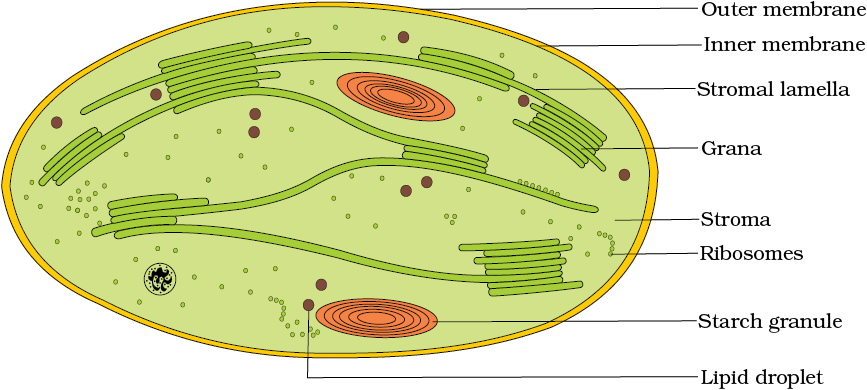
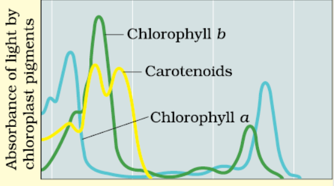
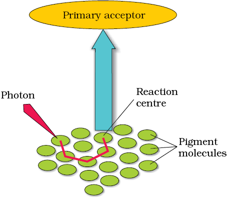
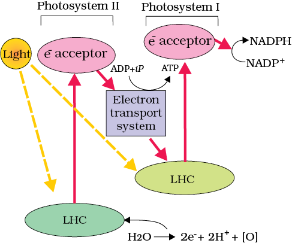
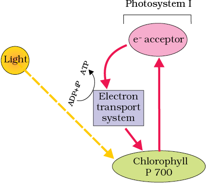

# 06/10/23 

$$
CO_2 + H_0 \overset{Chlorophyll}{\underset{Sunlight}{\rightarrow}} C_{6}H_{12}O_{6} + H_2O + O_2 
$$

Steps:  
1. Sunlight absorbed by chlorophyll 
2. Conversion of night energy into chemical energy and oxygen is liberated. 
3. Reduction of carbondioxide into carbohydrate. 

- Without chlorophyll $a$, photosynthesis is not possible. 

- Pigment is found is chloroplast. 
    - Extra pigments (chlorophyll b, carotenoids, xanthophyll, anthocyanin, phycoerythrin, phycocyanin) are also present. 

> Photosynthetic and chemosynthetic bacteria are also autotrophs. 

- Bacterio chlorophyll is found in some bacteria. 

Mesophyll cells perform photosynthesis.

Vascular bungle is surrounded by bundle sheath cells. 

- Generally leaves perform in photosynthesis 

## C3 pathway 

The $C_3$ pathway, also known as the Calvin cycle, is a vital part of photosynthesis in plants. 

1. **Carbon Capture**: It starts by capturing carbon dioxide (CO2) from the air and turning it into a 3-carbon compound, 3-PGA.

2. **Making Energy**: In the next steps, 3-PGA becomes G3P and uses energy molecules (ATP and NADPH) produced in the light-dependent reactions.

3. **Recycling**: Some of the G3P helps regenerate the initial carbon-capturing molecule.

4. **Sugar Production**: The rest of the G3P is used to make glucose and other sugars, essential for the plant.

Remember, it's called C3 because it starts with **3 carbon atoms** . While it's common, some plants use more efficient pathways like C4 and CAM in specific conditions.

- Some plants also use $CO_2$ at night to conserve water, specially seen in desert plants. 

## Kranz Anatomy 

Kranz Anatomy is a special leaf structure found in certain plants, mainly in [$C_4$](#the-c4-pathway) plants. 

1. Cell Arrangement: Kranz anatomy features a unique cell arrangement in the leaves of C4 plants. These cells are arranged in two distinct layers: the inner bundle sheath cells and the outer mesophyll cells.

2. Cell Roles: In this setup, the mesophyll cells are responsible for capturing carbon dioxide (CO2) and converting it into a 4-carbon compound. This is more efficient in high-heat and high-light conditions.

3. Protection: The inner bundle sheath cells act as protective shields. They keep oxygen out and prevent water loss through evaporation.

4. Efficiency: This arrangement enhances the efficiency of photosynthesis in C4 plants, especially in hot and dry environments.

So, Kranz anatomy is like a two-layered team, with one layer capturing CO2 efficiently and the other layer protecting against wasteful processes, making it perfect for certain plants in challenging conditions.

**Eg: Maize (corn), Sugarcane, Millet, Switchgrass**

# 12/10/23 

## Where does Photosynthesis take place? 

> In broad terms, photosynthesis takes place in the chloroplasts. 

The mesophyll cells in the leaves are in large number where chloroplasts align along the walls for optimum quantity of light.

 

Within the chloroplast, there is a membranous system consisting of grana, stroma lamellae and the matrix stroma.

- Membrane is for trapping light energy and synthesis of ATP and NADPH (nicotinamide adenine dinucleotide phosphate hydrogen).
- In Stroma, enzymatic reactions synthesize sugar, which forms strach. 

|  | Light Reaction   | Dark Reaction |
|-|-|-| 
| Location | Thylakoid membranes of chloroplasts | Stroma of chloroplasts |
| Energy Source | Require light energy (photons) to drive the process | Utilize the ATP and NADPH produced in the light-dependent reactions | 
| Products | Generate ATP, NADPH, and oxygen as a byproduct | Produce glucose and other organic molecules by fixing carbon dioxide | 
| Purpose | Convert light energy into chemical energy (ATP and NADPH) for the next stage | Fix carbon dioxide and synthesize sugars (glucose) from carbon compounds| 
| Depenent on light | Cannot occur in the absence of light |  Can occur in the absence of light, as they rely on the products of the light-dependent reactions for energy | 

## How many types of pigments are involved in Photosynthesis 

- Generally, 4 pigments are crucial in leaves: 
    - Chlorophyll $a$ (bright or blue green)
    - Chlorophyll $b$ (yellow green)
    - Xanthophylls (yellow)
    - Carotenoids (yellow to yellow orange)

Pigments are the substances that help in the absorption of light, at specific wavelenghts. 

- **Chlorophyll $a$ is the most important pigment in photosynthesis**

The red and blue wavelenghts are captured the most in leaves.  
**Therefore, chlorophyll $a$ is the most significant.** 

- Other thylakoid agents like chlorophyll $b$, xanthophyll and carotenoid are also called accessory pigments. 

|  | This table shows the maximum absorption of the electro-magnetic spectrum of different pigments |
|--------------- | --------------- |

## What is Light Reaction 

- Light reaction is the phase that includes the following processes: 
    - Light absorption 
    - Water splitting 
    - Oxygen release
    - Formation of ATP and NADPH 

  

- The pigments are classified into two **Light Harvesting Complexes (LHC)**
    - Photosystem I (PS1)
    - Photosystem II (PS2)

> **NOTE**: These are named in the sequence of the discovery and not during light reaction. 

- These LHCs are made up of hundreds of pigment molecules bound to proteins. 

- Each photosystem has all the pigments forming a Light Harvesting system also called antennae 

The various pigments help the plant to capture a broad spectrum of light to make photosynthesis more efficent. 

- A single chlorophyll $a$ molecule forms the reaction center. 

- The PS1 photosystem chlorophyll $a$ has absorption maxima of 700 nm and is called the P700 
- The PS2 photosystem chlorophyll $a$ has absorption maxima of 680 nm and is called the P680

## The Electron Transport 

In photosystem 2, the reaction center chlorophyll $a$ absorbs 690 nm wavelength of red light which causes the electrons to become excited and jump into an orbit farther from the atomic nucleus. These electrons are picked up by an electron acceptor which passes them to an **electrons transport system consisting of cytochromes**. 

Electrons move through the electron transport chain from high to low energy states (downhill), facilitating the production of energy-rich molecules, but they are not consumed; instead, they are passed on to photosystem I, where they play a crucial role in converting light energy into chemical energy.

Simultaneously, electrons in PS1 are also excited in the reaction when they receive red light of wavelength 700 nm and are transferred to another accepter molecule that has a greater redox potential. In the Z-scheme, electrons flow downhill through a sequence of carriers, ultimately reducing $NADP^+$ to produce energy-rich $NADPH + H^+$, forming a distinctive "Z" shape on the redox potential scale.

## Z-Scheme 

The Z-scheme is a crucial concept in the process of photosynthesis, specifically in the light-dependent reactions that occur in the thylakoid membranes of chloroplasts. 

### The Z-Scheme in Photosynthesis:

1. **Light Absorption**: The process begins when chlorophyll and other pigments in the photosynthetic machinery absorb sunlight. This energy is absorbed by chlorophyll molecules in the photosystem II (PSII) and photosystem I (PSI).

2. **Photosystem II (PSII)**:

PSII comes first in the Z-scheme.
It absorbs light and uses this energy to split water molecules, releasing oxygen ($O_2$) and protons ($H^+$).
The energy from PSII is transferred to an electron transport chain, creating an electron flow.

3. **Electron Transport Chain**:

The energized electrons from PSII move through a chain of proteins embedded in the thylakoid membrane.
As the electrons move along this chain, they release energy, which is used to pump protons (H+) into the thylakoid space, creating a proton gradient.

4. **Photosystem I (PSI)**:

After the electrons have passed through the electron transport chain, they arrive at PSI.
PSI absorbs more light energy, further energizing the electrons.
The electrons are then used to reduce NADP+ (nicotinamide adenine dinucleotide phosphate) to form NADPH, which is an important molecule for the Calvin cycle, the light-independent reactions of photosynthesis.

5. **ATP Synthesis**:

Simultaneously, the proton gradient created in the thylakoid space due to both PSII and PSI pumps is used to generate ATP (adenosine triphosphate) through ATP synthase. This is known as chemiosmotic phosphorylation.

6. **The "Z" Shape**:

The name "Z-scheme" comes from the zigzag shape formed when representing the flow of electrons and energy in the process.

### Overall Significance:

- The Z-scheme illustrates the way in which light energy is captured, used to split water, generate ATP, and produce NADPH, all of which are critical for the subsequent dark reactions (Calvin cycle) in photosynthesis.
- It's a key part of how plants and other photosynthetic organisms convert light energy into chemical energy stored in glucose and other organic molecules.

## Cyclic and Non-cyclic Photo-phosphorylation 

- The process through which ATP is synthesized by cells (in mitochondria and chloroplast) is called phosphorylation.

- Phosphorylation is the process by which ATP is synthesized from ADP and inorganic phosphate in the presence of light. 

When two photosystems work in a series (first PS2 and then PS1), the process is called Non-cyclic Photo-phosphorylation. 

The two photosystems are connected thorugh electron transport chain in the [Z-scheme](#the-electron-transport). 

- Both ATP and NADPH + $H^+$ are synthesized by this kind of electron flow. 

When only PS1 is functional, electron is circulated within the photosystem and phosphorylation occurs due to cyclic flow of electrons. 

- The location where this happens could possibly be the stroma lamellae 

When the membrane or lamellae of the grana have both PS1 and PS2, the **stroma lamellae membrane lacks PS2 and NADP reductase enzyme**  
The excited electron doesn't pass on to $NADP^+$ and it cycled back to the PS1 complex through the electron transport chain. 

### Cyclic Phosphorylation 

Cyclic Phosphorylation results only in ATP but not $NADPH+H^+$

It only occurs in the light of wavelengths beyond 680 nm for excitation of the electons. 

## The Calvin Cycle 

Clavin Cycle is a cyclic operation which synthesizes sugar and RuBP is regenerated. 

- Calvin Cycle is present in all plants irrespctive that they use $C_3$ or $C_4$ pathway. 

  

- Stages: 
    - Carboxylation
    - Reduction 
    - Regeneration 

 

1. Carboxylation

It is the fixation of $CO_2$ into a stable organic intermediate. It is the **most crucial step of Calvin Cycle** where $CO_2$ is utilized for the carboxylation of RuBP. This reaction is **catalyzed by enzyme RuBP carboxylase** resulting in the **formation of two molecules of 3-Phosphoglycerate (3-PGA)**. Since this enzyme also has has an oxygenation activity, it is also called **RuBisCO (Ribulose bisphosphate Carboxylase-Oxygenase)**. It is also the **most abundant protein in the biosphere**. 

2. Reduction 

It is a series of reactions that result in the formation of glucose. This step includes **2 molecules of ATP for phosphorylation and two of NADPH for reduction per $CO_2$ molecule** fixed. Therefore, **six molecules of $CO_2$ and 6 turns of the cycle are required for the formation of one molecule of glucose from the pathway**. 

3. Regeneration 

Regeneration of $CO_2$ acceptor molecule **RuBP** is crucial if the cycles has to continue uninterrupted. This step for regeneration requires **one APT for phosphorylation to form RuBP**. 

In the Calvin cycle of photosynthesis, for every $CO_2$ molecule converted into a carbohydrate, 3 molecules of ATP and 2 molecules of NADPH are needed to supply energy and reducing power for the chemical reactions that turn $CO_2$ into sugars.

| In | Out |
|-|-|
| 6 $CO_2$ | 1 Glucose |
| 18 ATP | 18 ADP |
| 12 NADPH | 12 NADP |

## The C4 Pathway 

- Plants in arid regions adapt $C_4$ pathway. 
    - Tolerate higher temperatures. 
    - Response to high light intensities. 
    - Lack of [photorespiration](#photorespiration)

# 16/10/2023

- First product to form in $C_4$ pathway - **Oxaloacetic acid**. 

## Photorespiration 

Photorespiration is the main difference between $C_3$ and $C_4$ pathway. 

### Photorespiration and RuBisCO

- RuBisCO is a crucial enzyme in the Calvin pathway.
- It can bind to both $CO_2$ and $O_2$, and this binding is competitive.
- The relative concentration of O2 and CO2 determines which binds to RuBisCO.
- In C3 plants, some O2 binds to RuBisCO, reducing CO2 fixation.
- Photorespiration occurs when RuBP binds with O2, resulting in the release of CO2 and phosphoglycolate, but no ATP or sugar production.
- The biological purpose of photorespiration is still unknown.

### C4 Plants vs. C3 Plants

- C4 plants minimize photorespiration.
- They achieve this by increasing CO2 concentration at the enzyme site.
- C4 acids in mesophyll cells break down in bundle sheath cells to release CO2, reducing oxygenase activity of RuBisCO.
- C4 plants have better productivity, higher yields, and increased heat tolerance compared to C3 plants.

### Key Takeaways

- Photorespiration reduces CO2 fixation and occurs in C3 plants.
- C4 plants minimize photorespiration through increased CO2 concentration.
- C4 plants are more productive and heat-tolerant.

## Factors Affecting Photosynthesis 

### Blackman's Law of Limiting Factors 

"If a chemical reaction is affected by more than one factor, then its rate will be determined by the factor which is nearest to its minimal value: it is the factor which directly affects the process if its quantity is changed."

- The above law should never be changed. 

It means that if a reaction is governed by more than one factor, then the factor which has the minimum value is the key factor which determines the limit of the reaction if its quantity can be changed. 

### Light 

As light increases, the reaction of photosynthesis increases but it has a point after which the increase will cause a breakdown in the chlorophyll. 

> High amounts of solar energy is harmful to plants because it deforms the proteins in it. 

### Carbon Dioxide Concentation 

$CO_2$ is a major factor which is directly proportional to the rate of photosynthesis. 

Its increase in concentation can increase the $CO_2$ fixation rates.

### Temperature

Temperature is a sensitive factor which governs photosynthesis due to the enzyme action having a narrow limit in the temperature for the full productivity.

### Water

Water is need in the process of photosynthesis, but its stress can cause the stomata to close hence reducing the $CO_2$ availability. Besides water can also wilt leaves, thus, reducing the surface are of leaves and metabolic activity. 

## Crassulacean acid metabolism (CAM) 

CAM is a unique photosynthetic pathway found in certain desert plants, such as cacti and succulents.

Instead of taking $O_2$ at day, it't taken at night 

Fix $CO_2$ almost as $C_4$ pathway 

Daytime regen $CO_2$ by decarboxylation and produce carbohydrate without opening stomata. 

Prominent in desert plants 

### Day-Night Separation:

CAM plants separate the processes of CO2 uptake and photosynthesis into day and night phases.

### Nighttime CO2 Uptake:

At night, CAM plants open stomata to take in CO2, as it's cooler and less water loss occurs.
The CO2 is converted into organic acids and stored in the vacuoles.

### Daytime Photosynthesis:

During the day, stomata close to conserve water.
The stored organic acids from the night are broken down to release CO2 for photosynthesis.
This separation of processes reduces water loss and enhances water use efficiency.

### Adaptation to Arid Environments:

CAM is an adaptation to arid (dry) environments where water conservation is crucial.
Examples:

Examples of CAM plants include cacti, agaves, and many succulents.

### Key Takeaways:

CAM is a photosynthetic strategy that separates CO2 uptake and photosynthesis in time to conserve water.
It's an adaptation to arid environments, allowing plants to thrive with minimal water availability.

