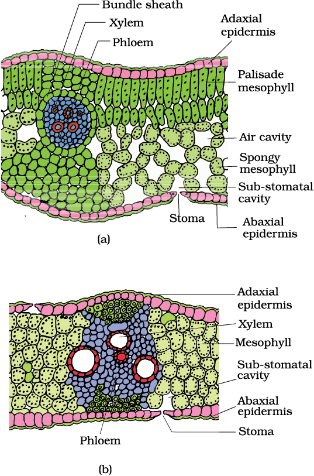

06/10/23 

$$
CO_2 + H_0 \rightarrow C_{6}H_{12}O_{6} + H_2O + O_2 

\text{This takes place in the presence of chlorophyll and sunlight}
$$

Steps:  
1. Sunlight absorbed by chlorophyll 
2. Conversion of night energy into chemical energy and oxygen is liberated. 
3. Reduction of carbondioxide into carbohydrate. 

- Without chlorophyll $a$, photosynthesis is not possible. 

- Pigment is found is chloroplast. 
    - Extra pigments (chlorophyll b, carotenoids, xanthophyll, anthocyanin, phycoerythrin, phycocyanin) are also present. 

> Photosynthetic and chemosynthetic bacteria are also autotrophs. 

- Bacterio chlorophyll is found in some bacteria. 

Mesophyll cells perform photosynthesis.

Vascular bungle is surrounded by bundle sheath cells. 

- Generally leaves perform in photosynthesis 

    _    ____  ____     ____ _____      _    _   _ ____     ____ _  _   
   / \  |  _ \|  _ \   / ___|___ /     / \  | \ | |  _ \   / ___| || |  
  / _ \ | | | | | | | | |     |_ \    / _ \ |  \| | | | | | |   | || |_ 
 / ___ \| |_| | |_| | | |___ ___) |  / ___ \| |\  | |_| | | |___|__   _|
/_/   \_\____/|____/   \____|____/  /_/   \_\_| \_|____/   \____|  |_|
  ______   ______ _     _____ 
 / ___\ \ / / ___| |   | ____|
| |    \ V / |   | |   |  _|  
| |___  | || |___| |___| |___ 
 \____| |_| \____|_____|_____|

 - Some plants also use $CO_2$ at night 
