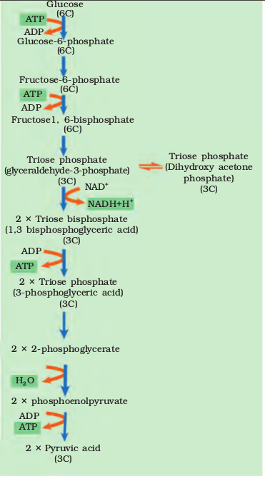
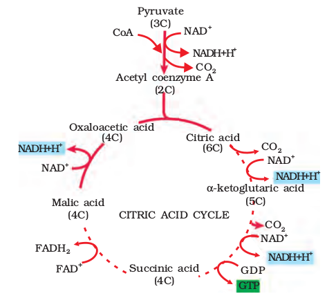

# 20/10/23 

Differences between Aerobic and Anaerobic respiration. 

| Aerobic | Anaerobic |
|--------------- | --------------- |
| 1. ATP, $H_2O$ and $CO_2$ are formed. | 1. ATP, $CO_2$ and Ethanol are fomed.|
| 2. Happens in the presence of $O_2$| 2. Doesn't need $O_2$ for energy formation. |
| 3. Happens in cytoplasm and mitochondria| 3. Happens only in the cytoplasm. |
| 4. Prominent in organ system level organisms and a lot of ATP is produced. | 4. Prominent in cellular level organisms and very low amount of ATP is produced. |

## Glycolysis 

 

**Isomer**: same chemical formula but different structure. 

- Enzymes involved in glycolysis: 
    - **Isomerase**: change structure without changing formula. 
    - **Invertase**: break down sucrose into glucose and fructose. 
    - **Hexokinase**: phosphorylate glucose, trapping it within the cell and starting the glycolytic pathway. 

$$
\text{Aerobic respiration}
$$

$$
\text{Glucose} \overset{\text{In cytoplasm}}{\rightarrow} \text{Pyruvic acid} \overset{\text{In mitochondria}}{\rightarrow} H_2O,\ CO_2,\ 38\ APT 
$$

$$
\text{Anaerobic Respiration}
$$

$$
\text{Glucose} \overset{\text{In cytoplasm}}{\rightarrow} \text{Pyruvic acid} \overset{\text{In cytoplasm}}{\rightarrow} 2\ ATP,\ \text{Ethanol},\ CO_2
$$

- Glycolysis involves 10 steps for converting glucose into pyruvic acid, which is the key product of glycolysis.

This is also the only process that generates ATP in anaerobic respiration.

### Role of Enzymes in Glycolysis

In plants, glucose is obtained from the sucrose which is the end product of photosynthesis or from storage carbohydrates.

**Sucrose** is **converted to glucose and fructose** by **invertase enzyme**.  
**Glucose and fructose are phosphorylated** to give **glucose-6-phosphate** by the **enzyme hexokinase**.  
Then **glucose-6-phosphate is converted** into **fructose-6-phosphate** by **isomerase enzyme**.

### ATP Formation and Usage 

Directly 4 ATP are formed by **2 $\cdot$ Triose bisphosphate** and **2 $\cdot$ phosphoenolpyruvate**. 

***2 ATP are consumed in step 1 and 3***. Leaving a **net of 2 ATP** formed directly. 

In step 5 and 6, $NADH+H^+$ is formed but since it is isomerized, it will form **2** $NADH+H^+$ **molecules** which is later **converted into 6 ATP by the mitochondria**. 

$\therefore \text{Produced} = 4\ ATP$  
$\text{Consumed} = 2\ ATP$

$\text{Net total} = (4-2) ATP$  
$\implies 2\ ATP$

$\text{ATP generated by } NADH+H^+ = (2 \cdot 3)\ ATP$  
$\implies 6\ ATP$ 

### PS 

Note that 2 pyruvic acid are formed. This is going to be useful in the later steps of Fermentation and Citric Acid Cycle. 

## Fermentation 

Fermentation is the process where glucose is broken down anaerobically to form Ethanol, $CO_2$ and ATP. 

- It's of two types: 
  - Lactic Acid fermentation
  - Alcohol fermentation 

These processes are hazardous, either acid or alcohol is formed and the yeast poison themselves to death when alcoholo concentration reaches about 13%. 

In this process, the $NADH+H^+$ are produced and consumed and this is the reason why there's so low production of ATP and only dependent on [Glycolysis](#glycolysis).

Since Glycolysis produces 2 net ATP, its the total production of glycolysis and fermentation combined. 

## Aerobic Respiration 

This process takes place inside the mitochondria where pyruvate it transported from cytoplasm into the mitochondria. 

The crucial events are:  
- The complete oxidation of pyruvate by the stepwise removal of all the hydrogen atoms, leaving three molecules of $CO_2$.
- The passing on of the electrons removed as part of hydrogen atoms to molecular $O_2$ with simultaneous synthesis of ATP. 

## Tricarboxylic Acid Cycle 

This process is **also known as the Citric Acid Cycle or Krebs' Cycle**. 

From [Glycolysis](#glycolysis), it can be noticed that Kreb cycle utilizes one molecule of pyruvate and that's why we have to take this reaction 2 times into account for balancing the results. 

ATP production  
- $NADH+H^+$: 3 ATP (in mitochondria)
- $FADH_2$: 2 ATP (in mitochondria)
- $GTP$: 1 ATP (directly)

Therefore, 

| 
 $NADH+H^+$ | 
 $FADH_2$ | 
 $GTP$ | 
|:-:|:-:|:-:| 
| 8 | 2 | 2 |

Therefore,  
$NADH+H^+ = 3 \cdot 8 = 24\ ATP$  
$FADH_2 = 2 \cdot 2 = 4\ ATP$  
$GTP = 2\ ATP$

$\text{Total = } 24 + 4 + 2$  
$\implies 30\ ATP$

# 04/11/2023 

## Electron Transport System (ETS) and Oxidative Phosphorylation 

$NADH+H^+$ enters and splits into two. 

Proton gradient forms  
Electron goes through various chain and energy is formed as ATP. 

$\text{Electron} + \text{Proton} + \text{Oxygen} \rightarrow \text{Water}$

ATPase catalyze the hydrolysis of a phosphate bond in Adenosine Triphosphate to form Adenosine Biphosphate 

## Amphibolic Pathway 

  

To summarize, it proves that respiration has a dual route.  
It means that its catabolic as well as anabolic. 

- Glucose is the favored substrate for respiration. 
- Carbohydrates are converted into glucose before respiration. 
- Other substrates are converted into glucose before respiration. 
- Fats need to be broken down into glycerol and fatty acids first.

If fatty acid were to be respired, they have to be first degraded into acetyl coenzyme A. Glycerol needs to be broken down into PGAL (3-phosphoglyceraldehyde) first. 

Proteins need to be degraded by protease enzyme into individual amino acid depending on their structure would enter the pathway at some stage within the [Krebs' Cycle](#tricarboxylic-acid-cycle) or even as pyruvate or acetyl CoA.

Since some side products are made and required to complete the reaction, respiratione is also considered as anabolic process. 

## Respiratory Quotient 

It is the ratio of the volume of $CO_2$ evolved to the volume of $O_2$ consumed in respiration. It is also called the respiratory ratio. 

$$
RQ = \frac{\text{volume of } CO_2 \text{ evolved}}{\text{volume of } O_2 \text{ consumed}}
$$

This quotient depends on the substrate that is used during respiration. 

### Carbohydrates 

$$
C_6H_{12}O_6 \rightarrow 6CO_2\ + 6H_2O\ + Energy 
$$
$$
RQ = \frac{6CO_2}{^6O_2} = 1.0 
$$

Therefore ratio for carbohydrates is 1.0 

### Fats 

$$
\underset{Tripalmitin}{2(C_{51}H_{98}O_6)} + 145O_2 \rightarrow 102CO_2 +  98H_2O + energy 
$$
$$
RQ = \frac{102CO_2}{145O_2} = 0.7 
$$

Note that Tripalmitin is a type of fatty acid and its RQ is 0.7. 

### Summary 

Carbohydrates RQ = 1.0  
Fats RQ = 0.7  
Proteins = 0.9 
