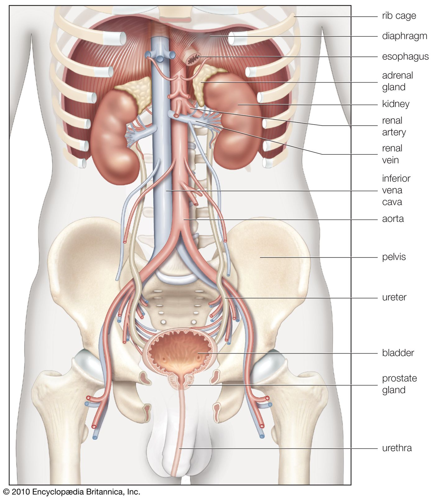

# Excretory Products and their Elimination 

- [Excretory Products and their Elimination](#excretory-products-and-their-elimination)
- [Excretory Organs in Different Phylums and Classes](#excretory-organs-in-different-phylums-and-classes)
  - [Non-Chordata](#non-chordata)
  - [Chordata](#chordata)
- [Human Excretory System](#human-excretory-system)

**Main excretory organ**: Kidney  
**Other**: lungs, skin, etc. 

> If consumed alcohol, the smell is also released through skin through sweat. 

**Excretion**: the process in which an organism removes unwanted and harmful substances from the body is called excretion. 

# Excretory Organs in Different Phylums and Classes

## Non-Chordata

- **Porifera**: Oscula and the surface of the sponge. 
- **Cnidaria**: simple diffsion through surface of body. 
- **Ctenophora**: anal pores 
- **Platyhelminthes**: Flame cells 
- **Aschelminthes**: Renette cell
- **Annelida**: Nephridia 
- **Arthropoda**: Malpighian tubules 
- **Mollusca**: Metanephridia
- **Echinodermata**: Water vascular system 
- **Hemichordata**: Proboscis gland 

## Chordata 

- **Cyclostomata**: mesonephric kidneys 
- **Chondrichthyes**: mesonephric kidneys 
- **Osteichthyes**: opisthonephric kidneys 
- **Amphibia**: mesonephros or pronephros kidney 
- **Reptilia**: metanephric kidney
- **Aves**: metanephric kidney 
- **Mammalia**: metanephric kidney 

# Human Excretory System 

It consists of a pair of kidneys, a pair of ureters, a urinary bladder and a urethra. 

Kidneys are **reddish brown**, **bean shaped** structure that are located between levels of last thoracic and third lumbar vertebra close to the dorsal inner wall of the abdominal cavity. 

Each kidney of an adult has a dimension of **length 10-12 cm**, **width 5-7 cm** and **2-3 cm thickness** and the weight is around **120-170 grams**. The outer layer of kidney is called renal capsule and it's a hard. 

**Hilum** is a **notch towards the center of the concave surface** of the kidney through which ureter, blood vessels and nervers enter. Inner to the hilum is a **broad funnel shape called renal pelves** with **projections called calyces**. 

The outer layer is a **tough capsule** called ***renal capsule***. Inside the kidney, there are two zones, an **outer cortex** and an **inner medulla**. The medulla is further divided into few conical masses called **medullary pyramids** projecting into the calyces. The cortex extends in between medullary pyramids as renal columns called **Columns of Bertini**. 

Each kidney has nearly a million complex tubular structures called **nephrons** which are the funcional units. Each nephron is made of two parts- **Glomerulus and renal tubule**. **Glomerulus** is a collection of capillaries **formed by the afferent arteriole**. Blood from glomerulus is drawn away by efferent arteriole. 

The renal tubule begins with a double walled cup-like structure called **Bowman's capsule** which encloses the glomerulus. The glomerulus combined with Bowman's capsule iscalled **malpighian body or renal corpuscle**. The tubule continues to form a highly coiled structure called **proximal convoluted tubule (PCT)**. A hairpin shaped **Henle's loop** is the next part of the tubule which has an ascending and a descending limb which continues as another highly coiled tubular region called **distral convoluted tubule (DCT)**. The DCT of many nephrons open into a straight tube called **collecting duct** which converge and open into the renal pelvis through medullary pyramids into the calyces. 

The **Malpighian corpuscle, PCT and DCT** of the nephron are situated in the **cortical region** of the kidney whereas the **loop of Henle dips into the medulla**. In **majority of the nephrons**, Henle's loop is **too short and exdends onto very little into the medulla**; such nephrons are called **cortical nephrons**. In a few nephrons, **Henle's loop is very long and runs deep into the medulla** and these are called **juxta medullary nephrons**.

The efferent arteriole eemrging from the glomerulus froms a fine capillar network around the renal tubule called **peritubular capillaries**. A minute vessel runs into the network parallel to Henle's lood forming a 'U' shape called the **vasa rects** and it is present or highly reduced in **cortical nephrons**.