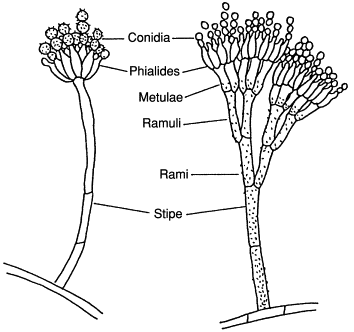
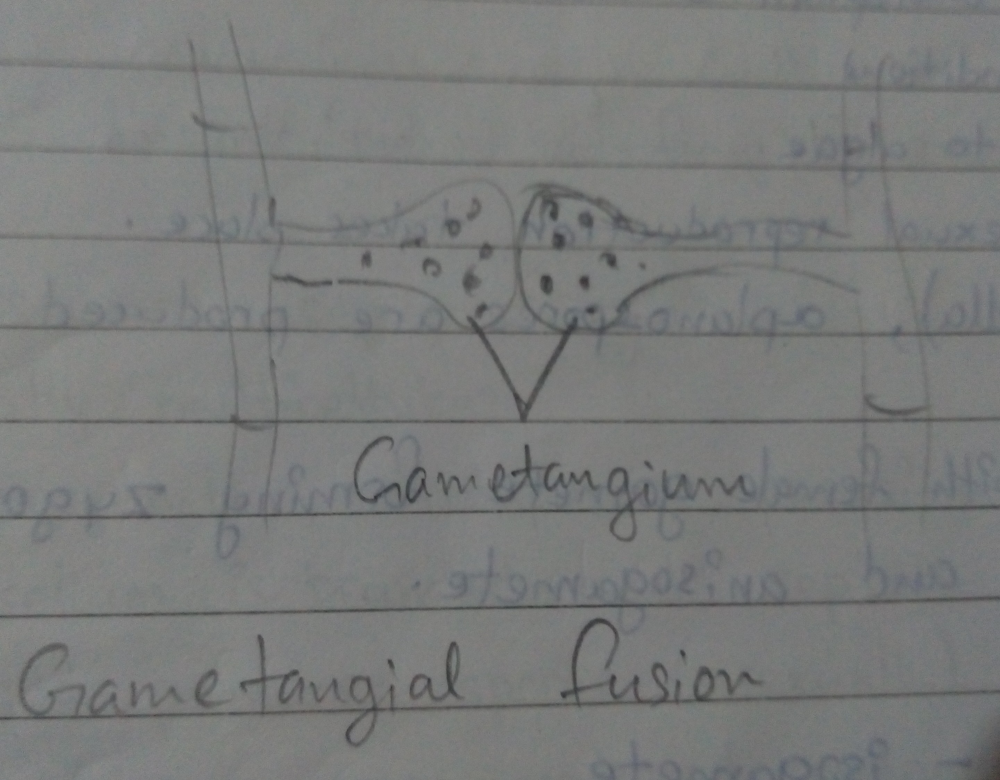
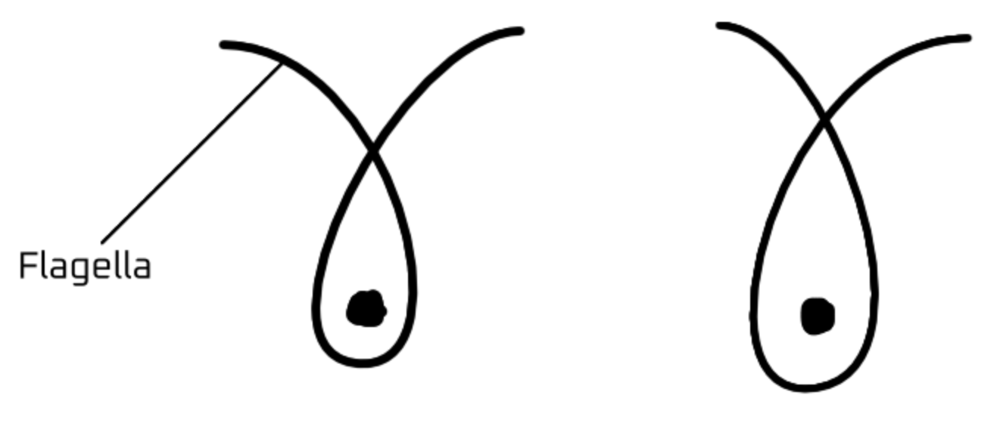
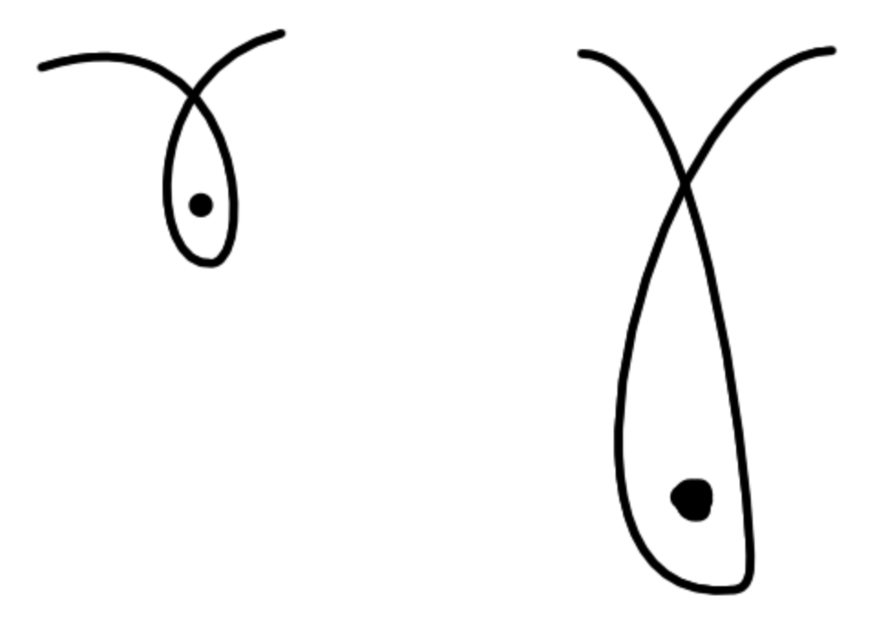
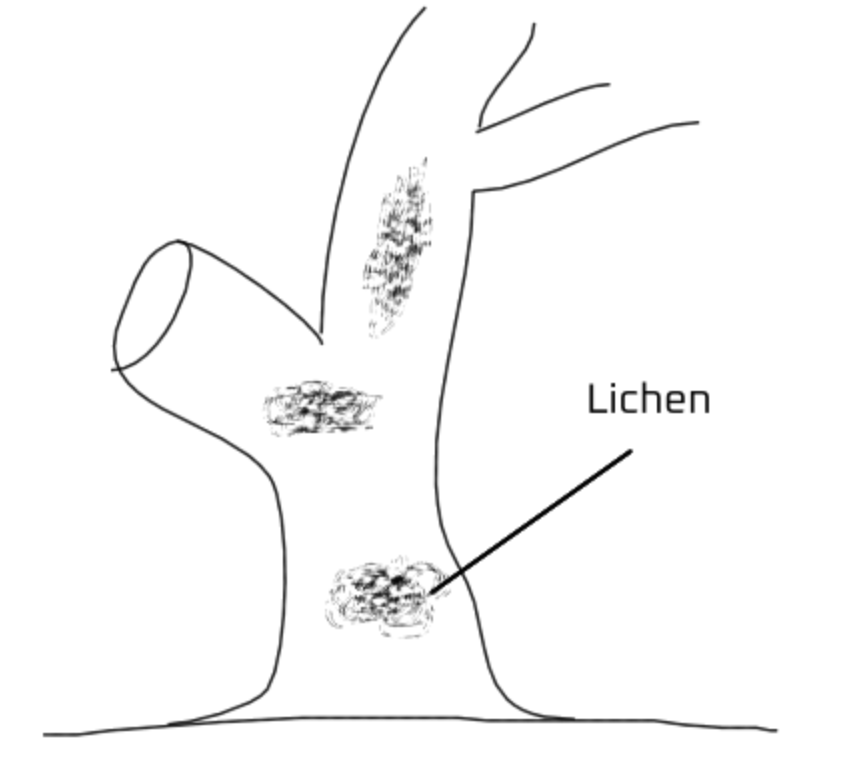

- [Introduction](#introduction)
    - [Characteristics of Five Kingdoms](#characteristics-of-five-kingdoms)
- [Kingdom Monera](#kingdom-monera)
  - [Archaebacteria](#archaebacteria)
  - [Eubacteria](#eubacteria)
  - [Protozoa](#protozoa)
    - [Nutrition in bacteria](#nutrition-in-bacteria)
    - [QnA](#qna)
    - [Bacterial reproduction](#bacterial-reproduction)
    - [Pilus's form of reproduction](#piluss-form-of-reproduction)
  - [Economic importance of bacteria.](#economic-importance-of-bacteria)
  - [Protista](#protista)
    - [Chrysophytes](#chrysophytes)
      - [Phylum Chrysophyta (diatom)](#phylum-chrysophyta-diatom)
  - [Dinoflagellates](#dinoflagellates)
  - [Euglenoids](#euglenoids)
  - [Slime molds](#slime-molds)
  - [Protozoa](#protozoa-1)
    - [Amoeboid Protozoan](#amoeboid-protozoan)
    - [Flagellated protozoans](#flagellated-protozoans)
    - [Ciliated protozoans](#ciliated-protozoans)
    - [Sporozoan](#sporozoan)
- [Kingdom - fungi](#kingdom---fungi)
  - [Phycomycetes](#phycomycetes)
      - [Same size gametes - isogametes](#same-size-gametes---isogametes)
      - [Unequal size gametes - anisogamete](#unequal-size-gametes---anisogamete)
      - [Oogamy](#oogamy)
  - [Ascomycetes](#ascomycetes)
  - [Basidiomycetes](#basidiomycetes)
      - [After meiosis](#after-meiosis)
  - [Deuteromycetes](#deuteromycetes)
    - [Lichen](#lichen)
    - [Plant succession](#plant-succession)
- [Virus, Viroids and Prions](#virus-viroids-and-prions)
- [Notes](#notes)
  - [Single Stranded DNA virus: influenza virus](#single-stranded-dna-virus-influenza-virus)
  - [Bacteriophage virus](#bacteriophage-virus)

# Introduction

- The need for classification organizes all the organisms based on the characters to make study easier.

**Carolus Linnaeus** used the _2 system classification_ which **consisted of Plantae and Animalia**

His system did not distinguish between photosynthetic, non-photosynthetic, prokaryotes and eukaryotes, unicellular and multicellular.

- 2 system classification was used for a long time but was found inadquate

### Characteristics of Five Kingdoms

| Characters        | Monera                              | Protista                        | Fungi                        | Plantae             | Animalia                      |
| ----------------- | ----------------------------------- | ------------------------------- | ---------------------------- | ------------------- | ----------------------------- |
| Cell type         | Prokaryotic                         | Eukaryotic                      | Eukaryotic                   | Eukaryotic          | Eukaryotic                    |
| Cell wall         | Noncellulosic[^1]                   | Present in some                 | Present with chitin          | Present (cellulose) | Absent                        |
| Nuclear membrane  | Absent                              | Present                         | Present                      | Present             | Present                       |
| Body organization | Cellular                            | Cellular                        | Multicellular / loose tissue | Tisuse / organ      | Tissue / Organ / Organ system |
| Mode of nutrition | Autotrophic[^2] & Heterotrophic[^3] | Autotrophic[^4] & heterotrophic | Heterotrophic[^5]            | Autotrophic[^6]     | Heterotrophic[^7]             |

- **R.H. Whittaker (1969)** proposed the **5 kingdom classification**.

- **Morphological features**: outside physical characteristics

> **Euglena** has _both chloroplast and holozoic nutrition_

> Controversial microbes are placed in Protista

- **Chitin**: amide derivative of glucose
- **Tissue**: a group of similar cells performing a similar task

# Kingdom Monera

- These are **Unicellular Prokaryotes**

The cell wall is _not made of cellulose or chitin_ but **peptidoglycan**, a **polymer of linked sugars and polypeptides**

- **Monera** $\rightarrow$ archaebacteria, eubacteria

> Initially, the RNA was formed in the cell but the origins are unknown

RNA $\overset{\text{Evolved}}{\rightarrow}$ DNA  
Amino acid $\overset{\text{Produces}}{\rightarrow}$ protein  
Both combined and formed protoplasm which evolved into prokaryotic cell

 

- A solid (capsule) or jelly-like substance (glycocalyx) protects the cell.

The _hair-like structure_ surrounding the cell is called **flagella or cilia** based on the length and function.

- **Cilia** are _short and cover the cell_ and **flagella** are _long hair for locomotion_

- **Probiotic capsules** have living spores of **lactobacillus** which _maintain the microenvironment_ of our intestine.

> Curd consumers already have lactobacillus in their intestines.

- Bacteria that **cause stomach ache** _damages the lining of the intestine_ which is the cause of **pain and irritation**.

- **Ribosomes, cell walls, RNA and DNA** may be present in both **prokaryotes and eukaryotes**

> Most Prokaryotes use anaerobic respiration

- All archaebacteria are anaerobic

- The **plasma membrane** was **first studied in RBC**

 

- **Carbohydrate**: Sugar - soluble in water, has a taste
- **Non-Sugar**: insoluble in water, tasteless

 

- Glucose, fructose - monosaccharides
- Sucrose - disaccharide
- Starch, dextrin, cellulose - Polysaccharide

**BSI**: Botanical Survey of India

- Types of bacteria based on structure:
  - Cocci
  - Bacilli
  - Spirilla
  - Vibro

**Culture**: taking an infected part and cultivating them for experimentation.

## Archaebacteria

> India has the largest population of cow in the world (generally used for milk production). So there's more methanogenic gut bacteria (to break down cellulose and this produces a lot of methane gas which leads to **Global Warming**)

> Organic materials that are present in ice caps are being digested by methanogenic bacteria and are forming methane. Global warming has created an issue of exposing this methane layer which will further increase global warming.

> Methane traps heat 4 times that of carbon dioxide.

- Types of archaebacteria:
  - **Halophilic**: found in salt deposits
  - **Thermoacidophilic**: hot springs and acidic environments
  - **Methanogenic**: produces methane from organic matter.

> Excess oxygen in biogas plants makes it useless because **oxygen is toxic for archaebacteria**

## Eubacteria

- Eubacteria is also known as "**true bacteria**"
- These have a **rigid cell wall, motile and a flagellum**

> Cyanobacteria has chlorophyll $a$ similar to that of higher plants. And are called **photosynthetic autotrophs**.

- Cyanobacteria are **unicellular, colonial or filamentous freshwater/marine or terrestrial algae.**

- Colonies of cyanobacteria are surrounded with a **gelatinous sheath**.

> These eubacteria often form algal blooms and pollute water bodies.
>
> But some of them also fix atmospheric nitrogen with the specialized cell **heterocyst**. Eg: nostoc, anabena

- **Chemosynthetic autotrophic** bacteria oxidise nitrates, nitrites, ammonia, etc. for the production of ATP.

> Eubacterias play a major role in recycling nutrients like nitrogen, phosphorous, iron and sulphur.

- Heterotrophic bacteria are the most abundant in nature.

- These bacteria help in producing curd, antibiotics, fixing nitrogen in legume roots, etc.

 

- Some known damages caused:
  - Human beings
  - Crops
  - Farm animals
  - Pets
  - Diseases
    - Cholera
    - Typhoid
    - Tetanus
    - Citrus canker

 

- Bacteria reproduce mainly by fission and sometimes from spores.
- They also reproduce sexually by adopting a primitive type of DNA transfer from one bacterium to the other.

> **Mycoplasma** lack a cell wall and are the smallest living cells known and can **survive without oxygen**.

## Protozoa

> Protozoa are single-celled eukaryotic organisms that belong to the kingdom Protista. They exhibit diverse forms and play essential roles in various ecosystems, while some species can cause diseases in humans and animals.

- Antibiotics should be taken daily or else the bacteria will become resistant to it.

> Superbugs are powerful bacteria resistant to antibiotics.

- Gram-positive $\rightarrow$ get stained
- Gram-negative $\rightarrow$ no staining

> Gram-positive bacteria have fewer lipids and they absorb the stain and retain the color.
>
> However, it's the exact opposite for Gram-negative bacteria

### Nutrition in bacteria

1. **Autotrophic**: Chemotrophic & Photoautotrophic
2. **Heterotrophic**: Parasitic, Saprophytic

- Parasitic:
  - Internal
  - External

> Cholera has external digestion and when it releases the enzymes in our intestine, it causes swelling and the intestine cannot do its work of absorbing the water. Therefore the patient becomes dehydrated which is the main cause of death.

- When any decomposing matter is in the process of bacterial external digestion it becomes slippery.

> Bacteria don't perform holozoic nutrition because the cell wall is not digestible for them.

- **Phagocytosis**: Phagocytosis is a cellular process by which certain specialized cells, called phagocytes, engulf and internalize foreign particles, such as bacteria, viruses, cellular debris, or other substances.

- **Pinocytosis**: Pinocytosis, also known as "cell drinking," is a non-selective process where the cell membrane invaginates and forms tiny vesicles to internalize extracellular fluid and its contents, allowing the cell to sample and uptake various solutes present in the surrounding environment.

### QnA

Q1> What is Gram Stain?

A1/ Gram stain is a widely used laboratory technique in microbiology for **distinguishing and categorizing bacteria** into two major groups: **Gram-positive and Gram-negative**. The stain involves a series of steps, including **applying a purple dye** (_crystal violet_) to the bacterial sample, **adding iodine as a mordant**, **decolorizing with alcohol or acetone**, and **counterstaining with a contrasting color** (such as _safranin_). The stain differentiates bacteria **based on their cell wall composition**. **Gram-positive bacteria retain the purple stain**, appearing purple under a microscope, while **Gram-negative bacteria lose the stain and appear pink or red** after counterstaining. The Gram stain is valuable in bacterial identification and provides preliminary information about the potential pathogenicity and response to certain antibiotics.

Q2> Distinguish between gram-positive and gram-negative.

A/ Gram-positive:

1. Gram-positive bacteria have a thick layer of peptidoglycan in their cell walls, making up a significant portion of the cell wall structure.
2. During the Gram staining process, Gram-positive bacteria retain the crystal violet dye and appear purple after decolorization.
3. The cell wall of Gram-positive bacteria is relatively simple, with peptidoglycan being the major component. It lacks an outer membrane.
4. Gram-positive bacteria are generally more susceptible to antibiotics that target the cell wall, such as penicillin. The thick peptidoglycan layer in their cell walls provides a target for these antibiotics.
5. Many Gram-positive bacteria produce exotoxins, which are released into the surrounding environment and can cause various symptoms and diseases.

Gram-negative:

1. Gram-negative bacteria have a **thinner layer of peptidoglycan** in their cell walls, located between an outer membrane and an inner cytoplasmic membrane.
2. During the Gram staining process, **Gram-negative bacteria lose the crystal violet dye** and **appear pink or red after counterstaining** with _safranin_.
3. The cell wall of Gram-negative bacteria is more complex, consisting of an **outer membrane composed of lipopolysaccharides** (LPS) and proteins, in addition to the peptidoglycan layer.
4. Gram-negative bacteria possess an **outer membrane** that **acts as a protective barrier against certain chemicals and antibiotics**. It also contains porins, which allow the passage of small molecules.
5. Gram-negative bacteria **produce endotoxins**, which are components of the LPS in the outer membrane. These **endotoxins can trigger immune responses** and contribute to the symptoms associated with **infections** caused by Gram-negative bacteria.

### Bacterial reproduction

- Asexual is common.
- Takes maximum 20 minutes.

 

- **Asexual reproduction by amitosis** where cell **divides without spindle formation or appearance of chromosomes**

 

- Sometimes also reproduce by spores:
  - In this process, the **cell divides the nucleus within itself** and the cell is bounded by the cell wall. When it is time, the **cell wall bursts and releases all the spores in the surrounding medium**.

### Pilus's form of reproduction

- The **preliminary form of sexual reproduction** in bacteria is called **conjugation**, where **genetic material is transferred between bacterial cells through a pilus**.

- The **F-plasmid** is a **circular DNA molecule** found in **bacteria that allows for conjugation**, the transfer of genetic material. It **carries genes for pilus formation** and can **also carry antibiotic resistance genes**.

## Economic importance of bacteria.

- Positives
  1. Produce antibiotics
  2. Biofertilizer
  3. Nitrogen filtering
  4. Decomposers
  5. Clean oil spills
  6. Food production
  7. Probiotics
  8. Dairy industry
  9. Production of methane for biogas
  10. Research and scientific advancement

 

- Negatives
  1.  Diseases and infection
  2.  Antibiotic resistance
  3.  Food spoilage
  4.  Dental issues
  5.  Environmental impact
  6.  Allergies and sensitivities
  7.  Contamination of soil and water
  8.  Economic losses in agriculture
  9.  Biological warfare
  10. Malodor production

> Insulin was earlier extracted from a cow's pancreas

---

- Mesosomes and cristae help in respiration too.
- Mesosome-having bacteria are generally gram-negative.

> Composition of cristae and mesosome are similar

> Theory of the origin of mitochondria in the cell
>
> Mitochondria originated from bacteria that were engulfed by a host cell. They formed a symbiotic relationship where the bacteria provided energy production capabilities, and the host cell offered protection. Over time, the engulfed bacteria evolved into mitochondria, losing their independence. This theory is supported by similarities in structure, reproduction, and the presence of distinct mitochondrial DNA.

- **Cyanobacteria** uses **water to produce a single atom of oxygen** and when that **atom fuses with another atom, it forms oxygen gas**.

> That's why it is also purposed that chloroplast in plant cells has origins back to cyanobacteria.

- **Cyanobacteria** are seen to exhibit **spore formation and nuclear fission**.

- **Chain-like structure** in cyanobacteria is called **Trichome**.

> The chain has special differentiated cyanobacteria cells that help in nitrogen fixation in soil.

- **Hormogonia** is a **fraction of a filament in algae** that **detaches from the organism and reproduces itself** by cell division.

> When the **nostoc (blue-green algae)** colony wants to expand, it **fragments a part of itself away** and that part is **called Hormogonia**.

> ### Anabaena azollae
>
> Anabaena azollae is a **cyanobacterium** that **forms a symbiotic relationship with the water fern Azolla**. It **helps the fern by fixing nitrogen** from the atmosphere, **enabling Azolla to thrive** in nitrogen-deficient environments. This symbiosis is beneficial in agriculture and environmental research as a **natural nitrogen fertilizer** and for **reducing greenhouse gas emissions**.
>
> **Cyanobacteria** is **present in the leaves** living in a symbiotic relationship.

- **Nostoc** is also **found in roots of some plants**.

 

- Negatives:
  1. Medical emergencies (accidents by slipping on it)
  2. Poison formation in aquatic bodies.

 

- **Phylogenetic relationship**: classification based on evolutionary relationship with the ancestors.

- **Thermophile example**: _Thermus aquaticus_

> **Cyanobacteria despite being called blue-green algae** is kept in monera because it is a **prokaryotic cell**.

> ### Mycoplasma
>
> It is also called PPLO which stands for **Pleuro Pneumonia Like Organisms**.  
> Since it was **found in pleural fluid** (a liquid that is located between the layers of the pleura, i.e., a thin layer of tissue that covers the lungs and lines the interior wall of the chest cavity) **of cows suffering from pneumonia**  
> It also causes **diseases in plants called Witch's Broom Infection**.

## Protista

- Eukaryotic cells with a **defined nucleus and membrane-bound organelles**.
- Can be unicellular or **multicellular**, **forming colonies or filaments**.
- Exhibits tremendous **diversity in forms, sizes, and lifestyles**.
- Found in **aquatic habitats, including freshwater and marine ecosystems**.
- Reproduces **sexually and asexually**.
- Displays various motility mechanisms like **flagella, cilia, or pseudopodia**.
- **Plays important ecological roles** as **primary producers, prey, parasites, or symbionts**.
- **Some protists** are **parasitic and can cause diseases**.
- Considered an **ancient and diverse group**, with evolutionary significance.
- They may be **photosynthetic, chemosynthetic, heterotrophic or both photosynthetic and heterotrophic**.

### Chrysophytes

- Chrysophytes
  - Bacillariophyceae (Diatoms)
    - Possess unique silica cell walls and have intricate patterns. They are the **crucial primary producers in aquatic ecosystems**
  - Synurophyceae
    - Have a **siliceous cell covering**, similar to diatoms, but they are distinguished by the **presence of a lorica**, which is a **protective shell-like structure around the cell**.
  - Chrysophyceae
    - Includes various **golden-brown algae** (from pigment **carotenoids**), many of which are **flagellated** and can be either **solitary or colonial**. Found in **both freshwater and marine** environments.
  - Xanthophyceae
    - Characterized by the presence of yellow-brown pigments and can be found in various aquatic habitats.
  - Eustigmatophyceae
    - Have **two flagella of unequal length** and are often found in **freshwater environments**. Have the ability to **accumulate lipids** and are of **interest in biofuel research**.

> Diatoms' dead cells combine and form diatomaceous earth.

- They have foldings of layers deposited by silica and are called **Hypotheca** and **epitheca** for **upper and lower layers respectively**.

 

- Diatoms are the **major producers** in any aquatic body.
- The places that have high concentrations of diatoms have _migratory bird hotspots_.
  - Because it's supposed to remove birds' parasites.
- These cells are **organized in colonies**.
- They reproduce by **sexual reproduction or spore formation**

> **Golden algae** get their color due to the presence of **carotenoids**

#### Phylum Chrysophyta (diatom)

**Sexual reproduction** is by the **formation of gametes** that involve **meiosis and the fusion** product **develops into an auxospore**.

> Silver paint also has diatomaceous earth.

- **Nitroglycerin absorbent** (used in explosives) is also made of diatomaceous earth

- **Sugar filtration** also requires diatomaceous earth.

## Dinoflagellates

- They have a **hard cover that acts as an armor**
- They have **long transversal and short longitudinal flagella**
- They are **mostly marine and photosynthetic**
- They have **different colors depending on their pigment**
- **Red dinoflagellate** (_Gonyaulax_) replicate quickly and cause **red tides** and their **excretion is toxic** to marine organisms

> **Noctiluca** is an example of **bioluminescent dinoflagellate**

## Euglenoids

- They have a long and a short flagella
- They have a cell membrane but also have chlorophyll like in higher plants

> The **cell membrane** is composed of **protein-rich pellicle**.

- Reserve food material in **euglena** is called **paramylum starch** (fat + starch)

> Luciferin + oxygen $\rightarrow$ Luciferin ATP complex

## Slime molds

- They are **not true molds or fungi** but are **_often classified as such due to their similar appearance and behavior_**.
- Slime molds are **found in various habitats worldwide**, **_including forests, grasslands, and even on decaying logs and leaves_**.
- They undergo a unique life cycle, **starting as individual cells and then aggregating together to form a multicellular mass** called a **plasmodium**.
- When **_conditions become unfavorable_**, **slime molds can form reproductive structures called fruiting bodies**, which **release spores for dispersal**.
- Slime molds have been studied for their **_ability to solve complex problems and navigate mazes_**, **despite their lack of a nervous system**.
- They play a role in **decomposition and nutrient recycling** in ecosystems.

## Protozoa

> Single eukaryotic cell acting like animal

- Types:
  - Amoeboid protozoans
  - Flagellated protozoans
  - Ciliated protozoans
  - Sporozoan

### Amoeboid Protozoan

> They have no fixed shape

They **change their shape** by using their **layers** in **cytoplasmic boundaries** called **endoplasm and ectoplasm**.

- Live in **freshwater, marine and moist soil**.
- Can capture prey by pseudopodia (as in Amoeba)
- Some of them like _Entamoeba_ are **parasites**
  

### Flagellated protozoans

- Flagella is present
- Either free-living or parasitic

Trypanosoma causes sleeping sickness and kala-azar

### Ciliated protozoans

- They are single-celled organisms belonging to the **phylum** **_Ciliophora_**
- Cilia are used for various functions, including **locomotion, feeding, and sensory perception**.
- Most ciliates are **free-living** and can be found in **freshwater, marine environments, and even in soil**.
- Ciliates are **heterotrophic organisms**, **feeding on bacteria, algae, and other small organisms**.
- Ciliated protozoans **reproduce asexually** through **binary fission**, where the cell divides into two identical daughter cells.

Example: paramecium

### Sporozoan

- They belong to the group of **parasitic protozoans** belonging to the phylum _Apicomplexa_.
- Sporozoans **lack cilia or **flagella\*\* and move through body fluids or tissues.
- The group includes well-known parasites such as **Plasmodium**, causing **_malaria_**, and **Toxoplasma gondii**, causing **_toxoplasmosis_**.
- They **reproduce asexually** through a process called **schizogony or multiple fission**.
- Sporozoans have an important impact on human and animal health, **causing various diseases** and **economic losses in livestock**.
- They have **complex mechanisms** for **evading the host's immune system**.

# Kingdom - fungi

> Fungus is a kind of **eukaryotic heterotrophic organism** whose **cell wall is made up of chitin**. They might look like high-level plants but they don't come under kingdom plantae. They **mainly grow on dead and decaying matter** as well as in some sources like barks and roots. They **reproduce through spore formation** and **lack chlorophyll** to produce their nutrients.

- Fungus: singular
- Fungi: plural

**_Fungus is present everywhere_** (cosmopolitan)

- They release digestive enzymes and dissolve the host organism's surface. Then it absorbs the products. It is called extra-cellular digestion. Eg: ringworm

**Allelopathy**: effects of a plant on the development of neighboring plants by the release of biochemicals

 

- Similar to plant cell but made with chinin
- No photosynthetic substance
- Purely heterotrophic

 

- Aspergillus can grow on betel leaf which causes throat cancer

> Hyphae is a singular strand of fungal hair  
> Whereas, mycelium is a group of strands

- **Breaks down organic matter** and **recycles nutrients**
- **Converts complex compounds** into **simpler forms**
- **Prevents erosion** by binding soil particles
- Forms **mutualistic partnerships** with plants for nutrient uptake
- Helps **control plant diseases** by **_outcompeting pathogens_**
- **Breaks down pollutants** and **heavy metals**
- **Absorbs and retains water** in the soil
  
- **Captures and stores carbon**, aiding in climate change mitigation
- Some species are **edible**
- **Filters and removes pollutants** from water and soil

 

> The hyphae is made up of many cells

- **Septa**: partition wall between the cells > Hyphae having septa are called septate hyphae

> The cells that have **more than 1 nucleus** are called **dikaryon**

- **Aseptate hyphae**: hyphae with **no partition wall**.

- **Coenocytic hyphae**: hyphae that **don't have any partition wall** and are **multinucleate** (having many nuclei in one cell)

- **Dolipore septum**: specialized **dividing walls** between **cells** (septa). **Has a pore** that **allows cytoplasm** **and** **tiny organelles to pass through**.

> **Mycology**: study of fungus

 

- **Mycorrhizae association**: fungus and roots of higher plant living in a symbiotic relation
  - **Myco**: fungus
  - **rhiza**: root related
    - Eg: truffle

 

- Fungus reproduces sexually and asexually
  - **Sexual**: spore formation
  - **Asexual**: vegetative propagation

 

- **Lichen**: fungus + algae
  - **Fungus**: provides nutrients and shelter
  - **Algae**: makes additional nutrients that the fungus cannot make

 

- **Zoo spore**: movable spore (having locomotion)
- **Aplanospore**: non-movable spore

**Fruiting bodies**: reproductive parts

- Types of fungus
  - Phycomycetes
  - Ascomycetes
  - Basidiomycetes
  - Deuteromycetes

## Phycomycetes

- **Phyco**: Similar to algae
- **mycetes**: fungus

 

- Similar to algae but chlorophyll is absent
- Grows in moist conditions
- Mycelium is similar to algae
- Both asexual and sexual reproduction takes place
- Zoospores (has flagella), aplanospore are produced inside the hyphae (endogenous)
- Male gamete fused with female gamete forms zygospores
- Generally isogamete and anisogamete

#### Same size gametes - isogametes

The cells are motile (capable of motion)

#### Unequal size gametes - anisogamete

‣ The smaller gamete acts like male gamete and the larger one acts like female

#### Oogamy

- Only one cell is motile

> Eg.- rhizopus, mucor, albugo (causes diseases in mustard plant which is economically important)

## Ascomycetes

> Also known as **sac-fungi** (saccus = bag in latin)

- These are **septate**
- Mostly **multicellular**
- **Saprophytic, decomposer, parasitic or coprophilious**
- **Mycelium** is **branched and septate**
- **Conida** produces **spores** (asexual)
- **Sexual spores** are **produced endogenously**
- The **spore bag** is called **ascus**

> Neurospora is an important fungus for genetic study

> Edible ascomycetes eg.- truffle & morels

- Eg- penicillium, yeast (only unicellular), aspergillus, neurospora

- **Coprophilious fungi**: These arefungi that **thrive on or are associated** with **animal dung** as their **primary substrate** for growth and reproduction.

> Coprophilious fungi eg- Pilobolus, Cyathus, and Bolbitius

> **Claviceps** is a fungus that **grows on wheat** and if a cattle eats it, it is very lethal to it.

- Yeast is important for **beverage industry**

## Basidiomycetes

- Mycelium is **septed and branced**
- Asexual **spores are absent**
- Vegetative **propagation by fragmentation**
- **Sex organs are absent**
- Grows in **soil, logs, trunks, tree stumps**
- Lives as **parasites in living trees**
- **Basidiospores are exogenously produced** on the basidium

#### After meiosis

> There are four spores attatched to basidium

> Colorful or black mushrooms are generally poisonous

> Eg: agaricus, ustilago (damages wheat flower and prevents seed formation), puccinia (causes rust in plants)

- **Forms**: mushrooms, bracket fungi, puffballs

## Deuteromycetes

Also known as Fungi imperfecti

- Sexual **reproduction not known**
- **Septate and branced mycelium**
- **Saprotrophic and parasitic**
- **Reproduce** only by **asexual medium**
- **Decomposes material and balances minerals**

> Alternaria $\rightarrow$ early blight of potato  
> Colletotrichum $\rightarrow$ red rust

15/06/23

### Lichen

 

- **Lichen can also grow in glass** by dissolving it by **Usnic acid** and absorbing the nutrients.

- **Lichen makes conditions suitable** for other plants eg. grass, herbs, etc

### Plant succession

Lichen $\rightarrow$ moss $\rightarrow$ fern $\rightarrow$ grass $\rightarrow$ herbs $\rightarrow$ shrubs $\rightarrow$ trees

- Mycobian: fungi part of lichen
- Phycobian: algal part of lichen

- 3 types of lichen
  - Foliose: looks like foilage on tree branch
  - Crustose: formation of lichen that looks like crust
  - Fruticose: looks like corals hanging down from tree body (most vulerable to pollution)

> Licen are considered important bioindicator for pollution.

# Virus, Viroids and Prions

> Virus was first coined by Beijerinck, in 1898

1st virus to be studied: tobacco mosiac virus

• Virus is poison in Latin

- Virus reproduce by injecting its DNA or RNA and make the host cell to produce virus cells.

 

- **Viroid**: capsid absent, low molecular weight RNA
- **Prions**: nucleic acid absent, highly oily protein molecules

> Sars Cov-2  
> Corona is a group of virus  
> It is retrovirus (nuclic acid RNA)

- **Retrovirus**: type of virus that **inserts a DNA copy of its RNA** genome **into the DNA of a host cell** that it invades. Eg: HIV, Walleye epidermal hyperplasia virus, Mouse mammalary tumor virus

 

- RNA is very fragile therefore,
  - Mutations are faster
  - Unstable because of Uracil

 

- **DNA**: **ATGC** $\rightarrow$ Stable & Double stranded
- **RNA**: **AUGC** $\rightarrow$ Unstable  
  [Refer chapter 8](./8-cell-the-unit-of-life.txt)

• Viroid has no capsid

Actual viroid diagram

> Mad Cow disease ([Bovine spongiform encephalopathy](https://en.wikipedia.org/wiki/Bovine_spongiform_encephalopathy)) is very harmful to the economy as it harms the cattle farms  
> Mad cow disease is caused by prion-protein molecule

- Human counterpart of Mad cow disease
  - CR-Jakob disease is a rare, rapidly worsening brain disorder that causes unique changes in brain tissue and affects muscle coordination thinking, and memory.

> Prion protein imitates the function of enzymes and causes malfunction in the vital organs by acting as a competitive inhibitor.

# Notes

## Single Stranded DNA virus: influenza virus

Double stranded RNA virus: Rotavirus, orbivirus (causes Encephalitis which inflammates the brain)

All viral infections are caused by body immunity provided by lymphocytes (antibodies)

- **Vaccine**: **introduction of weakened/dead germ cells** to **increase immunity**.

- Even a patch of mud can contain virus

> **Virus** was first studied by **M.W. Beijerinek** in 1898 and later experimented by W.M. Stanley

- **Viroid length**: **50 nanometre** and have **250-400 nucleotides**. This small number of nucleotide is not enough to code for protein synthesis.

  

- Viroid doesn't has protein
  - Reason: number of nucleotide is not enough to form protein.

> Potato spindle tuber viroid (PST) was the first viroid to be identified.

> Soap kills the virus because the Sodium Hydroxide breaks down the capsid and kills it.

- HIV was first caused by chimpanzees
  - When hunters used to kill chimpanzees for meat, the infected viral cells in blood got transfused with human blood and it spread via. lymph nodes.

## Bacteriophage virus

Bacteriophages, also known as phages, are viruses that specifically infect and replicate within bacteria. They are the most abundant and diverse biological entities on Earth, estimated to outnumber bacteria by a factor of 10 to 1. Bacteriophages play a crucial role in shaping bacterial populations and influencing microbial ecosystems.

Here are some key characteristics and aspects of bacteriophages:

Structure: Bacteriophages have a complex structure consisting of a protein coat called a capsid, which encapsulates their genetic material. They can have different shapes, such as icosahedral, filamentous, or complex structures.

Genetic Material: Bacteriophages can possess either DNA or RNA as their genetic material. The genetic material carries the instructions for viral replication and the production of viral components.

Infection Process: Bacteriophages have a specific host range, meaning they can only infect certain types or species of bacteria. They use tail fibers or other specialized structures to recognize and attach to specific receptors on the bacterial cell surface. Once attached, the phage injects its genetic material into the host cell.

Replication: Inside the bacterial cell, the phage genetic material takes control of the host's cellular machinery and redirects it to produce viral components. These components are then assembled to form new bacteriophages. Eventually, the infected bacterial cell lyses (bursts open), releasing a large number of phage particles, which can go on to infect other bacteria.

Impact on Bacterial Populations: Bacteriophages are major drivers of bacterial evolution and diversity. They can exert selective pressure on bacterial populations, leading to the emergence of phage-resistant bacteria. Phages can also transfer genes between bacteria through a process called transduction, thereby contributing to horizontal gene transfer and the spread of genetic traits, including antibiotic-resistance genes.

Applications: Bacteriophages have gained attention for their potential applications in various fields. They have been explored as alternatives to antibiotics for treating bacterial infections, especially those caused by antibiotic-resistant bacteria (phage therapy). Phages are also used in molecular biology research, genetic engineering, and as tools for detecting and quantifying bacteria

[^1]: Polysaccharide + amino acid  
[^2]: Chemosynthetic and photosynthetic  
[^3]: Saprophytic / Parasitic  
[^4]: Photosynthetic like in plants  
[^5]: Saprophytic or parasitic  
[^6]: Fully photosynthetic  
[^7]: Holozoic / Saprophytic, etc