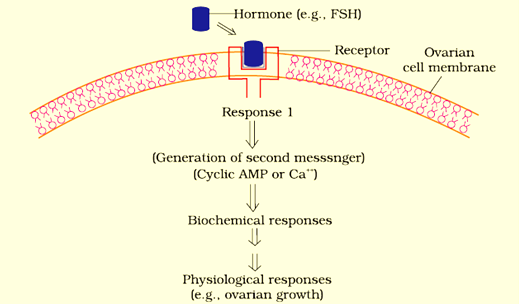
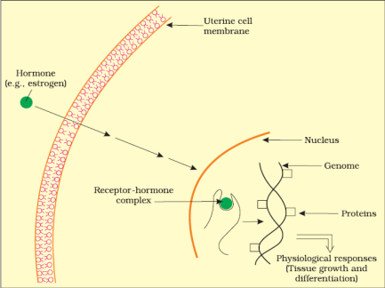
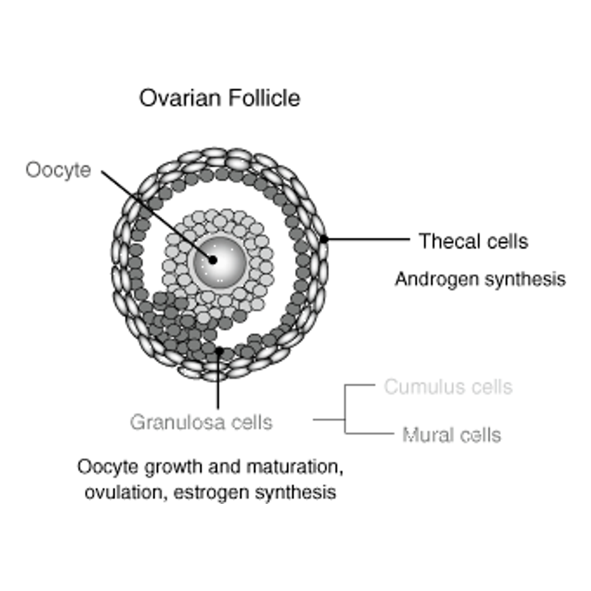

<h1 align=center> Neural Control and Coordination </h1>

- **Hormone**: it is a chemical that coordinates different functions in our body by carrying messages through the blood to the organs, skin, muscles and other tissues and tells what to do at what time. 
- **Endocrine Gland**: these are ductless glands that transfer hormone directly into the blood stream and uses blood circulation to send information all over the body. 
- **Exocrine Gland**: these are the glands that release substances through ducts onto the body surface both inside and outside. These include sweat, saliva, milk and digestive juices. 

## Categorization of Hormone 

1. **Peptide, Polypeptide, Protein hormones**: insulin, glucagon, pituitary hormones, hypothalamic hormones, etc. 
2. **Steroids**: cortisol, testosterone, estradiol, progesterone
3. **Iodothyronines**: Thyroid hormones 
4. **Amino-Acid derivatives**: Epinephrine

### What are Hormones? 

These are chemicals that are non-nutritive in nature and send signals throughout the body maintaining balance and growth throughout. Mostly secreted by endocrine glands and changes the body internally and externally. Deficiency or excessiveness may lead to deformities which are hard to treat. 

# Human Endocrine System 

- **Brain**
    - **Hypothalamus**: control heart rate, blood pressure and body temperature. 
    - **Pineal Gland**: secretes melatonin which controls the circadian rhythm. 
    - **Pituitary Gland**: monitors and regulates bodily functions through hormones. 
- **Neck** 
    - **Thyroid Gland**: regulates metabolic rate, growth and development.
    - **Parathyroid Gland**: regulates amount of calcium and magnesium in bones and blood by Parathyroid hormone (PTH)
- **Chest (sternum)**
    - **Thymus**: production and maturation of immune cell (lymphocytes)
- **Abdomen**
    - **Pancreas**: produce insulin to regulate blood sugar level. 
    - **Adrenal Gland**: regulate metabolism, immune system, blood pressure, response to stress, etc. 
- **Groin**
    - **Testis (male)**: produces testosterone to regulate sex drive, bone mass, fat distribution, muscle mass, strength, RBC (red blood cell) and sperm production. 
    - **Ovary (female)** produces hormones to control menstrual cycle and pregnancy and secondary sexual characteristics, i.e., breast formation, endometrium (inner lining of uterus) formation, regulation of menstrual cycle, development of ovarian follicles, mammary gland development, milk secretion. 

# Mechanism of Hormone Action 

## Peptide Hormones

Hormones bind to specific proteins called **hormone receptors**; these are target tissue specific. 

 

- Types of Hormone Receptors 
    - **Membrane-bound Receptor**: hormone receptors are present on the cell membrane. 
    - **Intercellular Receptor**: horomone receptors are present inside the cell. 

**Binding of horomone to horomone receptor forms Hormone-Receptor Complex.** Then its formation leads to biochemical changes to the target tissue. 

In the diagram, FSH (Follicle-stimulatin hormone) is taken which bounds with the receptor on ovarian cell membrane which leads to the formation of a **biochemical response** called `Response 1` which **generates a secondary messenger** which triggers an important biochemical response which leads to physiological response. 

## Steroid Hormone 

- These hormones don't have any receptor and directly go inside the nucleus by penetrating the cell membrane (uterine cell membrane in the diagram's case) and nuclear membrane. 

Upon entering the cell nuclear membrane, it forms horomone-receptor complex and transfers that data into genome (DNA instructions found inside the cell) and produces mRNA to form a protein which results in physiological responses. 

# Ovary 

- Located in the abdomen
- Primary female sex organ 
- Produces one ovum per menstrual cycle 
- Composed of oivarian follicles and stromal tissues

  

- Hormones produced 
    - **Estrogen**: development of secondary female sexual characteristics.
        - Produced by growing ovarian follicles.
    - **Progesterone**: prepares endometrium for implantation and growth of fertilized egg. 
        - Secreted by **Corpus Luteum**, formed by the repture of ovarian follicle.

  

- Estrogen
    - Stimulates growth and activity of secondary sex organs
    - Development of growing ovarian follicles 
    - Appearance of female secondary sex characteristics
    - Mammary gland development
    - Regulate femalel sexual behavior
- Progesterone 
    - Support pregnancy 
    - Stimulates formation of alveoli (for milk production)
    - Milk secretion

Luteinizing hormone (LH) helps to **rupture graafian follicle** and **release ovum**.

- Graafian Follicle converts into 
    - Ovum 
    - Corpus luteum 

  

- If endometrium wall is degenerated, it leads to miscarriage

# Testis 

- Present in **Scrotal sac**
- Performs dual function 
    - Sex organ 
    - Endocrine gland 

- Androgen produces testosterone
    - Forms spermatogonia to produce sperm (spermatogenisis)
    - Contains secondary sexual characteristics 

> Sperms are secreted by testis. 

- Hypothalamus (GnRH)
    - Pituitary Gland 
        - Ledig cell produce androgen which leads to speamatogenesis (LH)
        - Sertoli cell is in factor starts spermiogenesis (LSH)

> Generally sex hormones are steroidal 

# Thymus 

It is lobular structure present between lungs behind sternum.  
Its size is maximum during puberty and slowly detoriates with age, thus reducing immunity. 

> Components of bloods are formed mainly in the bone marrow. 

- Thymus plays important role in development of immunity. 
- Lymph is responsible for exchange of tissues since blood is not in direct contact with tissues. 

  

- **Bone marrow and thymus** are the **primary lymphoid organs**

T-cells are matured in thymus.  
Therefore, thymosin is very important for its development. 

AIDS destroys the T-cells and without it, B-cells cannot make antibodies. 

- Spread of HIV 
    - Blood transfusion 
    - Unprotected sex 
    - Intravenous infusion

# Pineal Gland 

- Present in dorsal side of brain. 
- Contains **circadian rhythm** (biological clock)
    - By **melatonin**

Other functions 
- Skin pigmentation 
- Controls menstrurations cycle
- Maintain body temperature 

If circadian rhythm is disturbed, it leads to physiological changes because human are not adapted to be nocturnal. 
