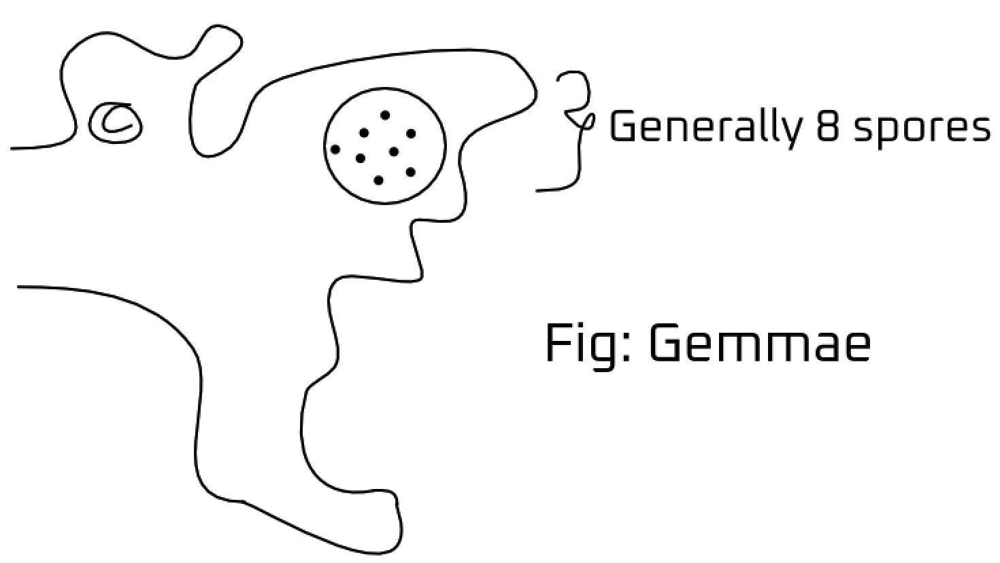
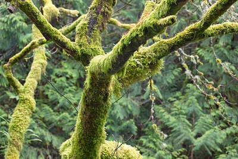
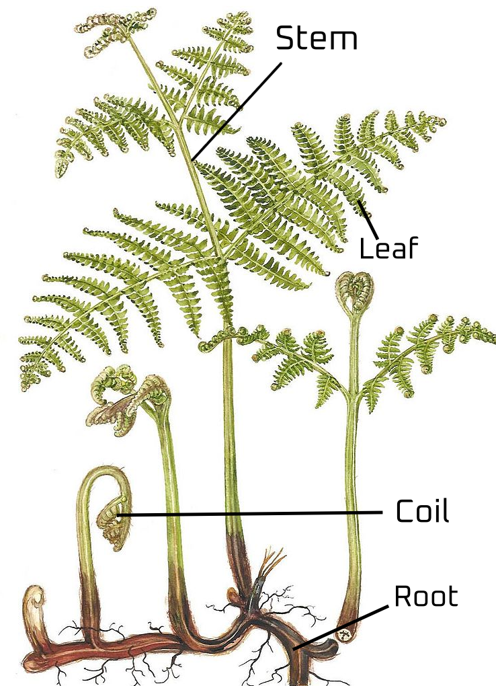
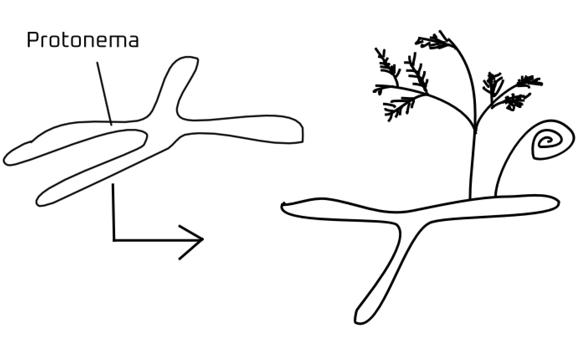

- [1. 20/06/23](#1-200623)
- [2. 01/08/23](#2-010823)
- [3. 02/08/23](#3-020823)
  - [3.1. Divisions of algae](#31-divisions-of-algae)
    - [3.1.1. Chlorophyta](#311-chlorophyta)
    - [3.1.2. Phaeophyta](#312-phaeophyta)
    - [3.1.3. Rhodophyta](#313-rhodophyta)
- [4. 07/08/23](#4-070823)
    - [4.0.1. Q1/ Describe the pigmentation in algae.](#401-q1-describe-the-pigmentation-in-algae)
    - [4.0.2. Q/ Discuss the reserve food material present in algae.](#402-q-discuss-the-reserve-food-material-present-in-algae)
    - [4.0.3. Q/ Mention the economic importance of algae](#403-q-mention-the-economic-importance-of-algae)
    - [4.0.4. Q/ Describe the reproduction in algae.](#404-q-describe-the-reproduction-in-algae)
- [5. 08/08/23](#5-080823)
  - [5.1. Bryophyta](#51-bryophyta)
  - [5.2. Bryophyta offsprings](#52-bryophyta-offsprings)
    - [5.2.1. After the two gametes fuse](#521-after-the-two-gametes-fuse)
  - [5.3. Moss](#53-moss)
  - [5.4. Liverwort](#54-liverwort)
    - [5.4.1. Gemmae](#541-gemmae)
- [6. 09/08/23](#6-090823)
- [7. 14/08/23](#7-140823)
  - [7.1. Random facts](#71-random-facts)
- [8. 16/08/23](#8-160823)
  - [8.1. Ptridophyte](#81-ptridophyte)
- [9. 22/08/23](#9-220823)
  - [9.1. Fern](#91-fern)
- [10. 23/08/23](#10-230823)
  - [10.1. Gymnospermae](#101-gymnospermae)
- [11. 25/08/23](#11-250823)
  - [11.1. Gymnosperm](#111-gymnosperm)
  - [11.2. Extra questions](#112-extra-questions)
- [28/08/23](#280823)

# 1. 20/06/23

Carl Linnaeus started studying plants based on mode of reproduction by flowers.

Bentham and Hooker divided Plant Kingdom into two divisions: Cryptogamia (non-flowering plants) and Phanerogamia (flowering plants)

Plants were first classified based on the morphology and anatomy and then later classified based evolutionary relationship called Phylogenetic relationship.

Chemotaxonomy: clasisfication based on chemicals present.
Cytotaxonomy: classified based on cell features
Numerical taxonomy: clasisfication with the help of computers

# 2. 01/08/23

Fungus: chitin, heterotroph
Algae: cellulose, autotroph

Algae generally requires water to survive


- Algae:
  - Green Algae (Chlorophyta)
  - Red Algae (Rhodophyta)
  - Brown Algae (Phaeophyta)
  - Diatoms (Bacillariophyta)
  - Dinoflagellates (Dinophyta)
  - Euglenophytes (Euglenophyta)
  - Blue-Green Algae (Cyanobacteria)


Colony of Chlamydomonas forms a piliminary organism but its not multicellular because every cell is independent and eventually forms a volvox

- Volvox is almost multicellular because it has some specialized cells and lives in colonies.

All chlophyll having algae are green but the form of chlorophyll is different.

- Importance of algae:
  - Food and Nutritional Supplements
  - Aquaculture and Animal Feed
  - Biofuel Production
  - Pharmaceutical and Biotechnology
  - Wastewater Treatment
  - Cosmetic and Personal Care Products
  - Agriculture and Fertilizers
  - Bioremediation and Carbon Sequestration
  - Algal Biomass and Bioproducts
  - Tourism and Aquatic Recreation

<br>

- Downsides of algae:
  - Algal Blooms
  - Toxicity
  - Contamination of Water Supplies
  - High Cost of Cultivation and Harvesting
  - Competition with Native Species
  - Variable Growth Rates
  - Challenges in Scaling Up
  - Processing and Extraction Difficulties
  - Limited Public Awareness
  - Land and Water Use

---

# 3. 02/08/23

```
Plantae
    Thallophyta (embryo absent)

    Embryophyta (embryo present)
        Bryophyta (vascular tissue absent)

        Tracheophyta (vascular tissue present)
            Pteridophyta (no flower, no seed)

            Spermatophyta (flowering plant with seed)
                Gymnospermae (naked seed, no fruit)

                Angiospermae (covered seed)
                    Monocotyledon (one seed leaf)
                    Dicotyledon (two seed leaf)
```

- Algae belongs to thallophyta
  - Thallos in latin means green shoot, young branch, twig

<br>

- Study of algae is called phycology

```
Father of phycology: F. E. Fritsch
Father of Indian phycology: Mandayam Osuri Parthasarathy Iyengar
```

- Basis of algal classification:
  - Pigment composition and body color
  - Nature and composition of reserved food materials
  - Flagellation

<br>

- Rhodophycae is found in warm regions
  - It can also survive in shallow and deep waters
  - Floridean starch is reserved.
    - Similar to amylopectin and glycogen.

<br>

- **Laminaria:** Reserved food is called laminarin reserves

---

## 3.1. Divisions of algae

### 3.1.1. Chlorophyta

- Similarities:
  - Habitat: Found in various aquatic environments, including freshwater and marine habitats.
  - Pigment: Contain chlorophyll a and b, giving them a green color.
  - Reproduction: Can reproduce both sexually and asexually.

<br>

- Differences:
  - Pigment Reserve: Store excess energy as starch.
  - Flagellation: Typically possess two flagella per cell.

### 3.1.2. Phaeophyta

- Similarities:
  - Habitat: Primarily found in marine environments, especially in colder waters.
  - Reproduction: Reproduce both sexually and asexually.

<br>

- Differences:
  - Pigment: Contain chlorophyll a and c, fucoxanthin, which gives them a brown color.
  - Pigment Reserve: Store excess energy as laminarin and mannitol.
  - Flagellation: Usually lack flagella.

### 3.1.3. Rhodophyta

- Similarities:
  - Habitat: Predominantly found in marine environments, ranging from shallow to deep waters.
  - Pigment: Contain chlorophyll a, phycocyanin, and phycoerythrin, giving them a red color.
  - Reproduction: Exhibit both sexual and asexual reproduction.

<br>

- Differences:
  - Pigment Reserve: Store excess energy as floridean starch.
  - Flagellation: Lacks flagella.

---

# 4. 07/08/23

### 4.0.1. Q1/ Describe the pigmentation in algae.

- There are three types of algae, i.e., Chlorophyceae, Phaeophyceae and rhodophyceae. They have their own pigments which carry out functions in their cells.
- **Chlorophyceae (green algae):** As by the name, it is obvious that his algae has chlorophyll as its major pigment which carry out photosynthesis. Namely, those are chlorophyll a and b which help to produce the organism's food as well as reserves.
- **Phaeophyceae (brown algae):** These algae have the fucoxanthin as its main pigment as well as chlorophyll a and c to help in photosynthesis.

- **Rhodophyceae (red algae):** These algae are red in color and have phycoerythrin as its main pigment but also has chlorophyll a and d to supplement in its photosynthesis.

### 4.0.2. Q/ Discuss the reserve food material present in algae.

- Chlorophyceae has startch as their reserves which is a proof that it primaily uses chlorophyll to produce food.
  - Phaeophyceae have mannitol and laminarin which are the products of stored complex carbohydrates.
- Rhodophycae have floridean starch as its reserves which is the mixture of carbohydrates which is very similar to amylopectin and glycogen in structure.

### 4.0.3. Q/ Mention the economic importance of algae

- The Economic importance of algae are as follows:
  - Species of porphyra, Laminaria and Sargassum are used as food.
  - Certain Rhodophyceae and Phaeophyceae in water bodies produce oxygen and in large amounts if they are in ocean.
  - Agar, an important commercial product used in microbial culture and production of ice-cream and jellies is derived from Gelidium and Gracilaria.
  - Chlorella is a source of protein dnad is used to make protein supplements for consumption even by astronauts.
  - Many species of algae usually interfere in agriculture and their overconcentration causes the formation of algal blooms.

### 4.0.4. Q/ Describe the reproduction in algae.

- Algae reproduce through fragmentation, where a piece of the parent algae breaks off and grows into a new individual.
- Asexual spores are also a common means of reproduction in algae. They are produced by algae, forming identical daughter cells that can disperse and develop into new organisms.
- Some algae undergo sexual reproduction. Specialized structures produce haploid gametes that fuse during fertilization, forming diploid zygotes. These zygotes then develop into new multicellular algae.

---

# 5. 08/08/23


- Laminaria can grow more than 100 m below seabed.

<br>
<br>
<br>
<br>
<br>
<br>
<br>

## 5.1. Bryophyta

- Similar root, leaves and stem like structures like in higher plants.
  - They are not true because they lack vascular bundle.

<br>

- Has single cell and multicell structures.
- Bryophyte is the **only amphibian group in plant Kingdom**.

**Amphibian:** initial part started in water but ended life on land. Eg: frog, dragonfly, etc.

`Male frog shouts to call for female for mating.`

- Amphibians go through metamorphosis
  - **Metamorphosis:** complete change

```
Indirect development: young one is different from the adult
Direct development: young one is similar to the adult.
```

- Bryophyta needs water for reproduction.

## 5.2. Bryophyta offsprings


### 5.2.1. After the two gametes fuse


## 5.3. Moss


- **Sporophyte:** Diploid
- **Gametophyte:** Haploid

- Protonema is found in the sporophyte section and is diploid.

- Features
  - They are non-vascular
  - Small in size
  - Anchor themselves by rhyzoids
  - Needs moisture for reproduction
  - Reproduces by spores
  - Found in forests, wetlands, bogs, rocks and damp urban areas.

<br>
<br>

## 5.4. Liverwort

- Comes under Bryophyte
- Reproduction same as moss and Bryophyte

### 5.4.1. Gemmae



Asexual reproduction takes place through fragmentation of thalli by the production of gemmae.

- Gemmae are green, multicellular and asexual spores.

- Economic importance

  - Helps in formation of forests

- Crustose lichen grows on rocks

Humus: dead and decaying matter that helps in plant formation.

---

# 6. 09/08/23

- Bryophyte is found in damp and shady areas.
  

- Moss grows in damp areas and walls.

- Liverwort is found in soil.

- Under suitable conditions, moss can make a carpet on surfaces like on trees and floor.
  

- Peat is formed when biomass (moss and trees) are buried in soil.

- Moss and other bryophyte spores can survive and again germinate in moist conditions.

- _Tinospora cordifolia_ (heart-leaved moonseed/giloy) has chlorophyll in its roots.




_Pteridophyta selaginella_ has true roots in its genus.

---

# 7. 14/08/23

## 7.1. Random facts

**Bryophyte:** Coined by Robert Brown in 1864

**Father of bryophyte/Bryology:** German botanist, **Johanne Hedwig**

**Father of India Bryology:** Shiv Ram Kashyap

- There are around 20,000 species of Bryophyte.

# 8. 16/08/23

## 8.1. Ptridophyte


> It is the first terrestrial plant with complete vascular bundle.

- Fern Types:
  - Fern
  - Fern-alyse
  - Tree fern

> Tree fern is also called a living fossil.  
> _Nepenthes khasiana_ is endengered and endemic species of pitcher plant native to the **Khasi Hills**  
> **Salvinia** is also called aquatic fern  
> **Equisetum** (horsetail) is found in sandy areas near river banks.

- Plucking horsetail leaves make a ticking sound.
- Equisetum has homospores
  - Homospores = similar sized spores

**Heterospore** = different sized spores. Eg- selaginella 



- Fern has true roots, stems and leaf because they have vascular bundle.
- Circinate vernation (coiling) is a key feature of **Fern**

- Types of leaves 

  - Iso-bilateral
  - Dorsi-ventral leaf

- Mature fern leaves have deep brown or deep green color.
- Spore bearing leaf = sporophyll

# 9. 22/08/23

## 9.1. Fern

Plant body (sporophyte) is prominent  
Gametophyte is prominent in bryophyte

Big spores are female; small spores are male  
These are called heterospore

Higher plants are descendant of ptridophyte  
Since, it has spores for reproduction.

Ovary -> fruit  
Ovule -> seed

Heterosporic condition is the start of seed forming.  
Heterosporic is the precursor to seed habit.

Seed habit: mode of sexual reproduction

- Ptridophyte economic importance
  - Ornamental Plants
  - Medicinal Uses
  - Food source
  - Horticulture and Landscaping
  - Environmental Indicators
  - Traditional Crafts
  - Pharmaceutical Research
  - Soil Improvement
  - Education and Research


Antheridium required moisture for growth


Archegonia = egg bearing structure (female character)

After the fern zygote matures, it transforms into a structure called Protonema which grows into fern.

The gametes fall to the ground and forms a zygote that further grows to form protonema

Embryophytic evolution: Embyophytic evolution is the process where plants evolved from water to land, developing features like embryos, roots, and protective layers to survive on land.

Osmunda fern is found in Elephants waterwalls and the whorl of leaves is similar to that of flower but isn't.

# 10. 23/08/23

## 10.1. Gymnospermae

- _Pinus khasian_ is found in the khasi hills

> Christmas tree is in the genus Pinus

Ovule in gymnosperm constains archegonia  
Ovary is absent

Male cone produces pollen (almost similar to angiosperm)

- Sulphur shower: a shower of yellow pollen often seen in spring that is carried by the wind from conifers

Gymno: naked  
Sperm: seed

Direct seed is formed in gymnosperm

> Gymnosperm only has trees and shrub
> Has no herbs

Anatomy: study of internal organs and structures

- Gymnosperm has a definite and defined vascular bundle.

# 11. 25/08/23

## 11.1. Gymnosperm

Pinus khasiana is found in the Khasi hills.

- Christmas tree is also in the genus Pinus.
- Ovule in gymnosperm contains archgonia.
  - Ovule is absent
- Male produces pollen grains (similar to angiosperm)

**Sulphur shower:** large release of pollen grain often in spring from cornifers (pines)

Seed is formed directly in gymnosperm.

Gymnosperm has only trees and shrub.  
Has no herbs.

Phloem: sieve tubes, companion cells, phloem fibres, phloem parenchyma  
Xylem: trachieds, vessels, xylem parenchyma, xylem fibres.

- All four components of xylem or phloem may not be present in gymnosperms

**Xaerophyte** grows in dry conditions (cactus)

- Gymnosperms (mostly) have modified leaves and show xaerophytic characters.

## 11.2. Extra questions

Q/ Differences on vascular tissue of gymnosperms and angiosperms.

| <center> Gymnosperm                                                                                                   | <center> Angiosperm                                                                                        |
| --------------------------------------------------------------------------------------------------------------------- | ---------------------------------------------------------------------------------------------------------- |
| 1. Generally lack vessel elements, which are specialized cells for water conduction in angiosperms.                   | 1. Possess vessel elements, larger and more efficient for water transport due to perforation plates        |
| 2. Main water-conducting cells, with tapered ends and overlapping cell walls.                                         | 2. Present in addition to vessel elements, especially in some primitive angiosperms                        |
| 3. Lack fibers in their xylem, which provide mechanical support in angiosperms.                                       | 3. Often have fiber caps on top of vessel elements, providing structural support.                          |
| 4. Lack true sieve tube elements, responsible for food (sugar) transport, and companion cells present in angiosperms. | 4. Contain sieve tube elements responsible for food transport, accompanied by specialized companion cells. |
| 5. Often have resin canals for defense and storage of resinous compounds                                              | 5. Generally lack resin canals; instead, produce latex in laticifers for defense and storage.              |

Q/ Differences betweeen dicot and monocot.

|<center> Dicot|<center> Monocot| 
|-|-| 
|1. The have 2 cotyledons | 1. They have one cotyledon| 
|2.  They have reticulate venation. |2. They have parallel venation.|
|3. Often taproot system with a main root and lateral roots.|3. Generally fibrous root system without a dominant main root|
|4. Floral parts often in multiples of four or five.|4. Floral parts often in multiples of three|
|5. Stomata are usually scattered on the leaf surface.| 5. Stomata are usually arranged in a regular pattern on the leaf surface.|

Q/ Differences between gymnosperm and angiosperm. 

|<center> Gymnosperm|<center> Angiosperm|
|-|-|
|1. Seeds are naked (not enclosed in fruit).| 1. Seeds are enclosed in fruits.| 
|2. Cones are the reproductive structures. | 2. Cones are the reproductive structures| 
|3. Lack vessel elements in their xylem. | 3. Have vessel elements in their xylem for efficient water transport.| 
|4. Lack true flowers and fruits.|4. True flowers and fruits are characteristic.|
|5. Needle-like or scale-like leaves common.|5. Broad, diverse leaf shapes and sizes.|
|6. Sporophyte is the dominant life stage.|6. Gametophyte is the dominant life stage.|

Q/ Heterosporus is a precursor to the seed habit considered an important evloution. Give reason.

Heterospory's two spore types (microspores, megaspores) reduced water reliance, protected embryos, aided nutrient supply, enabled dispersal, dormancy, and an independent sporophytic life cycle, crucial for seed habit evolution.

# 28/08/23 

**Higher plants:** diploid  
**Lover plants:** haploid 

**Haplo-diplontic life-cycle:** equal lengths of alteration in haploid and diploid life cycle. 

Ptridophyte has haplo-diplontic type life-cycle 

- **Moss life cycle**
  - Spores from sporophyte capsule germinate into protonema, producing male and female gametophytes. Sperm from antheridia fertilizes egg in archegonia, forming sporophyte atop gametophyte.

<br>

- **Pteridophyte life cycle**
  - Spores disperse from sporangia on sporophyte, grow into gametophyte. Sperm from antheridia fertilizes egg in archegonia on gametophyte, leading to sporophyte development.

<br>

- **Bryophyte life cycle**
  - Spores from sporophyte capsule develop into male and female gametophytes. Sperm from antheridia fertilizes egg in archegonia, forming sporophyte attached to gametophyte.

