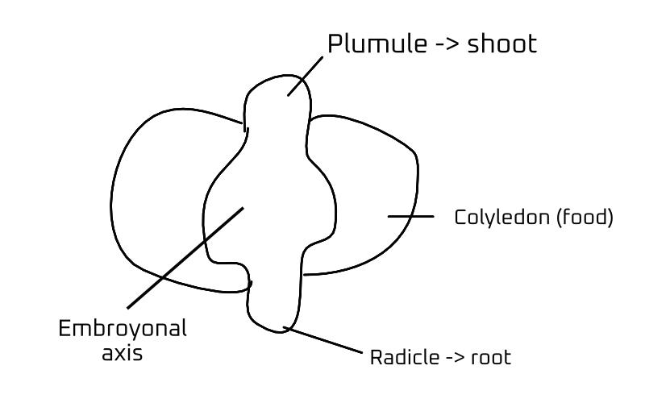
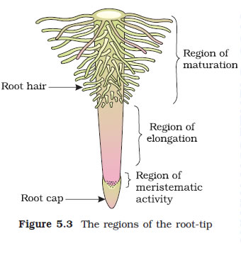
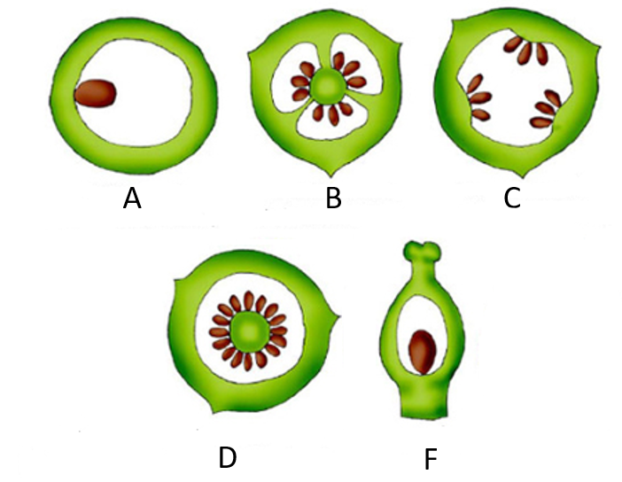
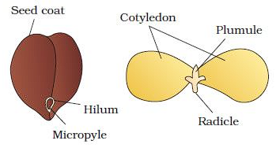
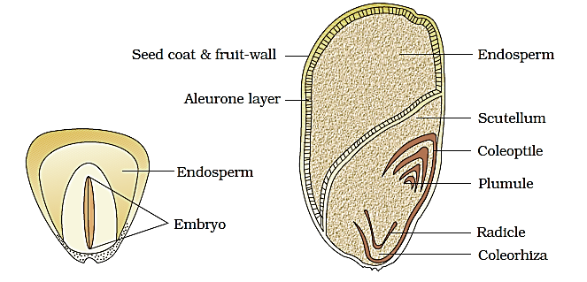
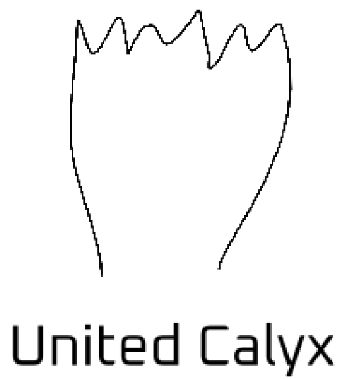
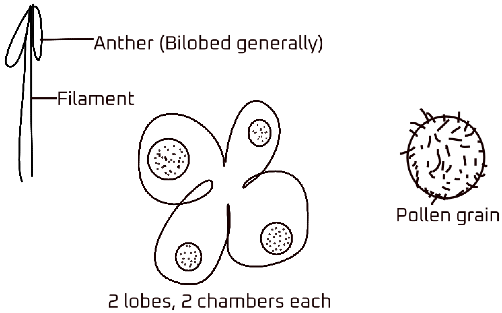
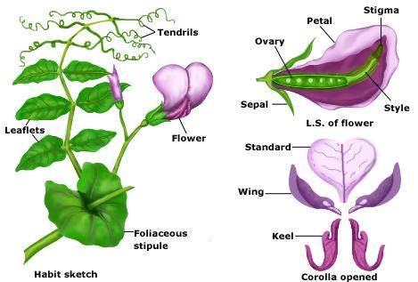
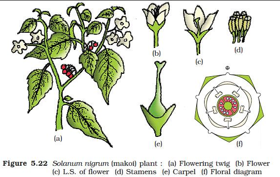
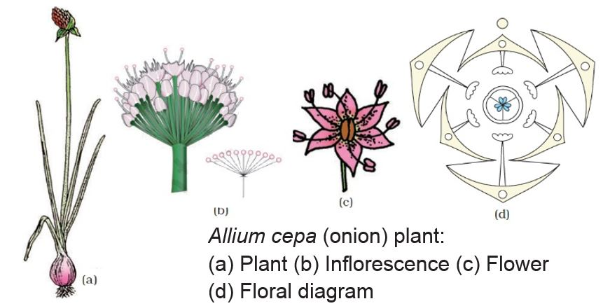

- [Introduction](#introduction)
  - [The Root](#the-root)
  - [Regions of Root](#regions-of-root)
  - [Stem](#stem)
- [Leaf](#leaf)
- [Venation](#venation)
- [Types of Leaves](#types-of-leaves)
- [Phyllotaxy](#phyllotaxy)
  - [Inflorescence](#inflorescence)
  - [The Flower](#the-flower)
- [Parts of a Flower](#parts-of-a-flower)
  - [Calyx](#calyx)
  - [Corolla](#corolla)
    - [Aestivation](#aestivation)
  - [Androecium](#androecium)
  - [Gynoecium](#gynoecium)
    - [Placentation](#placentation)
- [The Fruit](#the-fruit)
  - [Edible Part of Fruit](#edible-part-of-fruit)
- [The Seed](#the-seed)
  - [Structure of Dicotyledonous Seed](#structure-of-dicotyledonous-seed)
  - [Structure of Monocotyledonous Seed](#structure-of-monocotyledonous-seed)
- [Symmetry](#symmetry)
- [Floral formula](#floral-formula)
- [Ovary](#ovary)
- [Calyx (K)](#calyx-k)
- [Corolla $(C)$](#corolla-c)
- [Androecium $(A)$](#androecium-a)
- [Gynoecium $(G)$](#gynoecium-g)
- [Fabaceae](#fabaceae)
- [Solanaceae](#solanaceae)
  - [Liliaceae](#liliaceae)


# Introduction 
- **Morphology**: physical characteristics/external observable features 

## The Root 


- Types of root: 
  - **Taproot:** root system where a central, dominant root grows downwards.  
  - **Fibrous:** branched roots that grow without any order.  
  - **Adventitious root:** a root that forms from non-root tissue (radicle). 

> [!NOTE]
> 1. Taproot and fibrous roots grow from radicle.  
> 2. Adventitious roots don't develop from the seed's radicle.

> [!IMPORTANT]
> **Fibrous root:** monocot 
> **Taproot:** dicot

Primary root persistent - taproot  
Primary root replaced - fibrous root  
Other than root - adventitious root  

## Regions of Root 


1. The Apex of the root is covered with a **root cap** which protects the root when it penetrates the soil.  
2. Above a few centimeters, there is the **region of meristematic activity** consisting of small, thin-walled cells with thick protoplasm that divides rapidly.  
3. The above region undergoes rapid elongation and enlargement and is called the **Region of elongation**  
4. Above it, there is the **Region of Maturation** where epidermal cells develop fine hair structures that absorb water and minerals from the soil. 

<br>

> [!NOTE] 
> Asparagus, raddish, carrot, sweet potato have modified root for storage of food. 

<br>


- **Epiphyte**: a plant that grows on another plant, especially one that is not parasitic but only relies on support. E.g.- orchid. 

<br><br><br><br><br><br>


- Epiphytes
  - Found in Tropical regions 
  - Adapted to capturing nutrients from air, rain and decaying organic matter
  - Takes support from the host and does not harm it. Therefore, not parasitic. 
  - Adapted to various light levels

## Stem 
> [!NOTE]
> 1. Develops from plumule
> 2. Ascending part bearing branches, leaves, flowers and roots. 
> 3. Bears **nodes and internodes**

- Always negatively geotropic and positive phototropism 
- **Important parts**: Node, Internode 

> [!NOTE]
> - Palm trees and bamboo have prominent nodes and internodes 
> - For the development of leaves and roots, a nodal portion is required. 
> - One nodal and internodal portion inside the soil and another outside.  


- Functions: 
    - Support 
    - Photosynthesis 
    - Vegetative propagation
    - Transport
    - Storage 
    - Lateral growth 
    - Defense 
    - Climbing and support structures 


- Bougainvillea: 
    - Flower is paper-like
    - Stem have thorns 

A Potato is a modified stem inside the soil. 


- Water hyacinth is also known as Terror of Bengal 
- Water hyacinth is an exotic plant; now an invasive species
- Reproduces by a modified stem called offset which fragments away. 

<br>

- Consequences: 
  - Rapid growth of hyacinth 
  - Habitat alteration 
  - Decreased biodiversity 
  - Impaired waterways 
  - Clogged water intakes 
  - Water stagnation 

# Leaf

> [!NOTE]
> - Leaves are developed from leaf primordia (appendages from the stem)


- Citronella leaf is sharp, i.e., an example of leaf modification

- Functions: 
  - Photosynthesis
  - Gas exchange
  - Transpiration
  - Storage
  - Protection
  - Shade and insulation
  - Attracting pollinators
  - Environmental indicators

> [!IMPORTANT]
> Dorsal - upper - chloroplast  
> Ventral - lower - stomata  

- Mesophyll cell: 
  - Spongy mesophyll 
  - Palisade mesophyll

- Types of leaves 
    - **Simple**: consists of a single lamina and is not divided into smaller leaflets
    - **Compound**: a leaf in which the blade is divided to the midrib, forming two or more distinct blades or leaflets on a common axis 


# Venation
> [!NOTE]
> Venation = network of veins

- Types of Venation:
    - Reticulate 
    - Parallel 


> [!IMPORTANT]
> Monocot has parallel venation  
> Dicot has reticulate venation 

> [!IMPORTANT]
> Monocot - not woody  
> Dicot - woody 

> [!NOTE]
> Woody means the stem that shows the growth of the xylem and phloem, i.e., the secondary growth of the plant. 

> [!CAUTION] Note
> Vascular bundle: xylem and phloem. 

- Inside: xylem 
- Outside: phloem

# Types of Leaves 
- **Pinnately Compound leaf:** A leaf that is divided into smaller leaflets, those leaflets arranged on each side of the leaf's central stalk/rachis (axis).
- **Palmately Compound leaf:** A palmately compound leaf has its leaflets radiating outwards from the end of the petiole, like fingers off the palm of a hand.


# Phyllotaxy

- Types:
  - Alternate
  - Opposite
  - Whorled 


- The Pitcher plant has a modified leaf in the form of a pitcher. 

- **Petiole**: a slender stem that supports the blade of a foliage leaf
  - The Petiole gets flattened and forms a leaf. 
  - Eg- australian acacia 

## Inflorescence 

> [!NOTE]
> Marigold: many flowers (cluster)  
> Hibiscus: one flower (individual)

- Flower: unit of sexual reproduction 

- Types of Inflorescence: 
    - **Racemose**: floral axis keeps growing 
    - **Cymose**: floral axis terminates to flower 

Generally, flower grows on axial sides 

|  |  | 
|:-:|:-:| 
| Also called indefinite or indeterminate inflorescence. | Also called determinate inflorescence. | 

## The Flower
- Parts of floral appendages: 
    - Sepal: Calyx $(K)$
    - Petal: Corolla $(C)$
    - Anther: Androecium $(A)$
    - Pistil: Gynoecium $(G)$

<br>

- Unisexual flower: has either male/female reproductive organs
    - Eg: Papaya, Coconut flower, Cucumber, Watermelon, White mulberry, Cucumber Maize, Castor bean, Musk melon, Snake gourd, and Tapioca

- Bisexual flower: has both reproductive organs 
    - Eg: Rose, Lily, Tulip, Mustard, Tomato, Hibiscus, Country bean, Brinjal, Mango, and Sunflower
<br>

> [!NOTE]
> Bisexual flowers are also called **hermaphrodite flower**


> [!IMPORTANT]
> - Incomplete flower: mising appendages 
> - Complete flower: has all appendages

```
Trimerous: Floral appendages multiple of 3 
Tetramerous: floral appendages multiple of 4 
Pentamerous: floral appendages multiple of 5 
```

> [!IMPORTANT]
> - **Trimerous flower** is a character of **monocotyledon plant** 
> - **Tetramerous and Pentamerous** is a character of **dicotyledon plant** 

# Parts of a Flower 

## Calyx 
The outermost whorl of the flower and the members are called sepals. Generally green, left life and protects the flower in the bud stage. Maybe gamosepalous (united) or polysepalous (free sepals).

## Corolla 
Composed of petals. Usually bright colored to attract insects for pollination. May be gamopetalous (free petals) or polysepalous (free petals). Shapes vary: tubular, bell-shaped, funnel-shaped, wheel-shaped. 

### Aestivation


- **Aestivation**: arrangement of floral appendages on the thalamus

- 4 arrangement: 
  - **Valvate:** petal margins contact each other without overlapping
  - **Twisted:** one petal margin overlaps the next petal 
  - **Imbricate:** petals overlap without clear direction 
  - **Vexillary:** a distinctive arrangement in which one giant petal covers the other smaller petals 

## Androecium
Composed of stamens. It represents a male organ consisting of a stalk or filament and an anther. Usually bilobed and has 2 chambers called pollen-sacs. 

## Gynoecium 
Made up of one or more carpels. The carpel consists of 3 parts- stigma, style and ovary. Each ovary bears one or more ovules attached to a flattened, cushion-like placenta. 

Stamen can be united into **one bundle (monadelphous), 2 bundles (diadelphous) or more than 2 bundles (polyadelphous)**. There may be variations in the length of filaments within a flower. 

### Placentation 


- Arrangement of the ovule 

- Types:
  - **Marginal:** The placenta forms a ridge or margin along the ventral suture of the ovary
  - **Axile:** The placenta is axial and the ovules are attached to it in a multilocular ovary
  - **Parietal:** ovules develop on the inner wall of the ovary
  - **Free central:** ovules cluster freely around a columnlike central placenta
  - **Basal:** The placenta gets developed on the base of the ovaries in which the single ovule has been attached

# The Fruit

- Fruit is the **seed-bearing structure** in flowering plants that is formed from the ovary after flowering.

- Ovules become seed

| Type        | Description               | Example                     |
| ----------- | ------------------------- | --------------------------- |
| True Fruit  | Develops from ovary       | Mango, Coconut              |
| False Fruit | Develops other than ovary | Apple, Date, Elephant apple |

> [!IMPORTANT]
> **Parthenocarpic Fruit:** develops without fertilization. Eg- banana

> [!NOTE]
> The fruit that can form without fertilization is called **parthenocarpic fruit**. An example of this is banana.

## Edible Part of Fruit 
Generally, fruits consist of a wall called **pericarp** and seeds. Pericarp can be dry of fleshy. 

- When Pericarp is fleshy, 
  - **Outermost**: Epicarp 
  - **Middle**: Mesocarp 
  - **Innermost**: Endocarp 

> [!NOTE]
> The fleshy fruits that contain a seed are called **drupe**s. The develop from **monocarpelary superior ovaries** and are **one seeded**. 

- The sclerenchymatous mesocarp of coconut is fibrous for protection. 

# The Seed 
Seeds are developed from fertilized ovules. A seed is made up of a **seed coat and an embryo**. The Embryo is made up of a **radicle, an embryonal axis and one or two cotyledons**. 

## Structure of Dicotyledonous Seed 


The Seed coat is the outermost covering of the seed. 

- It has 2 layers
  - **Testa**: Outer layer 
  - **Tegmen**: Inner layer 

> [!IMPORTANT]
> **Hilum** is a scar on the seed coat through developing seed are attatched to the fruit. 

- Hilum has a small pore called the **micropyle** through which the pollen tube penetrates. 

> [!NOTE]
> Cotyledons are often full of reserve food materials. 

In seeds like castor beans, endosperm is formed from **double fertilization** and is a food-storing tissue, they are called endospermic seeds.  
Whereas in beans, chickpeas and peas, the endosperm is absent and are called non-endospermic seeds.  

## Structure of Monocotyledonous Seed 


Most monocot seeds are endospermic but some plants like orchids are non-endospermic. Cereal seeds have a **membranous seed coat** and are generally **fused with the endosperm**. The endosperm is **bulky and stores food**.

The outer covering of the endosperm is separated from the seed coat by a proteinous layer called **aleurone layer**. The embryo is **small** and **situated in a groove at one end of the endosperm**.

# Symmetry 
> [!IMPORTANT]
> **Bilatreal symmetrical (zygomorphic)**: Divided into two equal parts from one part  
> **Radial symmetrical (actinomorphic)**: can be divided into two parts from any point

Zygomorphic flower = $％$  
Actinomorphic Flower = $⊕$

# Floral formula 
$⊕$: radial symmetrical  
$％$: bilateral symmetrical

- Symbols: 
    - Calyx: $K$ 
    - Corolla: $C$ 
    - Androecium: $A$ 
    - Gynoecium: $G$ 

Bract present = bracteate (Br)<br>
Bract absent = ebracteate (Ebr)
<br>

- **Bract:** Scaly leaf-like structure

# Ovary

- **Hypogynous:** The ovary is above the other three appendages. E.g.- Mustard, brinjal, potato
- **Perigynous:** The ovary and other flower parts are at the same level. E.g.- peach, rose, plum
- **Epigynous:** The ovary is below other floral appendages. Eg- apple blossoms, rose flowers, cherry blossoms 

**Superior ovary:** all floral appendages are below the ovary. 

- **Epigynous:** $\overline{G}$
- **Hypogynous:** $\underbar{G}$ 

# Calyx (K)



**United sepals:** Gamosepalous  
**Free sepals:** Polysepalous 

- Generally green 
- **Function**: protect flower buds in the initial stages 

5 sepals = $K_{5}$  
Gamosepalous = $K_{(5)}$  
Polysepalous = $K_{5}$

$5$ in $K_{\text{5}}$ is the number of sepals.

# Corolla $(C)$

**Function:** attract pollinators  
**Individual=** petal 


**Free** = polypetalous  
**United** = Gamopetalous


Symbol =  $C$   
Number = $C_{\text{6}}$

Gamopetalous = $C_{(6)}$  
Polypetalous = $C_{6}$

# Androecium $(A)$



**Monadelphous:** all androecium are in one bundle.  
**Diadelphous:** stamens are divided into bundles of two  
**Polyadelphous:** stamens are divided into more than two bundles. 

> [!NOTE]
> Sterile stamen cannot produce viable pollen. 

- **Epipetalous:** androecium is attached to the petals  
- **Perianth:** used for undefined sepals and petals. 
  - Symbol: $P$

$A_{9+5+6}$  
The numbers below are bundle notations 

Diadelphous = $A_{(5+5)}$ 

**Epipetalous:** $\overgroup{CA}$  
**Epiphylus:** $\overgroup{PA}$

- **Perianth:**  is a characteristic of monocot

# Gynoecium $(G)$


**1 carpel** = monocarpelary  
**More than 1 carpel** = multicarpelary

- Hibiscus has 5 carpels. 

**Apocarpous**: one free carpel is present  
**Syncarpous**: carpels are fused

# Fabaceae 


$％⚥$ $K_{(5)}$ $C_{1+2+2}$ $A_{9+1}$ $\underbar{G}_{1}$  
> [!NOTE]
> It is a complete Flower

％ = It is zygomorphic (bilaterally symmetrical)  
⚥= Bisexual flower  
$K_{(5)}$ = Calyx has 5 petals and is united (Gamosepalous)  
$C_{1+2+2}$ = total 5 petals, polypetalous, vexillary aestivation  
$A_{(9)+1}$ = total 10 stamen, diadelphous  
$\underbar{G}_{1}$ = superior ovary, monocarpelary


# Solanaceae 


$⊕ ⚥$ $K_{(5)}$ $\overgroup{C_{(5)}{A}_{5}}$ $\underbar{G}_{(2)}$  
> [!NOTE]
> It is a complete flower 

$⊕$ = radial symmetrical, actinomorphic  
$⚥$ = Bisexual  
$K_{(5)}$ = 5 sepals, united, gamosepalous  
$\overgroup{C_{(5)}{A}_{5}}$ = Epipetalous; 5 petals, gamopetalous; 5 stamen  
$\underbar{G}_{(2)}$ = bicarpellary, syncarpous, superior ovary, hypogynous

- Pentamerous Flower 

## Liliaceae 


$Br$ $⊕ ⚥$ $\overgroup{P_{(3+3)}A_{3+3}}$ $G_{3+3}$
> [!NOTE]
> It is an incomplete flower

$Br$ = Bracted  
$⊕$ = Radial, actinomorphic  
$⚥$ = Bisexual  
$\overgroup{P_{(3+3)}A_{3+3}}$ = Epiphylus; Perianth; Diadelphous  
$G_{3}$ = Tricarpelary, united, syncarpous

- Trimerous flower; monocot