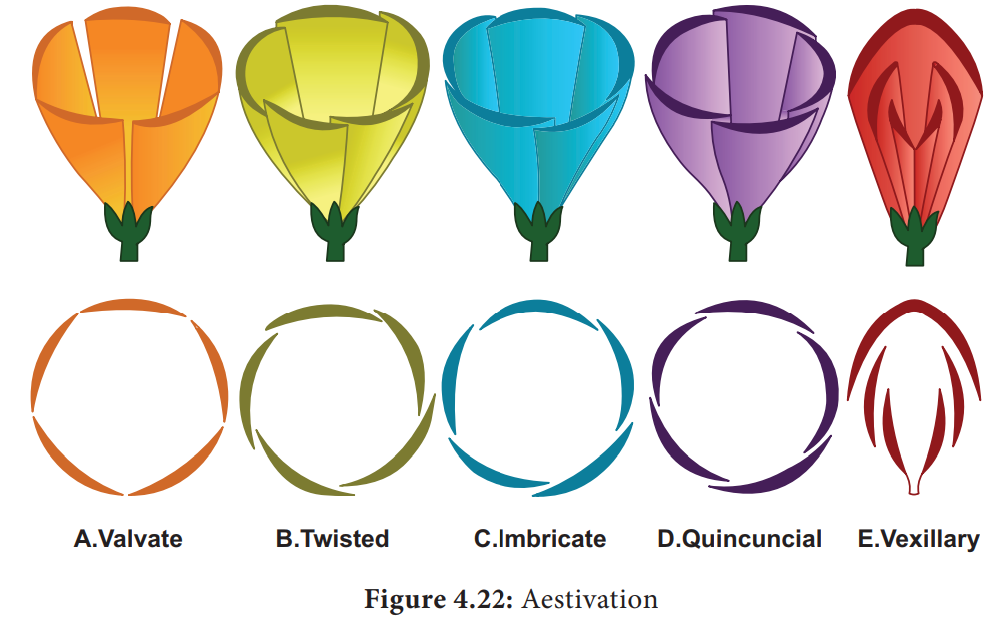
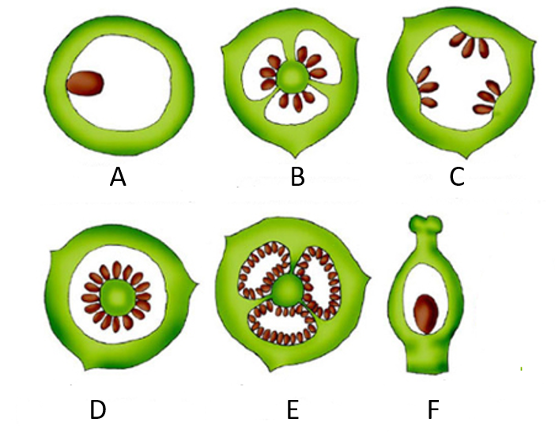

# Contents
### [01/07/23](#1723)

### [10/08/23](#10/08/23)


 
 
 
# 1/7/23 

Morphology: physical characteristics/ external observable features 

## Roots: 


Types of root: taproot, fibrous, adventitious root


Adventitious root don't develop from the seed's radicle 

## Crop root 

Develops from radicle: taproot and fibrous root 
Doesn't develop from radicle (other than radicle): adventitious root

Fibrous root: monocot 
Taproot: dicot 

---


# 3/7/23 

Primary root persistant - taproot 
Primary root replaced - fibious root 
Other than orrt - adventitious root 

## Regions of Root 


Asparagus, raddish, carrot, sweet potato have modified root for storage of food. 


Epiphyte: a plants that grows on another plant, especially one that is not parasitic but only relies on support. Eg- orchid. 


## Stem 

• Develops from plumule
• Ascending part 
• Always negatively geotrophic and positive phototropism 

Important part: Node, Internode 


• Palm trees and bamboo have prominent nodes and internodes 
• For development of leaves and root, nodal portion is required. 
• One nodal and internodal portion inside soil and another outside. 

Functions: 
    Support 
    Photosynthesis 
    Vegetative propogation
    Transport
    Storage 
    Lateral growth 
    Defence 
    Climbing and support structures 


Bougainvillea: 
    Flower is paper-like
    Stem has thorns 

Potato is modified stem inside the soil. 


• Water hyacinth is also known as Terror of Bengal 
• Water hyacinth is an exotic plant; now an invasive species
• Reproduces by modified stem called offset which fragments away. 

Consequences: 
    Rapid growth of hyacinth 
    Habitat alteration 
    Decreased biodiversity 
    Impaired waterways 
    Clogged water intakes 
    Water stegnation 


---


# 04/07/23 

## Leaf

Leaves are developed from leaf primordia (appendages from the stem)


• Citronella leaf is sharp, i.e., example of leaf modification

Functions: 
    Photosynthesis
    Gas exchange
    Transpiration
    Storage
    Protection
    Shade and insulation
    Attracting pollinators
    Environmental indicators

Dorsal - upper - chloroplast
Ventral - lower - stomata 

Mesophyll cell: 
    Spongy mesophyle 
    Palisade mesophyll

Types of leaves 
    Simple
    Compound 


• Venation - network of veins

- Types of Venation:
    - Reticulate 
    - Parallel 


Monocot has parallel venation 
Dicot has reticulate venation 

Monocot - not woody <br> 
Dicot - woody 

- Woody means the stem that shows the growth of xylem and phloem, i.e., the secondary growth of the plant. 

Vascular bundle: xylem and phloem. 

Inside: xylem <br>
Outside: phloem

Pinnately Compound leaf: A leaf which is divided into smaller leaflets, those leaflets arranged on each side of the leaf's central stalk/rachis (axis).
Palmately Compound leaf: A palmately compound leaf has its leaflets radiating outwards from the end of the petiole, like fingers off the palm of a hand.


## Phyllotaxy

Types:
    Alternate
    Opposite
    Whorled 


Pitcher plant has modified leaf in the form of a pitcher. 

Petiole: a slender stem that supports the blade of a foliage leaf
    > Petiole gets flattened and forms a leaf. 
    Eg- australian acacia 


---


# 03/08/23 

## Inflorescence 

Marigold: many flowers (cluster) <br>
Hibiscus: one flower (individual)

Flower: unit of sexual reproduction 

- Types of Inflorescence: 
    - Racemose: floral axis keeps growing 
    - Cymose: floral axis terminates to flower 

Generally, flower grows on axial sides 


- It is also called indefinite or indeterminate inflorescence


- It is also called determinate inflorescence


## The Flower

- Parts of floral appendages: 
    - Sepal: Calyx
    - Petal: Corolla 
    - Anther: Androecium 
    - Pistil: Gynoecium 

<br>

- Symbols: 
    - Calyx: K 
    - Corolla: C 
    - Androecium: A 
    - Gynoecium: G 

<br>

- Unisexual flower: has either male/female reproductive organs
    - Eg: Papaya, Coconut flower, Cucumber, Watermelon, White mulberry, Cucumber Maize, Castor bean, Musk melon, Snake gourd, and Tapioca

<br>

- Bisexual flower: has both reproductive organs 
    - Eg: Rose, Lily, Tulip, Mustard, Tomato, Hibiscus, Country bean, Brinjal, Mango, and Sunflower
<br>

Bisexual flower is also called hermaphrodite flower


- Incomplete flower: mising appendages 
- Complete flower: has all appendages

```
Trimerous: Floral appendages multiple of 3 
Tetramerous: floral appendages multiple of 4 
Pentamerous: floral appendages multiple of 5 
```

- Trimerous flower is a character of monocotyledon plant 
- Tetramerous and Pentamerous is a character of dicotyledon plant 

## Symmetry 

- Bilatreal symmetrical (zygomorphic): Divided into two equal parts from one part 
- Radial symmetrical (actinomorphic): can be divided into two parts from any point

## Floral formula 
- ⊕ = radial symmetrical 
- ％ = bilateral symmetrical

- Symbols: 
    - Calyx: K 
    - Corolla: C 
    - Androecium: A 
    - Gynoecium: G 

Bract present = bracteate (Br)<br>
Bract absent = ebsrateate (Ebr)
<br>

- **Bract:** Scaly leaf-like structure
 
---


# 10/08/23 

## Aestivation




- Aestivation: arrangement of floral appendages on the thalamus

- 4 arrangement: 
  - **Valvate:** petal margins contact each other without overlapping
  - **Twisted:** one petal margin overlaps the next petal 
  - **Imbricate:** petals overlap without clear direction 
  - **Vexillary:** distinctive arrangement in which one giant petal covers the other smaller petals

<br>
<br>

## Placentation 



- Arrangement of the ovule 


- Types:
  - **Marginal:** placenta forms a ridge or margin along the ventral suture of the ovary
  - **Axile:** placenta is axial and the ovules are attached to it in a multilocular ovary
  - **Parietal:** ovules develop on the inner wall of the ovary
  - **Free central:** ovules cluster freely around a columnlike central placenta
  - **Basal:** placenta gets developed on the base of the ovaries in which the single ovule has been attached

<br>
<br>
<br>

## The Fruit

- Fruit is the seed-bearing structure in flowering plants that is formed from the ovary after flowering

- Ovules becomes seed

| Type        | Description               | Example                     |
| ----------- | ------------------------- | --------------------------- |
| True Fruit  | Develops from ovary       | Mango, Coconut              |
| False Fruit | Develops other than ovary | Apple, Date, Elephant apple |

- **Parthenocarpic Fruit:** develops without fertilization. Eg- banana

## Edible Part of Fruit 

- The edible part of mango is called mesocarp

- Clerencymatous mesocarp of coconut is inedible 

- Endosperm of coconut is edible 

```
Epicarp: the outermost layer of the pericarp
Mesocarp: the middle layer of the pericarp of a fruit 
Endocarp: the innermost layer of the pericarp which surrounds a seed
```

- Coats of seed: 
  - Testa 
  - Tagmen