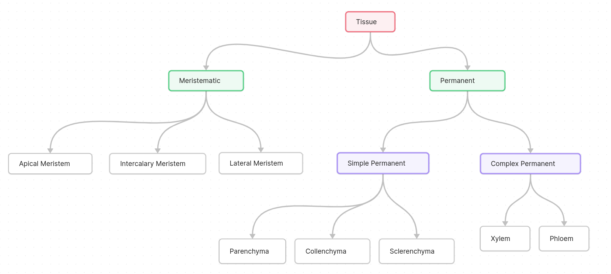

# Anatomy of Flowering Plants

- [Anatomy of Flowering Plants](#anatomy-of-flowering-plants)
- [Meristematic Tissue](#meristematic-tissue)
    - [Apical Meristem](#apical-meristem)
    - [Intercalary Meristem](#intercalary-meristem)
    - [Lateral Meristem](#lateral-meristem)
- [Permanent Tissues](#permanent-tissues)
  - [Simple Permanent Tissues](#simple-permanent-tissues)
    - [Parenchyma](#parenchyma)
    - [Collenchyma](#collenchyma)
    - [Sclerenchyma](#sclerenchyma)
- [Types of Wood](#types-of-wood)
- [Xylem and Phloem](#xylem-and-phloem)
  - [Xylem](#xylem)
  - [Phloem](#phloem)

> Flowering plants are considered higher plants. 



Note that this chart only applies for higher plants. 

# Meristematic Tissue 

These are the tissues that have the power to divide. 

- Types
  - Apical meristem 
  - Intercalary meristem 
  - Lateral meristem 

These tissuse are classified based on their location. 

From meristematic tissues, permanent tissues are fromed from differentiation.   
But under some conditions, the dedifferentiate

### Apical Meristem 

Found in tips of shoot and roots. 

### Intercalary Meristem 

Found in base of leaves and inter-nodal segment. 

> Leaves only come out of nodes.

### Lateral Meristem

These are found in mature parts of the plant, eg- the girth of the tree

These are also called **cambium** or **vascular cambium** 

Note that monocot plants don't have vascular cambium

> Increase in girth is also called secondary growth.

Generally,  
Inside growth: xylem  
Outside growth: phloem

Therefore, the furnitures that are eaten by termite have phloem present in it. So the furniture that are made from 50-60 year old trees are better suitable for furniture because they have xylem.  
Since phloem transports food, termites eat it and xylem only carries water and minerals. 

# Permanent Tissues 

These cells don't have the ability to divide further. 

- **Types** 
  - **Simple**: All cells are similar in structure 
  - **Complex**: there are different types of cells

## Simple Permanent Tissues 

These are similar in structure and provide support, protection as well as photosynthesis and assist in conduction of water, minerals and nutrients.

### Parenchyma 

Parenchyma forms the major components within organs and the plant. 

- **Shape**:  These cells are generally rough spherical or polyhedral and may have elongation. Their walls are thin and made up of cellulose and these are packed closely or have small intercellular spaces.
- **Functions**: These cells perform various functions such as photosynthesis, storage (waste, water, food), provides rigidity and secretion. 
- **Location**: Found in the cortex of stems and roots, mesophyll in leaves, and pulp of fruits.

<br> 

- Features 
    - Has thin cell walls 
    - These are living cells 
    - Inter cellular space is present 

<br> 

- Modifications
    - Chlorenchyma: contains chlorophyll molecule to undergo photosynthesis 
    - Aerenchyma: contains wide intercellular air pockets which enables the plant to remain buoyant. 

### Collenchyma 

- **Shape**: Consists of cells which are thickened in the corners due to deposition of cellulose, hemicellulose and pectin. These may be oval, spherical or polygonal. Intercellular space is absent. Compact in size, it makes the tissues flexible. 
- **Functions**: These provide mechanical strength and flexibility to young and growing parts of the plant and are involved in maintaining structural integrity of the plant. These cells assimilate food when they contain photosynthesis and they are called **chlorenchyma**. 
- **Location**: Found in layers belor epidermis in most dicotyledonous plants either as a homogeneous layer or in patches. These are also present in growing parts of the plant such as a young stem and a petiole of a leaf. 

### Sclerenchyma 

- **Shape**: Sclerenchyma cells are characterized by their long, narrow shape, thick lignified cell walls, and the presence of few or numerous pits. Typically dead and lacking protoplasts, they exist as either fibers or sclereids, which vary in structure, origin, and development. Fibers are elongated, pointed cells occurring in groups, while sclereids, found in various plant parts, are spherical, oval, or cylindrical with highly thickened walls and narrow lumens.
- **Functions**: these provide mechanical support to organs and help protect seeds.
- **Location**: these are commonly found in the mature regions of stems, fruit walls of nuts, pult of fruits like guava, pear and sapota, seed coats of legumes and tea leaves. 

<br> 

- Types 
    - **Fibers**: provides mechanical strength and strength to plants. 
    - **Scleried**: found in nuts, fruits, etc. and provides hardness and grittiness texture.

<br> 

- Lignin is deposited in these tissues and this provides durability since it is one of the toughest chemical. 
- These tissue have no protoplasm 

Even though lignin is not easily degradable by microorganisms but doesn't produce harmful chemicals like non-biodegradable materials. 

# Comparison between Parenchyma and Collenchyma 

| Feature                | Parenchyma                                           | Collenchyma                                         |
|------------------------|------------------------------------------------------|-----------------------------------------------------|
| **Cell Type**          | Simple permanent tissue                             | Simple permanent tissue                            |
| **Cell Shape**         | Usually isodiametric (round/spherical)              | Elongated, often with irregular cell walls         |
| **Cell Wall**          | Thin primary cell wall                               | Unevenly thickened primary cell wall, often at corners |
| **Cell Arrangement**   | Cells are loosely packed with large intercellular spaces | Cells are closely packed with little intercellular spaces |
| **Function**           | Storage of nutrients, photosynthesis, and gas exchange | Provides mechanical support to growing plant parts  |
| **Location**           | Found in various plant organs, such as leaves, stems, and roots | Often found in the outer regions of stems and in leaf veins |
| **Flexibility**        | Flexible and adaptable                               | Flexible, allowing for support and growth           |
| **Special Features**   | May have chloroplasts for photosynthesis (parenchyma in leaves) | Often elongated cells with unevenly thickened cell walls |
| **Role in Growth**     | Involved in both primary and secondary growth        | Primarily associated with primary growth            |
| **Cellularity**        | Cells are alive and metabolically active             | Cells are alive and metabolically active            |
| **Examples**           | Cortex parenchyma, pith parenchyma, mesophyll cells   | Hypodermis, cortex collenchyma, vascular collenchyma |


# Types of Wood 

- **Hard Wood**: obtained from dicot trees found in broad-leaved temperate and tropical forests.  
- **Sap wood**: aka alburnum, these are outer living layers of trees which engage in transport of water and minerals to the crown of the tree.
- **Spring wood**: at summer and spring, the cambium is actively producing wood and these help to transport water and minerals therefore, have larger xylem element.   
- **Autumn wood**: these are formed during winter and autumn season when water is scarce and results in narrow xylem vessels therefore making the wood dense. 

**Annual ring**: it is a ring that forms annually in the girth of the tree as a result of growth. 

# Complex Tissues  

## Xylem 

- Parts 
  - **Tracheids**: functions primarily in the transport of water and minerals, providing structural support to the plant through their rigid cell walls while also serving as storage cells during periods of low water availability.
  - **Vessels**: facilitates efficient water and mineral transport in plants through their wide, interconnected tubes, enhancing the plant's structural support, and often lack end walls to optimize fluid flow.
  - **Xylem Parenchyma**: supports the xylem tissue by storing nutrients, providing metabolic support, and participating in lateral water movement, contributing to the overall functionality and resilience of the plant.
  - **Xylem fibers**: contributes to plant support and strength by providing mechanical rigidity through their elongated, thick-walled cells, reinforcing the structural framework of the xylem tissue and aiding in the overall stability of the plant.

**Transpiration pull**: the pull of water from the roots to the plant by the xylem. Thinner the vessels, more efficient the pull will be. 

> Vessels are unidirectional.  
> Diameter is less than capillary tube, i.e., < 0.5 mm. 

- Primary xylem types 
    - **Protoxylem**: first formed xylem elements.
    - **Metaxylem**: later formed xylem elements. 

Protoxylem lies towards the center (pith) and metaxylem lies towards the periphery of the organ. 

**Endarch xylem** starts towards the center and grows towards the periphery which is called metaxylem, commonly seen in stems.  
Whereas **Exarch xylem** is **found in roots** where protoxylem is in periphery and **metaxylem grows towards the center**

# Phloem 

- Parts 
  - **Companion cells**: supports the efficient transport of organic nutrients, actively participating in the loading and unloading of sugars into and out of sieve elements, ensuring the successful long-distance translocation of food materials in plants.
  - **Sieve tubes**: Sieve tubes in the phloem are specialized for the transport of organic nutrients, particularly sugars, facilitating the bidirectional flow of sap throughout the plant; these elongated cells lack a nucleus and end walls, relying on adjacent companion cells for metabolic support and maintaining a crucial role in the plant's nutrient distribution system.
  - **Phloem parenchyma**: Phloem parenchyma cells support the phloem tissue by storing and transporting organic nutrients, providing metabolic assistance to sieve elements, and contributing to the overall flexibility and functionality of the phloem for efficient long-distance translocation of food materials in plants.
  - **Phloem fibers**: Phloem fibers enhance the structural integrity of the phloem tissue, offering mechanical support and strength through their elongated, thick-walled cells, reinforcing the overall framework of the phloem and contributing to the stability and resilience of the plant's nutrient transport system.

<br> 

- Primary phloem types 
    - **Protophloem**: consists narrow sieve tubes and forms initially 
    - **Metaphloem**: consists of bigger sieve tubes and forms later

**Gymnosperms lack sieve tubes and companion cells but have albuminous cells and sieve cells.**  
**Whereas angiosperms have all the default parts of phloem** 

### The Vascular Tissue System 

- Types
    - **Radial**: found in roots, its when xylem and phloem are alternating. 
    - **Conjoint closed**: in monocotyledons, there is no cambium present and hence no xylem growth is seen. Therefore, no gurth development takes place. 
    - **Conjoint open**: in dicotyledons, a cambium is present between xylem and phloem and this is the region where cell differentiation takes place and forms new permanent tissue on either sides. 

Furniture is generally made by xylem, i.e., the core of the tree which only consists of water, waste and lignin which makes it durable. 

**Sapwood** means the outer layers of the plant which has phloem activity and is vulnerable to termites. 

- Lignified wood = wood deposited with lignin. 

> In secondary xylem of old trees, the dark brown color is possessed due to the deposition of tannins, resins, oils, gums, aromatic substances and essential oils. 

# Bark 

> Epidermis is single cell thick 

```
Q> Why is the bark of the tree rough?
> This is because when the cambium grows, it exerts pressure on the outer layers and this causes the epidermis to rupture and make dead cells. Over time, this accumulates and creates roughness texture on the bark which is impermeable to liquid and gas. 
```

- Leaf 
  - Dorsi-ventral 
  - Iso-bilateral 

In Dorsi-ventral leaves, more stomata is found in the lower surface.  
But in iso-bilateral leaves, it is found equally scattered thoughout the leaf. 

- Plants take both $CO_2$ and $O_2$ 

Since each part of the plant needs oxygen, there are small pores on the stem and root called lenticel which makes the exchange possible. 

- Therefore gas exhange regions
  - Stomata
  - Lenticel

## Pneumatophore 

Some roots and geo-negative because some in flood regions and wetlands, they need oxygen in order to sustain. This led to the evolution of geo-negative, ground-piercing roots that makes the necessary oxygen available in trees such as mangroves. 

