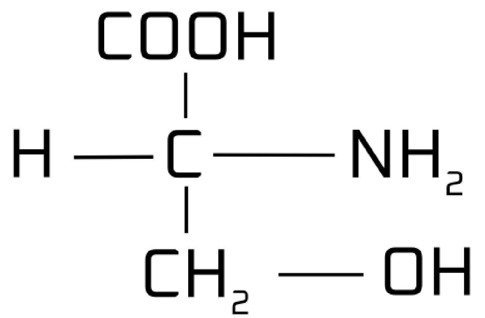

Biomolecules: the molecules that are found in living organisms

Human body is made up of many chemicals and they contribute to the biomolecules

• Human diet mainly consists of proteins, carbohydrates and fats

Protein: C, H, O, N, S
Carbohydrates: C, H, O
Fats: C, H, O

Nucleic acid consists of DNA and RNA
Its components are C, H, O, N, P

Enzymes: C, H, O, N, S

• Approximately 27 different elements are found in the human body

Other elements: Calcium, Iodine, Iron, Magnesium, Phosphorus, Sodium, Zinc

Some animals also have gold and radioactive materials in their body

Micro and macro nutrients:
Micro: found in low quantities
Macro: found in high quantities

More micro nutrients: physiological disorders
Less micro and/or macro elements: deficiency

Vitamin A, D, E, K: fat soluble
Vitamin B, C: water-soluble

# 2/6/23

Amino acids: essential and non-essential
Essential: cannot be made by the body and requires to get from food
Non-essential: can be made by the body

• There are 20 types of amino acids

> > Fats

Stored in the adipose tissue
Acts as an insulator

Not used by the body right away and is reserved for emergencies

Cholesterol: bad and good

-ase = enzyme

• All the biological processes require enzyme
• Catalyst enhances chemical reaction but is not present in the reaction

> > > Nucleic acid

• Found in the nucleus, mitochondria and plastid

• Protein controls enzymes

• All the processes require ATP (C, H, O, N, P)

> > Ways to find components in a sample

> Dehydration
> Burning
> The result ashes have all the inorganic components

or

> Dissolved or crushed in Trichloroacetic Acid
> Solution is filtered
> Separated into acid-soluble components and acid-insoluble components

Acid soluble components: bio-micro molecules
Acid insoluble components: bio-macro molecules

# 3/6/23

<800 daltons -> micro nutrients

> 800 daltons -> macro nutrients

Primary and secondary metabolite

Primary metabolite: directly involved in normal growth, development, reproduction
Secondary metabolite: not essential for basic cellular functions but play crucial roles in various ecological and biological processes.

Glycogen: Whenever the body needs energy, glycogen produces supplies it

Seconday metabolite: eg.- antibiotic (produced by penicilium) {but the use of it by the organism remains unknown}

Some plants also have oil but the reason is unknown

Oxalicacetic acid helps in photosynthesis

• Antibiotic is known as the wonder drug of the 19th century

> > > Biomacromolecules

Eg.- nucleic acid

> > > DNA

DNA: Deoxyrhibonucleic acid

• Contains hereditary information (genes)
• Acidic in nature (negatively charged)
• It is a polymer
• Double helical structure
• Made of 2 strands of polynucleotide
• 2 strands are antiparallel to each other

> > Composition

1. Phosphate group
2. Deoxyrhibose sugar (pentose sugar)
3. Nitrogenous bases (adenine, thymine, cytosine, guanine)
4. Paired by 2 bases: AT, CG

{Schematic diagram of DNA}

• dsDNA: Double-stranded DNA

2n: 6.6 _ 10^9 base pair
n: 3.3 _ 10^9 base pair

• Nucleoside: combination of sugar with any nitrogenous base

• Phosphodiester bond: the linkage between the 3' carbon atom of one sugar molecule and the 5' carbon atom of another, deoxyribose in DNA and ribose in RNA

A glycosidic bond is a covalent bond that forms between the anomeric carbon of a sugar molecule and another molecule, such as another sugar or a non-sugar compound. This bond is vital for the construction of complex carbohydrates, including disaccharides and polysaccharides, by joining sugar units together.

Hydrogen bonds in DNA are weak chemical bonds that form between complementary base pairs, specifically adenine (A) with thymine (T) and guanine (G) with cytosine (C). These bonds contribute to the stability and structure of the DNA double helix.

Nucleoside bond: A nucleoside bond is a linkage between a sugar molecule and a nitrogenous base in a nucleoside.

• Distance between 2 base pairs: 0.34 nano meters

# 08/06/23

> > > RNA

Rhibonucleic Acid

Composed of phosphate group, rhibose sugar, and four nitrogenous bases, i.e., adenine, cytosine, uracil, and guanine.

Types: mRNA: Messenger RNA: Carries information about protein synthesis.
tRNA: transfer RNA Responsible for transfer of amino acid from cellular environment to ribosome
rRNA: Ribosomal mRNA: forms ribosomes, which are essential in protein synthesis

RNA is a linear structure made up of single strand of polynucleotide

Structure
{Structure of RNA}

RNA virus: Ebola, infulenza, HIV
DNA virus: herpes, smallpox, hepatitis B, adenoviruses, warts

> > > Enzyme

Mainly made of protein along with co-factor

{https://i.imgur.com/KyuBOlM.png}

Without co-factor, enzymes cannot work.

Prosthetic groups: tightly binded with the enzyme
Co-enzyme: binds whenever required
Metal-ions: attatch with protein part and make the enzyme active or inactive

> > Mechanism of enzyme action.

Lock and key theory method: enzymes have a specific site to activate in

           Amylase

Starch --------------> Maltose

Enzyme substrate complex: it is a non covalent complex composed of a substrate bound to the active site of the enzyme and it is formed during chemical reaction.

Enzymes are substrate specific, i.e., it requires a specific substrate to work.

These can be visualized like building blocks which lock onto each other

Enzyme + substrate ----> Enzyme-substrate complex -------> Enzyme + product

‣ No change will occur in the enzyme

        Pepsin

Starch -------> No reaction
Amylase
Protein --------> No reaction

‣ For every specific enzyme, it has a specific substrate to accomodate

denaturation of protein: lost of function permanently

# 09/06/23

> > > Factors affecting the rate of enzyme action

(i) Temperature
(ii) pH level
(iii) Substrate concentration
(iv) Competitive inhibitor

> > Temperature:

- At higher temperatures, protein gets denatured and lower temperatures make the enzymes inactive.

Body getting hot is a defence mechanism to stop microbes during fever.

> > pH level

Pepsin - acidic
Trypsin - Alkaline

- Enzymes are pH specific

> > Substrate concentration

The amount of substrate present that can be turned into product

If the amount of substrate is more than the enzymes, the reaction will slow down and create an arc which increases rapidly and then slows down to steady.

( https://www.ucl.ac.uk/~ucbcdab/enzass/images/subs1.png )

> > Competitive inhibitor

Substrate molecule is prevented from binding to the active site of an enzyme by a molecule that is very similar in structure to the substrate.
Therefore, stopping the reaction from happening.

# 10/06/23

Eg.- inhibition of sucicne dehydrogenase by malonate which closely resembles the substrate succinate in structure. Such competitive inhibitors are often used in the contryl of bacterial pathogens.

> > > Classification of enzymes

- Oxidoreductase/dehydrogenase
  Makes redox reactions in the body

- Transferase
  Transfers groups of chemicals to make new chemicals

- Hydrolase
  Catalyses hydrolysis of ester, ether, peptide, etc

- Lyase
  Breaks down the bonds between two chemicals

- Isomerase
  Catalyses the change of structure without changing the compound

- Ligase
  Helps in establishing bonds

{https://i.imgur.com/nwXA3hL.png}

‣ When any process is mediated by enzymes, it requires less energy to produce the product.

> > > Carbohydrates

Monosaccharide -> 1 saccharide -> glucose, fructose, xylose
Disaccharide -> 2 saccharide -> sucrose, lactose, maltose
Polysaccharides -> many saccharide -> starch, glucogen, cellulose

---

# All the previous notes in txt sucks

# 24/08/23

- mRNA has code for amino $\overline{\text{a}}$ and polypeptide 
  > Peptide is a short chain of amino $\overline{a}$ linked by peptide bonds

TRNA: transfers amino acid and translate mRNA into sequence of protein.  
rRNA: helps to form ribosome and assists in protein synthesis.

- Amino acid is the building block of protein.

- 3 main amino acid in human body:
  - Glycine
  - Alanine
  - Serine

There are total 20 amino acid

## Zwitterionic form

- Amino acid can exist as ionized form and it is called Zwitterionic form

Our body has 2 types of Amino acids:  
**Essential amino acid:** lysine, histidine, valine  
**Non-essential amino acid:** alanine, glycine, serine

- Lysine and Glycine are also used in medicines.

## Protein

Protein are form when DNA's instructions are transcribed into mRNA, which guides the assembly of amino acids into proteins through a process called translation.

> This process is also called Polymerization

Protein produced by our body are biomacromolecules

- Acid insoluble particles are biomacromolecules
- Acid soluble particles are biomicromolecules

