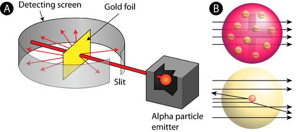
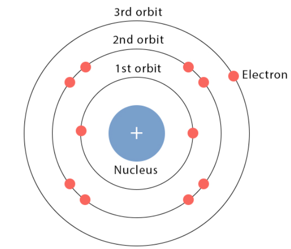
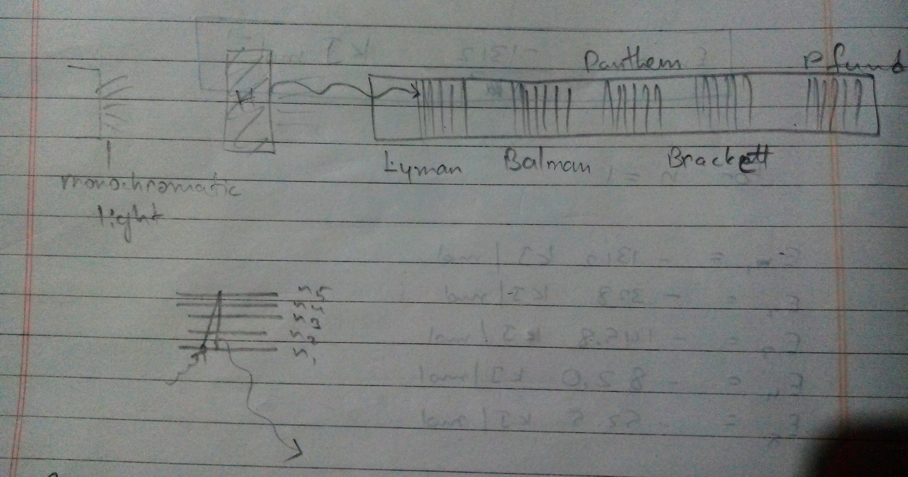
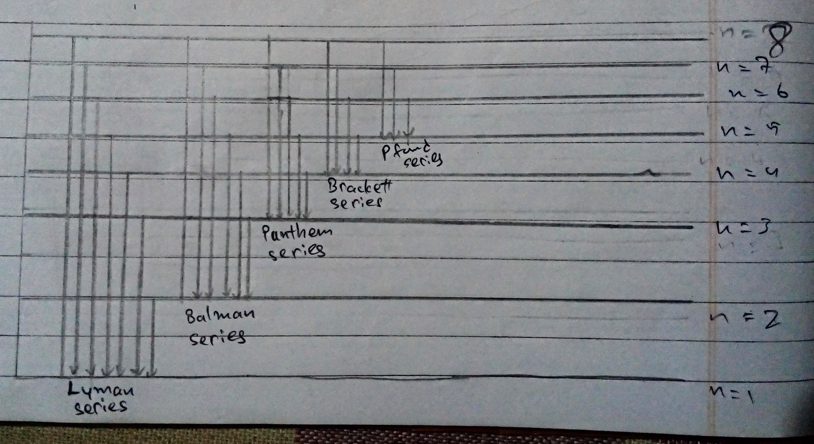

- [Charge and Mass of Electon](#charge-and-mass-of-electon)
- [Charge and Mass of Proton](#charge-and-mass-of-proton)
- [Radioactivity](#radioactivity)
  - [Types of Rays](#types-of-rays)
- [Thompson's Model of Atom](#thompsons-model-of-atom)
- [Rutherford's Model of an Atom](#rutherfords-model-of-an-atom)
  - [Rutherford's Gold Foil Experiment](#rutherfords-gold-foil-experiment)
    - [Observations](#observations)
    - [Conclusion](#conclusion)
    - [The Model](#the-model)
  - [Drawback](#drawback)
  - [Atomic Number](#atomic-number)
  - [Mass number](#mass-number)
- [Isotopes](#isotopes)
- [Isobars](#isobars)
- [Isotnes](#isotnes)
- [Bohr's Atomic Model](#bohrs-atomic-model)
  - [Mathematically](#mathematically)
  - [Drawbacks](#drawbacks)
- [Achievements of Bohr's Atomic Model](#achievements-of-bohrs-atomic-model)
- [Energy of electron in Hydrogen Atom](#energy-of-electron-in-hydrogen-atom)
  - [Example](#example)
- [Explaination for the Simultaneous Appearance of many Spectral Light in Hydrogen Spectrum](#explaination-for-the-simultaneous-appearance-of-many-spectral-light-in-hydrogen-spectrum)

> Electron is just a wave which moves around the nucleus in a fixed path.

# Charge and Mass of Electon

- Charge, $e^-$ = $1.6 \cdot 10^{-19}$ C

- Mass = $9.1 \cdot 10^{-31}$ kg

- Relative charge = -1

# Charge and Mass of Proton

- Charge, $e^- = 1.6 \cdot 10^{-19}$ C

- Mass: $1.6 \cdot 10^{-27}$ kg

- Relative charge: -1

# Radioactivity

The phenomena of spontaneous emission of certain highly active radiation by radioactive substance.

## Types of Rays

1. $\alpha$ particle (same as $He^{+2}$ particle)

- Mass: 4u ($6.6 \cdot 10^{-24}g$)
- Charge: +2 ($3.2 \cdot 10^{-19}C$)

2. $\beta$ particle (same as $e^-$)

- Mass: $9.1 \cdot 10^{-31}kg$
- Charge: $1.6 \cdot 10^{-19}C$

3. $\gamma$ particle (same as photon (light particle))

- No charge
- No mass

> $\gamma$-particle has high penetrating power  
> $\alpha$-particle is the heaviest.

# Thompson's Model of Atom

Thompson's model of an atom can be visualized at a christmas pudding or watermelon with a positively charged shell iwth eletrons embedded in it.

- Number of proton = number of +ve charge

# Rutherford's Model of an Atom

## Rutherford's Gold Foil Experiment

### Observations

1. Most of the alpha particles (about 99%) passed through the gold foil undeflected.
2. Some of the particles were deflected by small angles.
3. A very few $\alpha$-particles (1 out of 20k) suffered major deflection (more than $90\degree$) and even came back in the same direction.

### Conclusion

1. As most $\alpha$-particle passed through the atom undeflected thus most of the space inside an atom is empty.
2. As a very few $\alpha$-particle suffered mainr deflection and a very few major deflection, this means that they must have came acros some obstruction which is very small, dense and positively charged.  
   Rutherford regarded this small, heavy and positively charged portion as nucleus. The space surrounding the nucleus as extra-nuclear portion.

### The Model

1. Atom consists of two parts- Nucleus and extra-nuclear portion.
2. Nucleus is present in center of the atom. It is psitively charged and extremely small.
3. The positive charge of nucleus is due to protons.
4. Extra-nuclear is the space around the nucleus in which electons are present.
5. Total -ve charge on the nucleus = total -ve charge on electons as a whole the atom is neutral.
6. Electons in extra-nuclear portion revolve around the nucleus at high speed in circular paths called orbits.

- Neutrons are neutral particle.
- Charge of n = 0
- Mass of n = $1.6 \cdot 10^{-27}kg$

## Drawback

According to Rutherfords's model of atom, the negatively charged electrons revolve around the positively charge nucleus.  
We can say that electron is undergoing acceleration. According to the radiation theory of Maxell when a charged particle is accelerated it emits electro-magnetic radiation. This means that the revolving electron also lose energy continiously in the form of EM radiation. This loss of energy brings the electron closer to the nucleus and ultimately fall into the nucleus following a spiral path. This means that the atom must collapse, Rutherford couldn't counter the Maxwell's theory.

## Atomic Number

(z): number of protons (p)

## Mass number

(A): number of proton + number of neutrons

# Isotopes

Isotopes are the atoms of same element having same atomic number but different mass number.

$H \rightarrow \text{ } ^1_1H$, $^2_1H(D)$, $^3_1H(T)$

$Cl \rightarrow \text{ } ^{35}_{17}Cl$, $^{35}_{17}Cl$

$C \rightarrow \text{ } ^{12}_{6}C$, $^{13}_{6}C$, $^{14}_{6}C$

# Isobars

They have same mass number but different atomic number.

- Eg: $^{40}_{18}Ar$, $^{40}_{19}K$, $^{40}_{20}Ca$

# Isotnes

Atoms of different elements which have same number of neutrons.

$^{14}C \rightarrow P:6, n:8$  
$^{15}N \rightarrow P:7, n:8$  
$^{16}O \rightarrow P:8, n:8$-

# Bohr's Atomic Model

It was primarily applicable to hydrogen and one electron species like $He^+$ and $Li^{+2}$

1. In hydrogen atom, electrons revolve around the nucleus in a well defined circular path of fixed radius and energy. The circular path is known as orbit and the corresponding energy state is called stationary state.
2. The energy of an electron is its orbit and does not change on its own.
3. When a required amount of energy is absorbed by the electron, it absorbs the same in fixed amounts of bundles called quanta and jumps to higher stationary state clled excited state.
4. Different energy level or energy state for electron are given as K, L, M, N or 1, 2, 3, 4.
5. Only those energy orbits are permitted for the electon in which the angular momentum of the electon is a whole number multiple of of $\frac{h}{2\pi}$, i.e., "$n \cdot \frac{h}{2 \pi}$"
   - Angular momentum of electron = $\omega = mvr = \frac{nh}{2\pi}$

- **Planck's constant** = $6.626 \cdot 10^{-34} Joule/second$

6. Energy of stationary state is given by
   - $E_n = R_H(\frac{1}{n^2})$
     - $R_H = \text{Rydberg's constant}$
     - $R_H = 2.18 \cdot 10^{-18} J$

## Mathematically

$\Delta E = E_2 \text{(Higher energy level)}- E_1 \text{Lower energy level}$

## Drawbacks

1. **Limited Applicability**: Bohr's model primarily worked well for hydrogen-like atoms with a single electron. It struggled to accurately describe atoms with multiple electrons, such as helium or heavier elements.
2. **Ignored Electron Motion**: The model didn't provide a detailed explanation of how electrons move within their orbits. It treated electrons as particles following classical paths, which contradicted the principles of quantum mechanics.
3. **Lack of Explanation for Energy Levels**: Bohr's model couldn't explain why electrons occupied specific energy levels or why they didn't continuously spiral into the nucleus due to their accelerating motion.
4. **Failed to Explain Fine Structure**: It couldn't account for the fine structure of spectral lines, which are additional splitting of lines in atomic spectra due to electron interactions and relativistic effects.
5. **Neglected Electron Spin**: Bohr's model did not consider the intrinsic property of electron spin, which is crucial for understanding the behavior of electrons in atoms.
6. **Quantum Mechanics Superseded It**: Eventually, Bohr's model was replaced by quantum mechanics, which provides a more comprehensive and accurate description of atomic behavior, including the wave-like nature of electrons and their probability distributions.

# Achievements of Bohr's Atomic Model 

1. It has explained the stability of an atom. 
2. It has been used to derive Balmer's formula. 

$E_f = R_H [\frac{1}{{n_f}^2}]$  
and $\Delta E = E_f - E_i$  
$\implies \Delta E = [\frac{-R_H}{{n_f}^2}] + \frac{R_H}{{n_i}^2}$
$\implies \Delta E = \frac{R_H}{{n_i}^2} - \frac{R_H}{{n_f}^2}$

$\therefore \Delta E = R_H (\frac{1}{{n_i}^2}) - \frac{1}{{n_f}^2}$

- If the electron moves from outer to inner shell, it releases energy in the form of EM (electro-magnetic) waves. 

$\Delta E = (2.18 \cdot 10^{-18} J) \cdot (\frac{1}{{n_i}^2} - \frac{1}{{n_f}^2})J$ 

The frequency for the absorbtion and emission of energy can be calculated as follows: 

$\Delta E = h\zeta$  
$\zeta = \frac{\Delta E}{h}$  
$\implies \frac{2.18 \cdot 10^{-8}}{6.626 \cdot 10^{-34}}(\frac{1}{{n_i}^2}- \frac{1}{{n_f}^2})$  
$\zeta = 3.29 \cdot 10^{15}(\frac{1}{{n_i}^2}- \frac{1}{{n_f}^2})$ Hz or $s^{-1}$

$\overline{\zeta} = \frac{\zeta}{\text{Speed of Light}}$  
$\implies \frac{3.29}{3 \cdot 10^8} \cdot 10^{15}(\frac{1}{{n_i}^2}- \frac{1}{{n_f}^2})$  
$\overline{\zeta} = 1.09677 \cdot 10^7 (\frac{1}{{n_i}^2}- \frac{1}{{n_f}^2}) m^{-1}$

# Energy of electron in Hydrogen Atom 

Energy of $n^{th}$ orbit is given by

$E_n = \frac{-2\pi^2k^2m_ee^4z^2}{n^2h^2}$

- K = Permitivity of the medium/material 
- $M_e$ = mass of $e^-$
- e = charge of $e^-$
- z = nuclear charge 
- n = number of $e^-$ orbit 
- h = Planck's constant 

## Example 

$E_n = \frac{-1312}{n^2}KJmol^{-1}$ 

For n = 1, 

$E_1 = -1312 \text{ } KJmol^{-1}$  
$E_2 = -328 \text{ } KJmol^{-2}$  
$E_3 = -145.8 \text{ } KJmol^{-3}$  
$E_4 = -82.0 \text{ } KJmol^{-4}$  
$E_1 = -52.5 \text{ } KJmol^{-5}$

# Explaination for the Simultaneous Appearance of many Spectral Light in Hydrogen Spectrum

In study of hydrogen spectrum, the appearance of spectral lines in difference series of hydrogen spectrum such as 

Spectra lines in different series of hydrogen spectrum.

