- [Laws](#laws)
- [Some Electron Configuration](#some-electron-configuration)
- [Electronic Concept of Oxidation and Reduction](#electronic-concept-of-oxidation-and-reduction)
- [Oxidation Number](#oxidation-number)
  - [Rules](#rules)
    - [Electo negitivity](#electo-negitivity)
- [Balancing Chemical Equation by Oxidation Number Method](#balancing-chemical-equation-by-oxidation-number-method)
  - [Redox Reaction in Acidic Medium](#redox-reaction-in-acidic-medium)
    - [Step 1: Assign Oxidation Numbers](#step-1-assign-oxidation-numbers)
    - [Step 2: Figure out what's being oxidized and reduced](#step-2-figure-out-whats-being-oxidized-and-reduced)
    - [Step 3: Write half reactions](#step-3-write-half-reactions)
      - [Reduction half-reaction](#reduction-half-reaction)
    - [Step 4: Add electrons to balance charges](#step-4-add-electrons-to-balance-charges)
    - [Step 5: Repeat the same steps on Oxidation half-reaction.](#step-5-repeat-the-same-steps-on-oxidation-half-reaction)
    - [Step 6: Multiply half reactions to make the number of electrons equal in both](#step-6-multiply-half-reactions-to-make-the-number-of-electrons-equal-in-both)
    - [Step 7: Add the half reactions, cancelling out stuff that appearss on both sides of the arrow.](#step-7-add-the-half-reactions-cancelling-out-stuff-that-appearss-on-both-sides-of-the-arrow)
    - [Step 8: Do a final check to make cure everything's balanced](#step-8-do-a-final-check-to-make-cure-everythings-balanced)
  - [Oxidation Reaction in Basic Medium](#oxidation-reaction-in-basic-medium)
    - [Step 1: Figure out what's being oxidized and reduced](#step-1-figure-out-whats-being-oxidized-and-reduced)
    - [Step 2: Write half reactions](#step-2-write-half-reactions)
    - [Step 3: Add electrons to balance charges](#step-3-add-electrons-to-balance-charges)
    - [Step 4: Repeat the same on oxidation half reaction](#step-4-repeat-the-same-on-oxidation-half-reaction)
    - [Step 5: Multiply half reactions to make the number of eletrons equal in both](#step-5-multiply-half-reactions-to-make-the-number-of-eletrons-equal-in-both)
    - [Step 6: Add the half reactions, cancelling out stuff that appears on both sides of the arrow](#step-6-add-the-half-reactions-cancelling-out-stuff-that-appears-on-both-sides-of-the-arrow)
    - [Step 7: For each $H^+$, add one $OH^-$ to both sides](#step-7-for-each-h-add-one-oh--to-both-sides)
    - [Step 8: Combine $H^+$ and $OH^-$ to make $H\_2O$](#step-8-combine-h-and-oh--to-make-h_2o)
    - [Step 9: Subtract $H\_2O$ from both sides if possible](#step-9-subtract-h_2o-from-both-sides-if-possible)
    - [Step 10: Do a final check to make sure everything's balanced](#step-10-do-a-final-check-to-make-sure-everythings-balanced)
    

# Laws 

1. **Aufbau Principle**: In the ground state of an atom, the electrons are **added progressively** to the various orbatals in **increasing order of energies**

$1 \rightarrow K = s$  
$2 \rightarrow L = sp$  
$3 \rightarrow M = spd$  
$4 \rightarrow N = spdf$

2. **Paulie's Exclusion Principle**: According to it, an orbital can have maximum of 2 electrons only and their **spins are opposite**. 

3. **Hund's Rule for Maximum Multiplicity**: When more than one orbitals of equal energies are available, the electrons will first occupy these orbaital singly with parallel spins. The pairing of electrons will then take place. 

| Orbitals | Electrons (max)  |
| :---- | :---- | 
| $s$ | 2 |
| $p$ | 6 |
| $d$ | 10 | 
| $f$ | 14 | 

$\uparrow: \text{Clockwise/up spin}$  
$\downarrow: \text{Anti-clockwise/down spin}$

# Some Electron Configuration

| Element | Electon Configuration | Element | Electron Configuration
|-|-|-|-|
| H | $1s^1$ | S | $[Ne]3s^23p^4$ | 
| He | 1$s^2$ | Cl | $[Ne]3s^23p^5$ | 
| Li | $1s^22s^2$ | Ar | $[Ne]3s^23p^6$ | 
| Be | $1s^22s^2$ |K | $[Ar]4s^1$ | 
| B | $1s^22s^22p^1$ | Ca | $[Ar]4s^2$ | 
| C | $1s^22s^22p^2$ | Sc | $[Ar]4s^23d^1$ | 
| N | $1s^22s^22p^3$ | Ti | $[Ar]4s^23d^2$ | 
| O | $1s^22s^22p^4$ | V | $[Ar]4s^23d^3$ | 
| F | $1s^22s^22p^5$ | Cr | $[Ar]4s^23d^4$ | 
| Ne | $1s^22s^22p^6$ | Mn | $[Ar]4s^23d^5$ | 
| Na | $[Ne]3s^1$ | Fe | $[Ar]4s^23d^6$ | 
| Mg | $[Ne]3s^2$ | Co | $[Ar]4s^23d^7$ | 
| Al | $[Ne]3s^23p^1$ | Ni | $[Ar]4s^23d^8$ | 
| Si | $[Ne]3s^23p^2$ | Cu | $[Ar]4s^23d^9$ | 
| P | $[Ne]3s^23p^3$ | Zn | $[Ar]4s^23d^{10}$ |

# Electronic Concept of Oxidation and Reduction

- $\text{Oxd}^n$:
  - Addition of $O$, removal of $H$
  - Loss of $e^-$

$Na \rightarrow Na^+ + 1e^-$$  
$Fe \rightarrow Fe^3+ + e^-$  
$S^{2-} \rightarrow S + 2e^-$$  

- $\text{Red}^n$: 
  - Removal of $O$, addition of $H$
  - Gain of $e^-$

$Cl + e^- \rightarrow Cl^-$
$\underset{Ferricyanoion}{[Fe(CN)_6]^{3-}} + e^- \rightarrow \underset{Ferrocyanoion}{[Fe(CN)_6]^{4-}}$

# Oxidation Number 

Oxidation numebr is the oxidation state of an element in a compound following a set of rules.

## Rules 

1. Elements with no charge have zero oxidation number.
2. $NH^4$, $SO_3^\text{2-}$, $Cl^-$, $Mg^{+2}$ have +1, -2, -1 , +2 oxidation number respectively. 
3. For **Hydrogen**
    1. H $\rightarrow$ +1 (when with non-metal)
         - Eg: $HCl$
    2. $H$ $\rightarrow$ -1 (when with metal)
      - $NaH$
4. For **Oxygen**
    1. $O$ $\rightarrow$ -1 (for peroxides)
        - $H_2O_2$, $Na_2O_2$
    2. $O$ $\rightarrow$ +2 (for Oxygen dyfloride)
       - $OF_2$
    3. $O$ $\rightarrow$ -1 (for dyoxygen dyfloride)
       - $O_2F_2$ 
5. **Halogens** usually -1, positive with oxygen.
6. If a compound is between metal and non-metal, **metal shows positive oxidation state** and **non-metal shows negative oxidation state**. 
- $\underset{+1}{Na}\underset{-1}{Cl}$ and $\underset{+2}{Mg}\underset{-2}{Cl}$
7. In non-metal + non-metal, 
  - $\underset{{+ve\text{ }oxd^n\text{ }state}}{\text{Non-metal}}$ $+$ $\underset{-ve\text{ }oxd^n\text{ }state}{\text{Non-metal}}$

 

$\xrightarrow{\text{Li Be B C N O F Ne}}$

### Electo negitivity 

It is the ability of an atom (deficient in electron to fulfil its octet) to attract an electron to become in noble gas configuration is called eletronegativity. 

# Balancing Chemical Equation by Oxidation Number Method 

## Redox Reaction in Acidic Medium 

$Ag + NO^-_3 \rightarrow Ag^+ + NO$

### Step 1: Assign Oxidation Numbers 
 
> Determine the oxidation numbers of each element in the equation:  
> 
> **Element by itself**: 0
> **Group 1A**: always +1 
> **Group 2A**: always +2
> **Halogens**: usually -1, positive with Oxygen 
>
> - Monatomic ion: ion charge
>   1. $H$: +1 with non-metals, -1 with metals 
>   2. $O$: Usually -2, -1 in peroxide ($H_2O_2$)
>   3. $F$: always -1 
> 
> Sum of ON's for a neutral compound: 0  
> Sum of ON's for a polyatomic ion = ion charge
>
> Assign oxidation numbers to each element:

$\overset{0}{Ag} + \overset{+5}{N}\overset{-6}{O^-_3} \rightarrow \overset{+1}{Ag^+} + \overset{+2}{N}\overset{-2}{O}$

### Step 2: Figure out what's being oxidized and reduced
>
> Reduction = gain of electron $\rightarrow$ $ON\downarrow$  
> Oxidation = loss of electrons $\rightarrow$ $ON\uparrow$

$\therefore \text{Silver is oxidized}$  
$\And\text{ Nitrogen is reduced}$

### Step 3: Write half reactions 

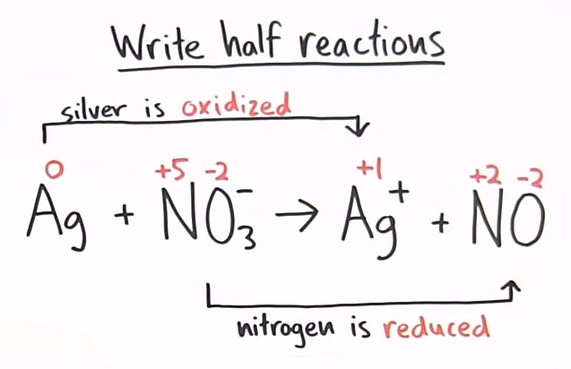

#### Reduction half-reaction 

### Step 4: Add electrons to balance charges 
> Use $H_2O$ to balance O and $H^+$ to balance H

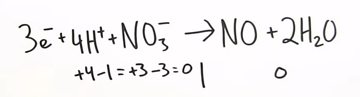

### Step 5: Repeat the same steps on Oxidation half-reaction.

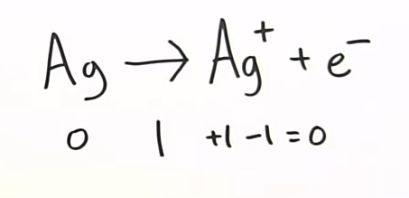

### Step 6: Multiply half reactions to make the number of electrons equal in both 

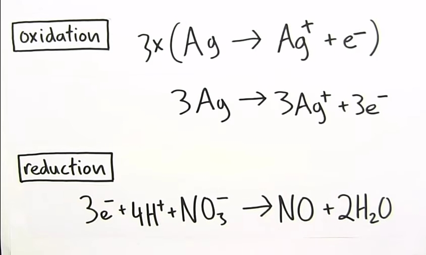

### Step 7: Add the half reactions, cancelling out stuff that appearss on both sides of the arrow. 

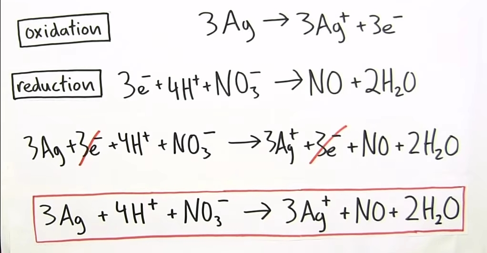

### Step 8: Do a final check to make cure everything's balanced

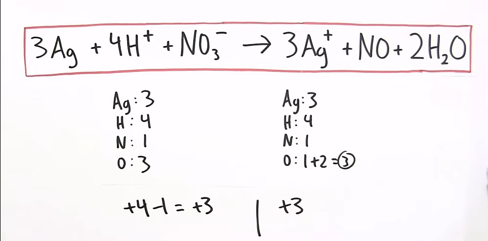

## Oxidation Reaction in Basic Medium 

$\overset{0}{Zn} + \overset{+5}{N}\overset{-2}{O_3^-} \rightarrow \overset{+2}{Zn^{2+}} + \overset{+4}{N}\overset{-2}{O_2}$

### Step 1: Figure out what's being oxidized and reduced

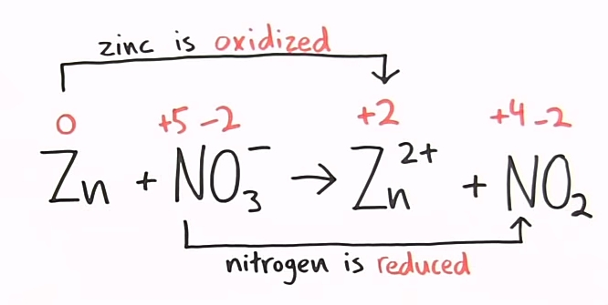

### Step 2: Write half reactions 

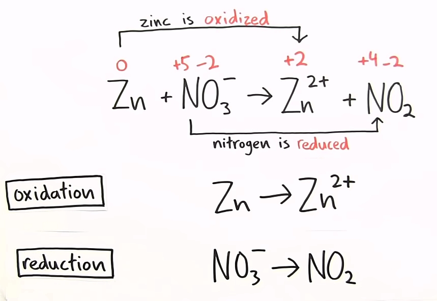

### Step 3: Add electrons to balance charges 

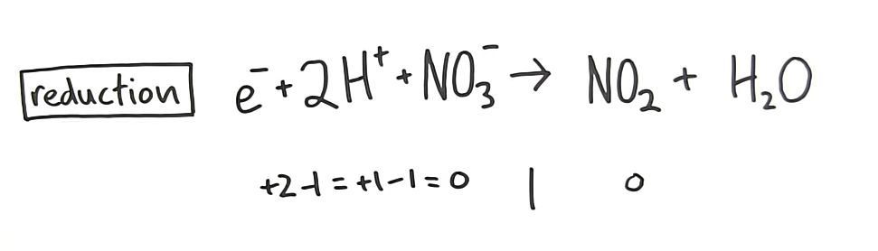

### Step 4: Repeat the same on oxidation half reaction 

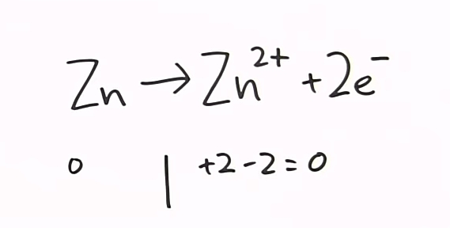

### Step 5: Multiply half reactions to make the number of eletrons equal in both 

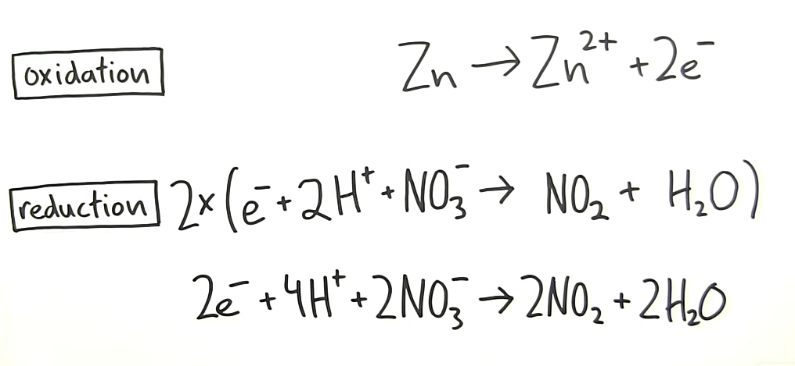

### Step 6: Add the half reactions, cancelling out stuff that appears on both sides of the arrow

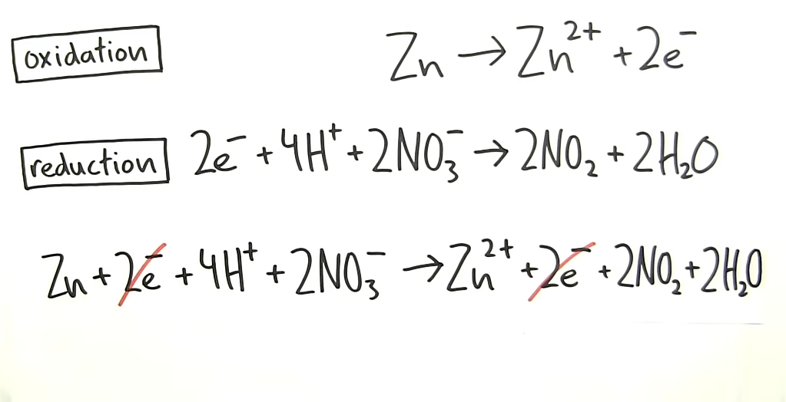

### Step 7: For each $H^+$, add one $OH^-$ to both sides 

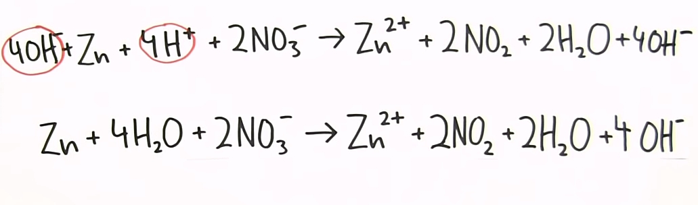

### Step 8: Combine $H^+$ and $OH^-$ to make $H_2O$

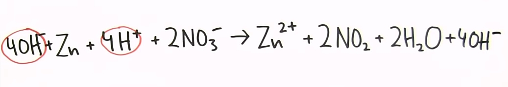

### Step 9: Subtract $H_2O$ from both sides if possible 

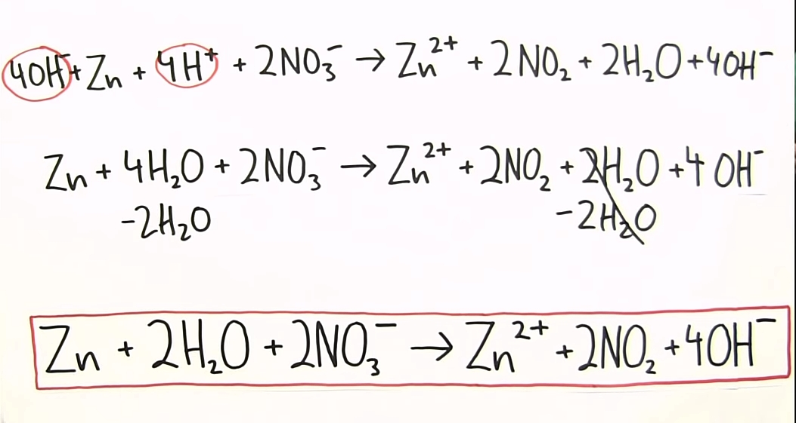

### Step 10: Do a final check to make sure everything's balanced 

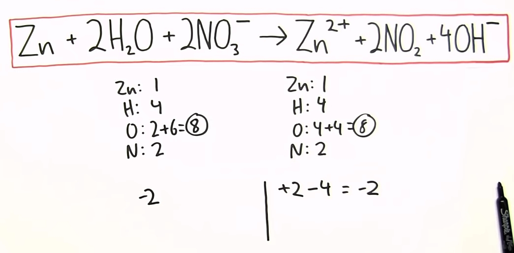