# Thermodynamics 

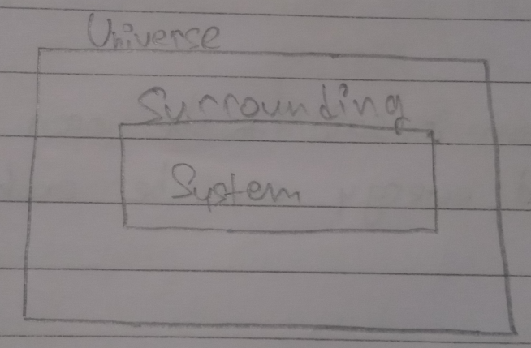  

**Thermo**: heat  
**Dynamics**: flow (flow if heat)  
> Heat is classified as energy 

- **System**: it is the specific part of the universe in which energy changes take place. 

> Either energy gaes out of system or enters it 

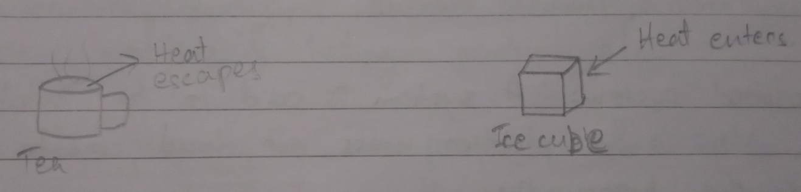

Chemistry considers the system whereas Physics considers the surrounding. 

- **Surrounding**: It represents the rest of the universe which surrounds the system. 

# Types of System 

1. **Open system**: a system is said to be open if both mass and energy can be exchanged with the surrounding 

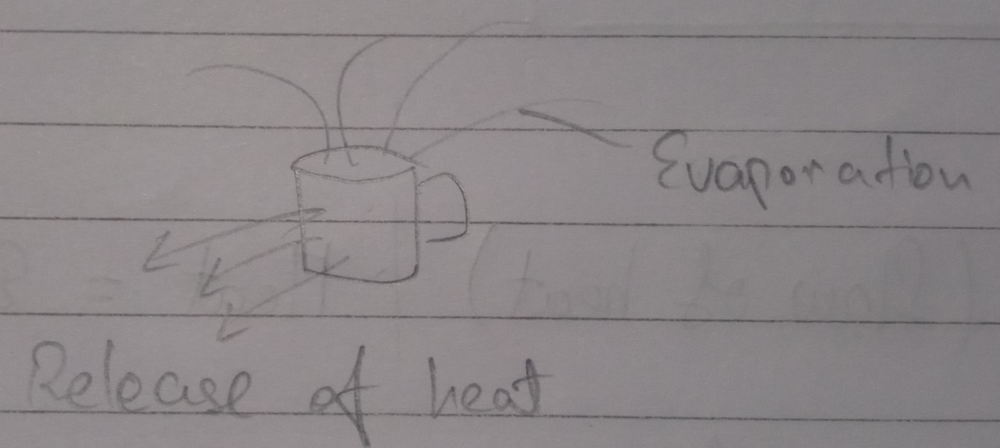

2. **Closed system**: a system where only heat is exchanged (exchange of energy) with the surrounding and no exchange of mass take place. 

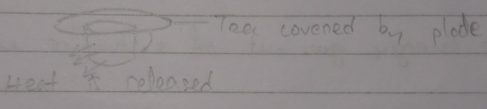

1. **Isolated system**: a system is said to be isolated if neither mass nor heat can be exchanged with the surrounding. 

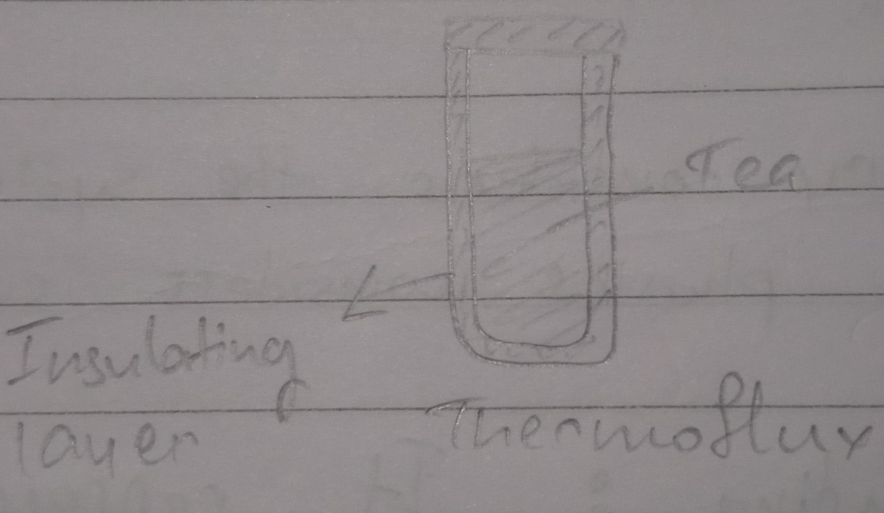

4. **Homogenous system**: if all the constituent of the system are present in the same phase, it is known as Homogenous system. Also they are of uniform composition. Eg: salt + water 

5. **Heterogeneous system**: A system where two or more distinguishable constituents are present. Eg: sand + water 

# Intensive and Extensive Property 

- **Intensive property**: The properties of a system which doesn't depend upon either thesize or quantity of matter present in it. Eg: pressure, temperature, density, surface tension, viscosity, refractive index, melting and boiling point, etc.

- **Extensive property**: The property of a system which depends upon the size and quantity of matter present in the system. Eg: mass, volume, internal energy, work done, entropy, etc. 

> Density of water; = $1\ g/cm^3$

# Thermodynamic State Functions 

If a system undergoes change as a result of chemical reaction, it can describe before and after the change in terms of certain properties. Such as pressure, volume,  temperature, etc. These are known as state functions, which can describe the state of function. 

- **List of State Functions**
  1. Enthalpy 
  2. Free energy 
  3. Internal energy
  4. Entropy 
  5. Number of moles 
  6. Pressure 
  7. Volume 
  8. Temperature 

# Thermodynamic Process 

1. **Iso-thermal process**: the tempreature of system remains constant. 

$\Delta T = 0$

2. **Adiabetic process**: no exchange of heat between system and surrounding is possible (system is isolated)

$\Delta q\text{ (heat)} = 0$

3. **Isobaric Process**: whent he pressure remains constant throughout the process. 

$dP=0$ [$dp$: change in pressure]

> Change in volume may not take place. 

4. **Isochoric process**: process carried out in constant volume. 

$dV = 0$

> Change in pressure may not take place. 

5. **Cyclic Process**: when a system undergoes a series of change and finally returns to initial state. 

$dE = 0$ [$dE$: change in energy]

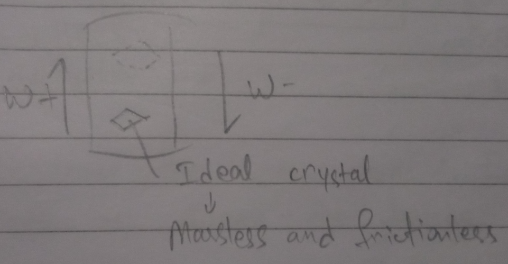

# Reversible Change and Irreversible Change 

- **Reversible change**: if the process can be turned back to such that both the system and the surroundings return to their origianl states, with no other change anywhere else in the universe. 

- **Irreversible change**: in this change, the system and the surrounding cannot return together to exactly the states that they were in is called irreversible change. 

# Mode of Energy Exchange 

## As Heat Energy 

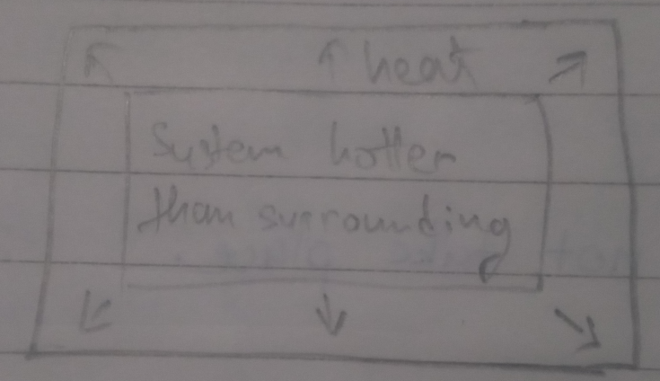

Heat $q$ is $-ve$ (if transferred from system to surrounding).  
If heat is transferred from surrounding to system, heat $q$ is $+ve$

## As Work Energy

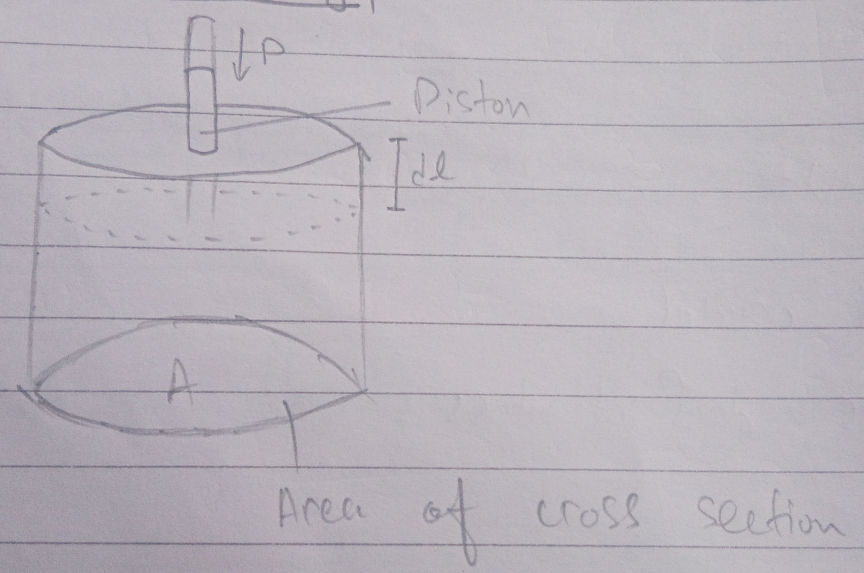

# Mechanical Work or Pressure Volume Work 

## 1. Work done during expansion 

Consider an ideal gas (1 ATP, NTP) enclosed in a cylinder fitted with a weightles snad frictionless piston having an area of cross section $A$. Let $V$ be the volume of gas and $P$ be the perssure acting on the system. 

$\therefore \text{Pressure} = \frac{\text{force}}{\text{area}}$  
$\implies P = \frac{f}{a}$  
$\implies f=Pa$ ------$\frak{1}$

### If the piston moves outward through a distance $dl$

$\therefore W = \frac{\text{force}}{\text{distance}}$  
$\implies W = -f \times dl$  
$\implies W = P \times a \times dl$  [from eq. $\frak{1}$]  
$\implies dW = P \times dv$ [$-ve$ since system is doing work]

### In case the system expands from a finite volumes $v_1$ to $v_2$ during the change, 

$\therefore$ work done by the system will be 

$W = -P \overset{v_2}{\underset{v_1}{\int}}dv$  
$W = -P [v_2-v_1]$  
$W=-P\Delta ve$

## 2. Work done during contraction 

### If the work is done on the system 

$W = P \overset{v_2}{\underset{v_1}{\int}}dv$  
$\implies W = P[v_2-v_1]$  
$\implies W = P \Delta V$ 

### Work done in isothermal and reversible expansion of gas 

$W = -Pdv$

We know for an ideal gas, 

$PV = nRT$ [Ideal gas equation]  
$\implies P = \frac{nRT}{V}$  
$\implies R = 8.314\ J/K/mol$  

$W = \frac{-nRT}{V}dv$  
$\implies\overset{v_2}{\underset{v_1}{\int}}\frac{-nRT}{V}dv$  
$W = -nRT \overset{v_2}{\underset{v_1}{\int}}\frac{1}{v} dv$  
$\implies W = -nRT\ ln[\frac{v_2}{v_1}]$

### If the work is done by the system at constant temperature, 

#### If change in pressure is given, 

$W = -2.303\ nRT\ log\frac{P_1}{P_2}$

# Internal Energy (U)

Every substance possessa certain definite amount of energy known as internal energy. Since every substance is made up of atoms and molecules, its internal energy is the sum of atoms and molecules. Such as electronic energy, nuclear energy, bond energy, energy due to movement of molecules (translatory motion) and movment within the molecule (rotatory motion and vibratory motion) 

## Change in Internal Energy $(\Delta U)$

$$
\Delta U = U_\text{Product} - U_\text{Reactant}
$$

If the reaction is carried out at a constatnt temperature and volume, i.e., no work is done on or by the system, the change in internal energy will be equal to the heat exchange betweensystem and surrounding. 

$$
\Delta U = q\ [\text{q: heat exchange between system and surrounding}]
$$

# Laws of Thermodynamics 

## First Law of Thermodynamics 

Also known as **Law of Conservation of Energy**

It states that ***energy can neither be created nor destroyed. It can be only converted from one form to another.*** 

The sum total of the energies of the universe is conserved during a physical or chemical change. 

It is impossible to create a perpetual motion machine (a machine that works without energy)

## Mathematical Representation of 1st Law 

Let a system having internal energy $U_1$ absorb q amount of heat from the surrounding. If $W$ is the work done on the system, then its final internal energy will be 

$U_2 = U_1+q+W$  
$\implies (U_2-U_1) = q+W$  
$\implies \Delta U=q+W$

If work is done on the system or of work is done by the system,

$\Delta U=q-W$

# Zeroth Law of Thermodynamics 

The law states that if two system $a$ and $B$ are separately in Thermal equilibrium with a third system $C$, then they are also equilibrium with each other. 

## For an Isothermal Expansion of Ideal Gas 

$\Delta U=0$  
Then $\Delta U=q+W$  
$\implies 0=q+W$  
$\implies -q=W$  
$\therfore $q=-W$

# Enthalpy and Change in Enthalpy 

Enthalpy is also known as heat content. Denoted by $H$. 

- It is defined as the sum to internal energy and pressure volume energy. 

$H=U+PV$  [U: internal energy, PV: pressure times volume]

**Internal energy**: sum of all energy of a system 

$U=q > \text{Internal energy = heat}$

## Change in Enthalpy $(\Delta H)$

- Change in enthalpy is the heat energy exchange between system and surrounding at constant temperature and pressure. 

$\Delta H$ can also be expressed as the difference in enthalpies of product and reactant. 

Mathematically, 

$\Delta H = H_\text{Product}-H_\text{Reactant}$

$H_p>H_r=+\Delta H$  
$H_p<H_r=-\Delta H$

# Relation between $\Delta H$ and $\Delta V$ 

$\Delta H = \Delta U + P\Delta V$ 

From ideal gas equation, 

$P\Delta V = \Delta^{ng}RT$ [$\Delta^{ng}$: ng stands for number of gaseous moles]

$\Delta H = \Delta U +\Delta^{ng} RT$ [$R$= Real gas constant]

Where, $\Delta^{ng} = \text{Number of gaseous moles of product - Number of gaseous moles in reactatnt}$

- $\Delta H = \Delta V \text{when} \Delta^{ng}=0$
  - eg: $N_2 + O_2 \rightarrow 2NO$
    - $\Delta^{ng}=2-2$
    - $\implies 0$

- $\Delta H > \Delta V$ when $\Delta^{ng}$ is $-ve$ 
  - eg: $N_2O_4\ \overset{\Delta}{\xrightarrow{}}\ 2NO_2$
    - $2-1=1$
- $\Delta H < \Delta V$ when $\Delta^{ng}$ is $-ve$ 
  - $N_2+3H_2\rightarrow 2NH$
    - $2-4=2$

# Exothermic and Endothermic Reaction 

## Exothermic Reaction 

Eg: $N_2+3H_2\rightarrow2NH_3+92.3\ KJ$

$H_p<H_r$ [$\because$ Heat is released on product side]

$\therefore \Delta H$ will be $-ve$ 

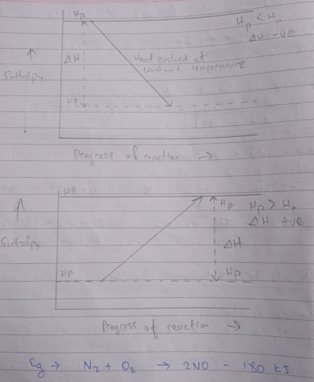

### Enthalpy change in a chemical reaction (Only in case of gaseous reaction)

Change in enthalpy, $\Delta H$ = $\text{(Energy required to break the bond in molecules in reactant)} - \text{(Energy released to form the bond in product)}$

Thus, if energy required in bond breaking is more than energy released in formation of bond. 

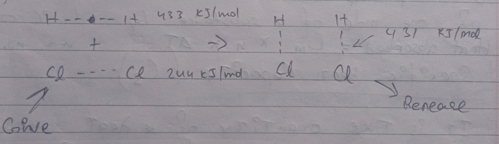

## Endothermic Reaction 

More energy is required to break reactant side bond. 

It is the exact opposite of exothermic reaction. 

Eg: $N_2+3H_2\rightarrow2NH_3+92.3\ KJ$  
$\Delta H = (443 + 244)-2\times431$  
$\implies 677-862$  
$-185\ KJ/mol$

$\therefore$ It is an endothermic reaction

# Heat Capacity (C)

It is defined as amount of heat supplied to an object to produce a unit change in temperature. 

**Unit**: $J/K \text{ or } J/\degree C$

$C = \frac{\text{Heat absorbed}}{\text{Rise intemperature}}$

# Molar Heat Capacity $(C_m)$

Quantity of heat needed to rise the temperature of one mole of a substance by $1\degree C$ or $K$

$\text{Heat absorbed} = C_m\times n\times \Delta T$ [n: number of moles]

# Specific Heat Capacity $(C_s)$

It is the quantity of heat needed to raise the temperature of one unit mass or one gram of a substance by 1 $K$ or $\degree C$

$\text{Heat absorbed}=C_s\times m \times \Delta T$ 

# Relation between $C_p$ and $C_v$

Molar heat capacity at constant pressure = $C_p$  
Molar heat capacity at constant volume = $C_v$

Heat exchanged at constant volume, $q_v = C_v\Delta T = \Delta V$  
Heat exchanged at constant pressure, $q_p$ = $C_p\Delta T=\Delta H$

## For 1 mole of ideal gas, 

$\Delta H=\Delta V + R\Delta T$  

# Types of Enthalpy of Reaction 

## 1. Enthalpy of Formation $\Delta_f H$

The heat energy change or the enthalpy change that accompanies the formation of $1 mol$ of a compound from its constituting elements at a given temperature and pressure. 

$C + O_2 \rightarrow CO_2 \Delta_f H = -72.8\ KJ/mol$

## 2. Standard Enthalpy of Formation 

It is the measure of the energy released or comsumed when one mole of a substance is created under standard condition from its pure elements. 

Denoted by $\Delta_f H^\Theta$

$\Delta_r H^\Theta = \Sigma\Delta_f H^\Theta_\text{product}-\Sigma\Delta_f H^\Theta_\text{reactant}$

## 3. Enthalpy of Combustion 

The heat energy or enthalpy change that accompanies the combustion of 1 mole of a substance in excess air or oxygen. 

Denoted by $\Delta_C H$ 

$CH_3+O_2\rightarrow CO_2+H_2O \Delta_C H=-890.3\ KJ/mol$

# Enthalpy of Neutralization 

The change in enthalpy which take place when 1 g equivalent of an acid and a base in dilute aqueous solution neutralizes each other. 

$HCl+NaOH\rightarrow NaCl+H_2O\ \Delta_\nu H \rightarrow -57.1\ KJ/mol$

- All neutralizatoin reaction are exothermic in nature 

# Enthalpy of solution 

The change in enthalpy when 1 mol of substance is dissolved in large excess of water (solvent) at a given temperature such that further addtion of solvent doesn't produce any more heat.

$NaCl+H_2O\rightarrow NaCl\ (aq)\ \Delta_\text
{sol} H = +5.45\ KJ/mol$

# Enthalpy of Fusion 

The chnge in enthalpy when 1 mol of a solid at its melting point changes to liquid state.

# Hess's Law of Constant Heat Summation 

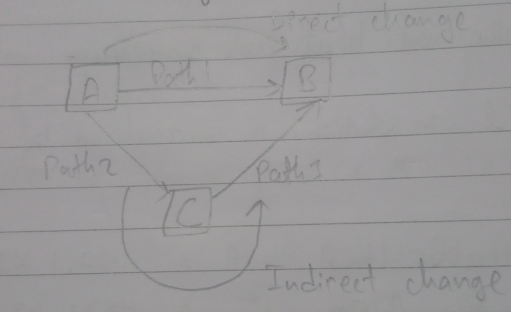

The heat energy or enthalpy in a physical process or chemical reaction is quite independent of the manner in which the change has been carried. 

## Application of Hess's Law 

- Predicting and calculating the enthalpy change of a reaction by compbinig known reactions. 
- Derivign overall enthalpy changes for complex reactions using simpler, measurable reactions. 
- Determining the tstandard enthalpy of formation of compounds. 
- Assessing heat changes in chemical processes, crucial in experimental setups. 
- Estimating the enthalpy change for combustion reactions 
- Evaluating multiple pathways for a reaction and predicting overall enthalpy changes. 
- Providing a theoretical basis for understanding and predicting energy changes in chemical changes. 

# Limitations of First Law of Thermodynamics 

1. All reaction don't take place in the same temperature and pressure. 
2. Different matter have different ways in which they react with each other. 

# Spontaneous Process 

A process which takes place either on its own or under some initiation. 

- Eg: 
    - Common salt dissolved in water
    - Evaporaton of water 
    - Zinc rod dipped in $CuSO_4$ solution form $ZnSO_4$ and $Cu$

# Non-Spontaneous Process 

The process which may not take place even after strong initiation. 

Eg: $Au + H_2O$ has no reaction 

# Driving Force in Spontaneous Reaction 

Tendency to acquire minimum energy to attain stability is the goal.

- Spontameous Process examples 
    1. Spring being compressed but goes to original state
    2. Carbon compound being burnt 
    3. Evaporatoin of water 
    4. Melting of ice

# Entropy 

Tendency of system to be in more disorder spontameously is known as entropy. 

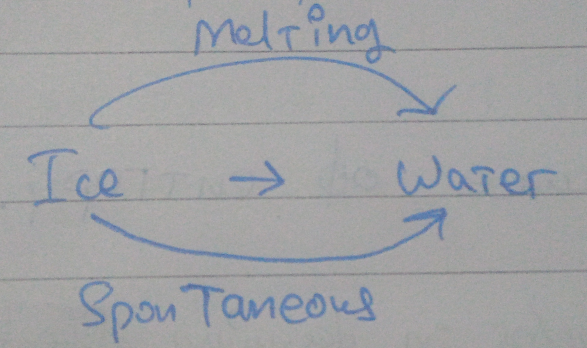

Acquired minimum energy is also responsible for entropy. 

Entropy should always increase in a system to be spontameous,  
i.e., $\Delta S = +ve$

- It is a state function and depends on the state of a system. 

- Entropy of a system depends on the temperature and increases with the rise in temperature, because it increases the chaos (kinetic enery) of the system. 

## Change in Entropy

$\Delta S = S_\text{product}-S_\text{Reactant}$

Unit: $J/K/mol$

If q is the heat evolved/absorbed in a reversible iso-thermal process then $\Delta S$ is given by   
$\Delta S = \frac{q_\text{rev}}{\text{Temperature}}$

## Physical Significance of Entropy 

1. Understanding of entropy helps in designing effective heating and energy conservation system. 
2. It helps to design chemical processes by measuring disorder in particle arrangement. 
3. It serves as a metaphor for system disorder and is applied to analyze market dynamics and societal trends.
4. It is useful in reducing traffic flow, reducing congestion and improving transportation system. 
5. It helps to model climate patterns, greenshouse gasses and earth's energy balance. 

## Factors Influencing Entropy 

1. **Volume change**: Entropy increases when the system gets more volume to move. 
2. **Tempreature change**: particles acquire more kinetic energy the more heat is supplied totem. 
3. **Physical state**: Going from solid to liquid to gas, the randomness of movement of particles increase. 
4. **Number of particles**: Particles collide much more when they are more in a system. 

## Entropy Change in Phase Transition 

1. **Entropy of fusion**: Change in entropy when 1 mol of solid at its melting point changes to liquid at the same tempreature. 

$\Delta S = S_\text{solid}+S_\text{liquid}=\frac{\Delta H_\text{fusion}}{T_\text{fusion}}$ $\frac{\text{Enthalpy}}{\text{Temperature}}^{+ve}$

# 2nd Law of Thermodynamics 

1. All spontaneous process or naturally occuring process are thermodynamically irreversable. 
2. Without the help of external agent, a spontaneous process cannot be reversed. 
3. If the system needs to be spontaneous, in a particular direction, $\Delta S$ must be greater than 0 ($+ve$)
4. The total entropy of the universe must tend to increase in a spontaneous process. 

$\Delta S=S_\text{system}+S_\text{Surrounding} > 0$

# Gibb's Free Energy (G)

It may be defined as the number of amount of energy available for doign useful work under conditions of constant temperature and pressure. 

$\Delta G=H-TS$

This equation is also known as Gibb-Helmholtz equation

## Change in Free Energy

$\Delta G = \Delta H - T\Delta S$

- If a change of reaction needs to be spontaneous, $\Delta G$ must decrease or must be $-ve$

- If $\Delta G$ is negative ($\Delta G < 0$), the process will be spontaneous. 

- Else $\Delta G=0$, system (process) is in equilibrium. 

# Conditions under which $\Delta G$ is Negative

1. If $\Delta H$ and $T\Delta S$ are negative, then, $\Delta H$ favors the spontaneous reaction while $T\Delta S$ offoses. 

> If the ambient tempreature is more than enthalpy, it will inhibit the exothermic process. 

2. If $\Delta H$ and $T\Delta S$ are positive,  
    - $\therefore T\DeltaS > \Delta H$

  

3. $\Delta H$ is $-ve$
    - $T\Delta S$ is $+ve$

# Effects of Temperature 

- High temperature will favor the endothermic process. 

$\Delta G = \underset{-ve}{\Delta H} - \underset{+ve}{T\Detla S}$  
$\Therefore$ Temperature variable should be high to speed up the process. 

Whereas for exothermic reaction,  
Low temperature favors the process as it helps to diffuse the heat faster to the surrounding. 

$\Delta G = \underset{-ve}{\Delta H} - \underset{-ve}{T\Delta S}$

In exothermic process $\Delta H$ is $-ve$, $\Delta S$ is also $-ve$, for $\Delta G$ to be $\Delta G$ to be $-ve$, temperature should be less. 

$\Delta S$ is $-ve$ because particles are becoming less random. 

# Phsical Significance of Gibb's Free Energy 

From 1st law of thermodynamics, 

$q=\Delta U+W$

If q is the heat absorbed by the system and $\Delta U$ is the change in internal energy and $W$ is the work done by the system, 

- The work $W$  includes two types of work, 
    - Work expansion 
    - Work non-expansion (useful work)

Because,  
In electrolysis of water to form $H_2$ and $O_2$ leading to the increase in volume, 

Transforming liquid to gas is expansion work and the electrical energy is the non-expansion useful work. 

$q = \Delta U + W_\Delta{exp}+W_\text{non-exp}$  
$\implies \Delta U + P\Delta V + W_\text{non-exp}$  
$\Delta H + W_\text{non-exp}$

Also, $q=T\Delta S$ 

$T\Delta S = \Delta H + W_\text{non-exp}$  
$\implies \Delta H - T\Delta S = -W_\text{non-exp}$  
$\implies\Delta G = -W_\text{non-exp}$

From this equation,  
Decrease in free energy results in non-expansion work. 

$\therefore -\Delta G= W_\text{non-exp}$

# Standard Free Energy Change 

$\Delta G\degree = \Delta H\degree - T\Delta S\degree$ 

Also,  
$\Delta G\degree = G\degree_\text{product} - G\degree_\text{reactant}$ 

# Relation between $\Delta G$ and Equilibrium Constant ($K_P$)

## For a reaction 

$aA+bB \leftrightarrows cC + dD$

$\Delta G = \Delta G\degree + RT ln \frac{P^C_C\times P^D_D}{P^A_A\times P^B_B}$  
$\Delta G  = \Delta G\degree + RT ln K_P$

## AT Equilibrium 

$\Delta G =0$  
$0=\Delta G\degree+RT ln K_P$  
$\Detla G =-RT ln K_P$

## According to Gibb-Helmholtz's Equation

$\Delta G\degree=\Delta H\degree -T\Detla S\degree$  
$-RT ln K_P = \Delta H\degree -T\Delta S$  
$ln K_P = \frac{T\Delta S - \Delta H}{RT}$
