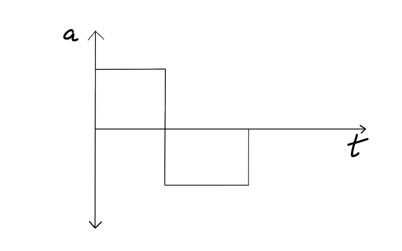

1. Deduce Dimensional formula of 
   1. Gravitational constant 
   2. Coefficient of viscocity 
   3. Universal gas constant 

2. Find the value of Stephen's constant ($\sigma$) in SI unit. (given $\sigma = 5.67\times 10^{-5} erg/s/cm^2/K^4$)

3. Check if 
   - $\nu = \frac{1}{2l}\sqrt{\frac{T}{M}}$
   - Check if this is dimensionally correct
     - $\nu$ = frequency 
     - l = length 
     - T = tension 
     - m = mass/unit length

4. Derive by method of dimensional analysis an expression for volume of liquid flowing out per second through a marrow pipe if rate of flow depends on 
   1. Coefficient of viscocity ($\nu$)
   2. Pressure gradient (pressure/length)
   3. Radius of pipe (r)

5. Substract with respect to significant figures 
   - $2.5 \times 10^{-6}$ from $4.0 \times 10^{-4}$

6. Multiply and roud off to appropriate signifiant figures
   - $75.5 \times 125.2 \times 0.51$

7. The acceleration of a particle is given below. If particle starts with velocity `2 m/s` at `t = 0s`, find velocity at the end of 2 seconds.
  - $s=3t^2+2t+2$

8. The displacement of a particle is given below. Find acceleration at the end of 3 seconds. 
   - $s=3t^2+2t+8$

9. velocity of a particle is given as, $v= 6t^3-2t$
   - Find 
     1. Acceleration of the particle from 1 to 3 seconds.
     2. Displacement of the particle from 2 to 4 seconds. 
     3. Acceleration of the particle at `t = 2 sec`.

10. A balloon ascends at a velocity of `9.8 m/s` at a **height of 39.2 m** above the ground. At that instant a food packet is dropped from the balloon. How much time and with what velocity the packet reach the ground. 
11. Acceleration-time graph is given, draw velocity-time graph. 

