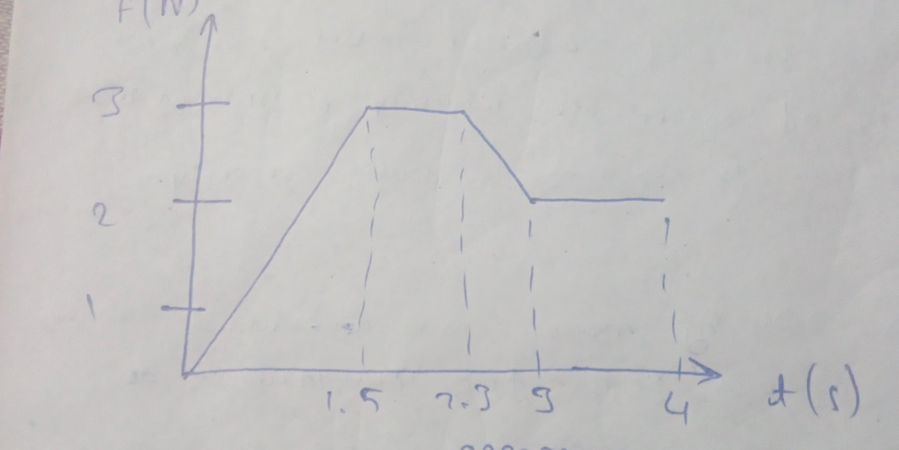
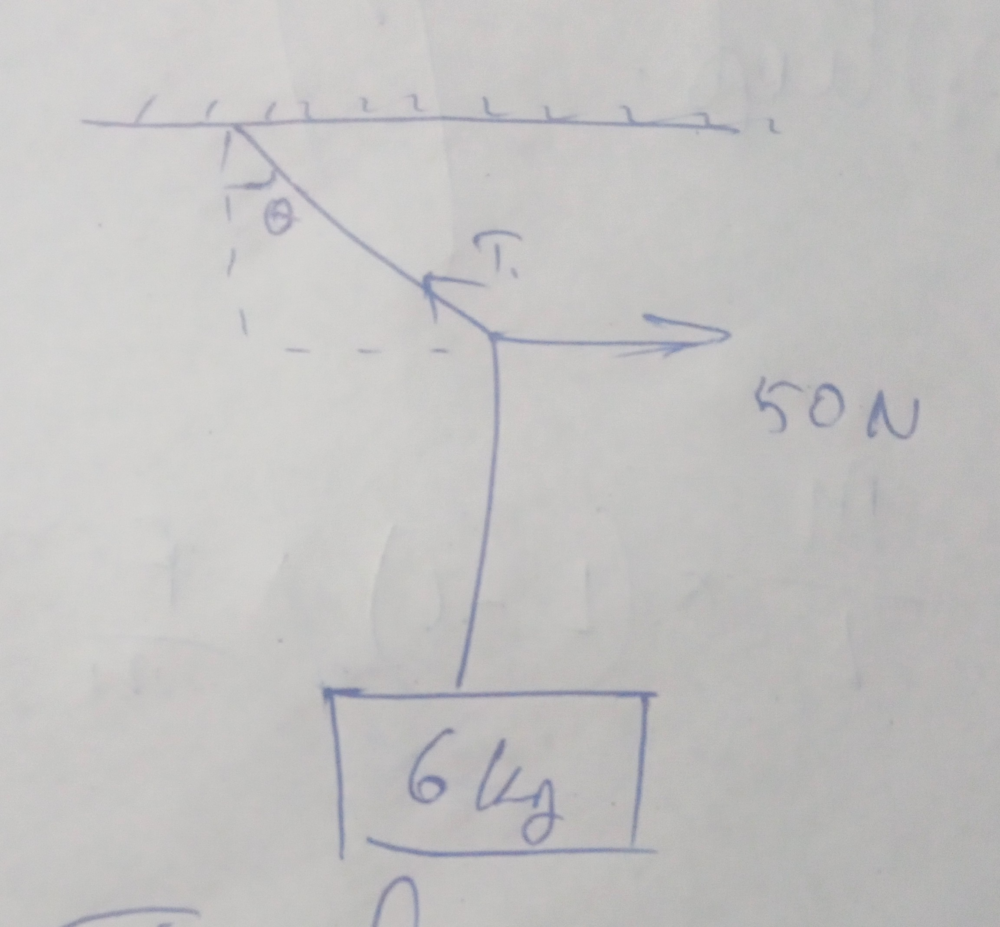
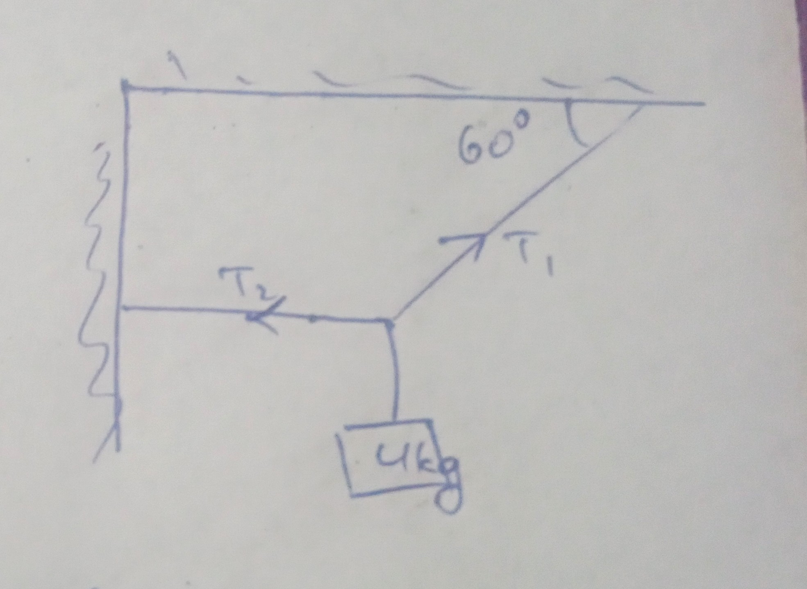
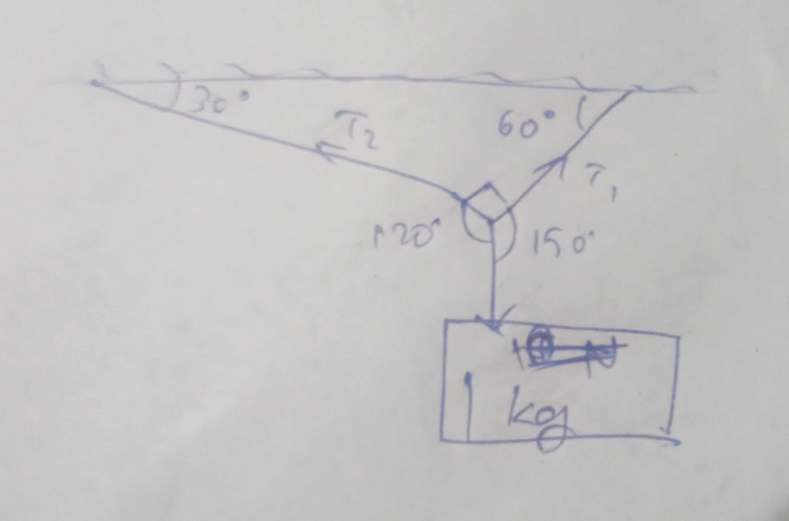

# 23/01/2024

1. Show
    1. If a mass $m$ remains ocnstant, the object having more velocity has more momentum. Also draw momentum-velocity graph if mass is constant.
    2. If velocity $v$ is constant, th eobject having more mass have more momentum. Draw momentum-mass graph if velocity is constant. 
    3. Show that if two bodies of different masses have same momentum, velocity of bodies are invesrely proportional to mass. Draw velocity-mass graph if momentum is constant. 
2. A bullet of mass 0.04 kg moving with a speed of 90 m/s enters a heavy wooden log and stops after travelling a distance 60 cm. What is the resistive force exerted by the log on the bullet. 
3. If $\overrightarrow{P}_x =2\ cos\ t$ and $\overrightarrow{P}_y=2\ sin\ t$, find force. Also find the angle between force and momentum. 
4. Define and derive inpulse-momentum theorem. 
5. A ball of mass 50 g falls from a height of 1 m and rebounces to a height of 0.5 m. Find impulse and average forec between the ball and the graound if time and of contact is 0.1 second. 
6. A ball moving with momentum of 5 kg m/s strikes a wall at an angle of $45\degree$ and deflects at the same angle. Calculate change in momentum along x and y axis. 
7. The initial speed of a body of mass 2 kg is 5 m/s. A force acts for 4 seconds in the direction of motion of the body. The force-time graph is shown. Calculate the impulse of the force and find speed of the body.

8. Show that apparent weight of a person inside a lift- 
    1. Increases when lift moves upward.
    2. Decreases when lift moves downwards. 
    3. Is zero if lift is under free fall. 
9. A lift of mass 2000 kg is supported by a thick steel rope. If maximum upward acceleration of the lift is 1.2 $m/s^2$ and breaking stress is $2.8 \times 10^8 N/m^2$, what should be the diameter of the rope? 
10. Derive equation of law of conservation of momentum from Newton's 3rd law. 
11. A 30 kg shell is flying at 48 m/s. When is explodes, its one part of 18 kg stops while the remaining flies on. Find velocity of the later. 
12. A mas of 6 kg is suspended by a rope of length 2 m from a ceiling. A force of 50 N in the horizontal direction is applied on the middle of the rope as shown. What is the angle that the rope makes with the vertical when it is in equilibrium. 

13. Determine the tension $T_1$ and $T_2$

 

14. A ball of mass 1 kg ends in equilibrium from 2 strings as shown. Find $T_1$ and $T_2$. 

15. A uniform rod of length 'L' is resting on a frictionless horizontal surface is pulled at one lenght of a force F. What is the tension in the rope at a distance 'l' from the end where force is applied. $(T = 1 = \frac{l}{L})F$

