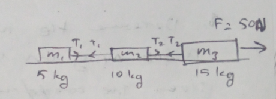
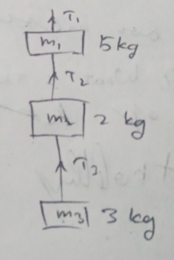
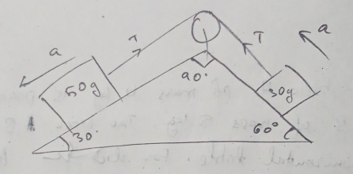
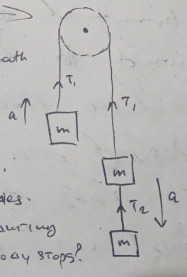
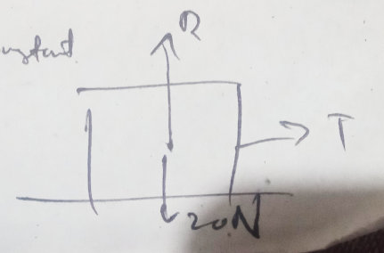
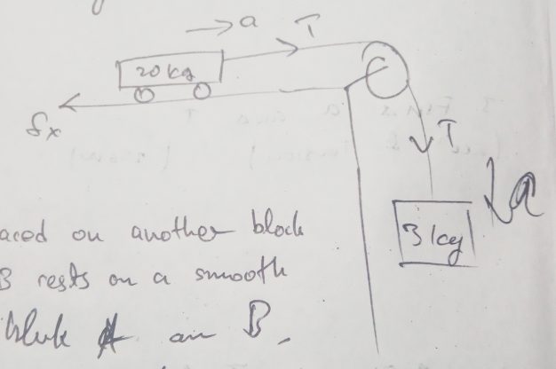
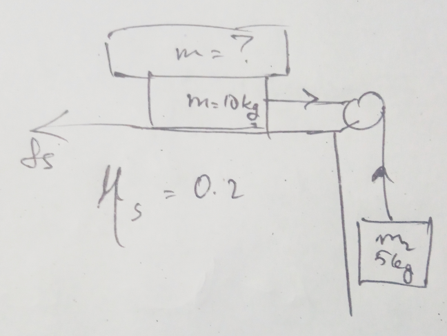

# 24/01/2024

1. Find $T_1$ and $T_2$.

2. Find $T_1$, $T_2$ and $T_3$ when 
    1. Whole system is at rest 
    2. Whole system is moving upward with acceleration 2 $m/s^2$

3. Find acceleration and tension. 

4. Find acceleration, $T_1$ and $T_2$

5. A body of mass 10 kg is placed on a smooth horizontal table. It is connected to a string which passes over a frictionless pulley and carries at the other end a body $m_2$ of mass 5 kg. What acceleration will be produced in the bodies? What will be the tension on the string during the motion of the body? What if the body stops? (g=$10m/s^2$)

6. A block of mass 2 kg is plaecd on the floor. The coefficient of static friction is 0.4. A force of 2.5 N is applied on the block as shown. Calculated force of friction. Will the block move? 

7. A block of weight 20 N is placed on a horizontal table and a tension T which can be increased to 8 N is applied before the block begins to move as shown. A force of 4 N keeps the block moving at constant speed once it has been set in motion. Find coefficient of static and kinetic friction. 

8. Determine the maximum accelem of the train in which a box lying on its floor will remain stationary given the coefficient of static friction between the box and the train floor is 0.15. (g = 10 $m/s^2$)

9. What is the acceleration of the block and trolley system if coefficient of static friction between the trolley and the surface is 0.04. 

10. Block A of mass 4 kg is placed on another block B of mass 5 kg. The block B rests on a smooth horizontal table. For sliding block A on B, a horizontal force of 12 N is to be applied on block A. When much force can be applied on block B so that both block A and B moves together. Find acceleration of the blcks together progressing. 

11. Find $m$ so system is in equilibrium. $(\nu_s = 0.2)$

