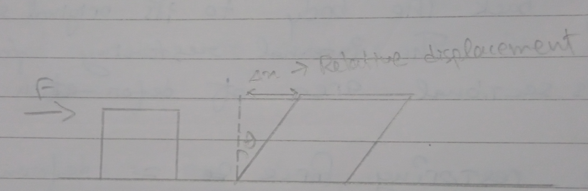
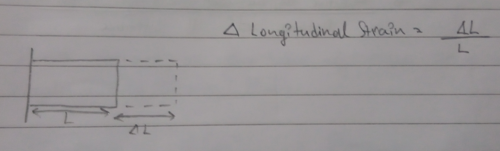
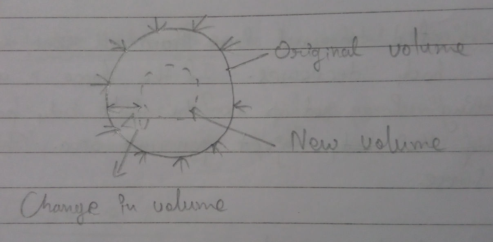
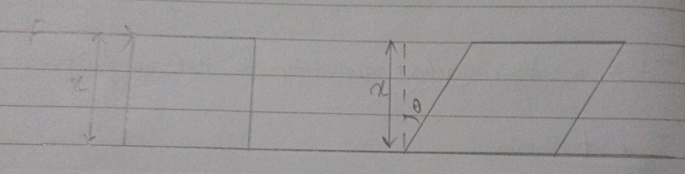
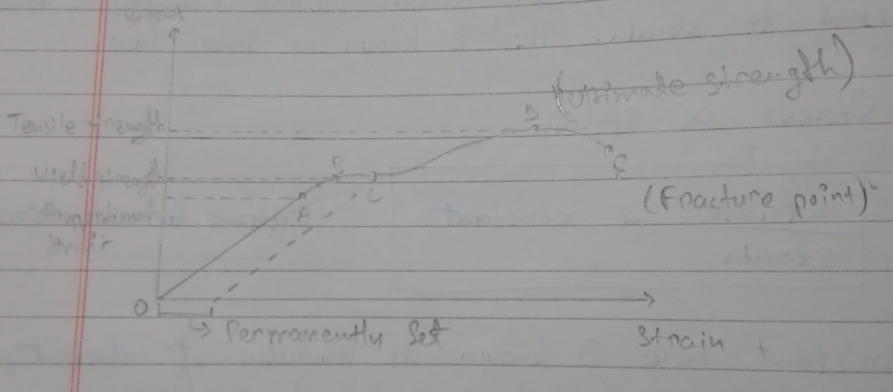
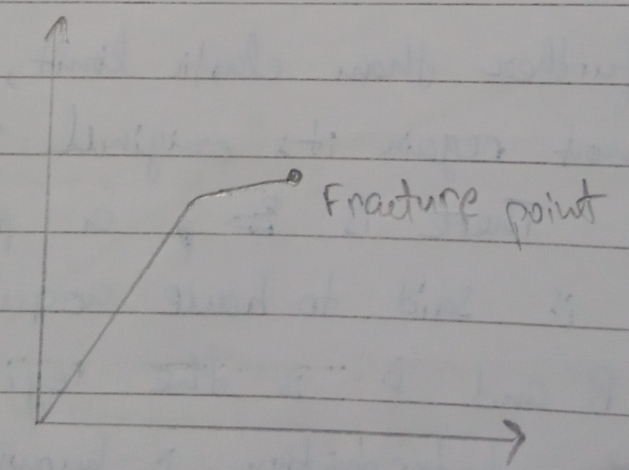
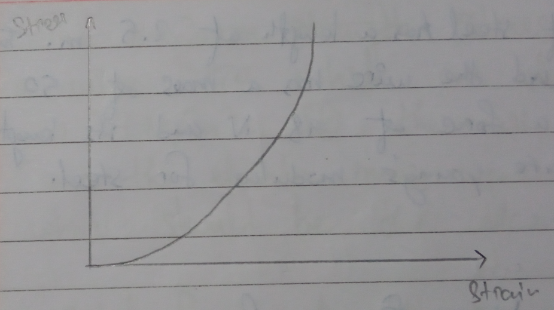
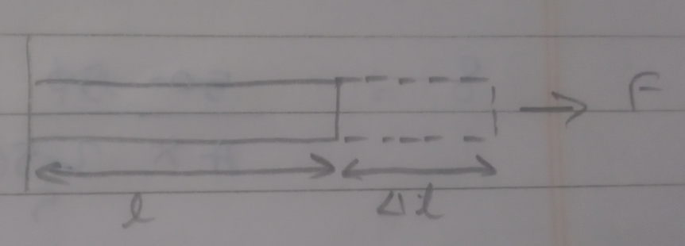
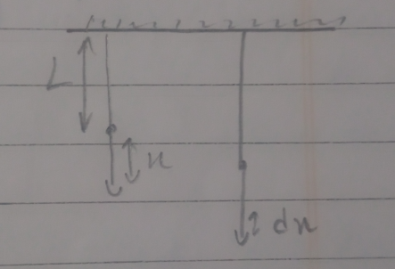
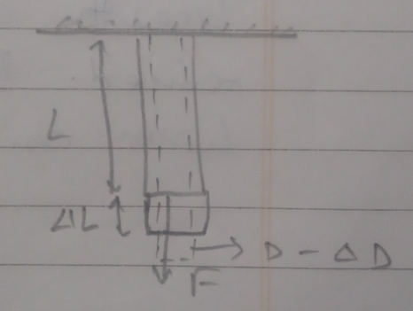

# Thermal Properties of Solids

# Elasitc and Plastic Behavior of Solid 

**Elasitc**: The material returns to its original shape and size when external forces aer removed due to molecular distortions.  
**Plastic**: Irreversable deformation resulting in permanent change in the material's atomic structure.  
**Deforming force**: A force which can change the shape and size of a body on which it is applied is called deforming force.  
**Elasticity**: Property of a solid to return to its original shape.  
**Perfectly Elasitc Body:** If a body regains it original shape and size immediately after removal of deforming foce, the body is said to be perfectly elasitc. Eg: quartz.  
**Plasticity:** Tendency of a body to go permanent, non-reversable deformation without fracturing when subjected to external forces. 
**Perfectly Plastic Body:** it is a material which deforms infinitely without resistance to change in its shape. 

> No body is perfectly elasitc or perfectly plastic. 

# Stress

Unit: $N/m^2$

When a body is deformed by and external deforming force and internal restoring force is developed to bring back the body to its original shape and size.  
The internal restoring force per cross-sectional area of deformation is called stress. 

Since, restoring force = deforming force, 

The formula of stress is given by, 

$$
\frac{Restoring Force}{Area} = \frac{Deforming force}{Area} = \frac{F}{A}  

OR 

\sigma = \frac{F}{A}
$$

Dimension: $[ML^{-1}T^{-2}]$

## Types of Stress 

1. **Tensile strength or longitudinal stress**: It is a restoric force set up per unit cross-sectional area of a body when length of the body increases in the directional force. 
2. **Compressive stress**: It is a restoric force set up per unit cross-sectional area when length decreases under deforming force. 
3. **Tangential stress or shearing stress**: 

 

When a body deforms under tangential force it produces a change in its shape of the body.  
The restoric force set up due to tangential force acting on a body is called tangential stress. 

> When tangential force applied, there is a relative displacement between the opposite surface on which the force is applied. 

4. **Bulk/volume/hydraulic/hydrostatic stress**: 

If a body is subjected to equal force from all sides, the volumes of the body decreases. IF the force is removed, there is a restorign force set up in the whole bbody perpendicular to the surface of the object per unit area. This stress is known as Bulk Stress. 

# Strain 

The ratio of change in dimension produced in a body to the original dimension is called strain. 

$$
\text{Strain} = \frac{\text{Change in dimension}}{\text{Original dimension}}
$$

It is a dimensionless quantity and has no units. 

## Types of Strain. 

1. **Longitudinal Strain:** It is defined as the increase in length per unit original length when the body is deformed by external force. 

2. Volumetric Strain 

3. **Shear Strain**: It is defined as angle $\theta$ (in radians) by which a face originally perpendicular to the fixed surface gets bent by applying tangential deforming force.

Shear strain = $\theta$  
$\implies \tau\theta$  
$\implies \frac{\Delta x}{x}$  
$\implies \frac{\text{Relative displacement between parallel surface}}{Distance between parallel surface}$

# Elastic Limit 

The maximum stress within which the body completely regains its original shape and size after removal of deforming force is called elastic limit.  
If deforming force exceeds the elastic limit, the body is permanently deformed. 

# Hooke's Law 

Within elastic limit, the stress developed in a body is directly proportional to strain. This is known as Hooke's law. 

$\text{Stress} \propto \text{Strain}$  
or $\frac{\text{stress}}{\text{strain}}$ = constant

- The constant here is known as modulus of elasticity or coefficient of elasticity  and depends on the type of material. 

# Modulus of Elasitcity

It is defined as the ratio of stress to that of strain within elastic limit. 

$\text{SI unit}: \frac{N}{m^2}$  
$\text{CGS unit}: \frac{dyne}{cm^2}$

Dimension: $[ML^{-1}T^{-2}]$

# Types of Modulus of Elasticity 

1. Young's modulus (Y)
2. Bulk modulus (k)
3. Modulus of Rigidity/Shear Modulus $(\eta)$

# Stress-Strain Curve

- Hooke's law is followed till Proportional limit
- Object can still return to original shape till yield strength/point
- Object permanently deforms when it reaches point C 
- Tensilestrendth is the maximum stress that can be applied at point D.

The graph represents stress-strain curve for a metallic wire, the graph can be explained as follows:

1. The region OA is linear and in this region, Hooke's law is obeyed. The point upto which Hooke's law is obeyed is called proportional limit. 
2. In the region AB, stress-strain curve is not proportional however if the force is remobed at any point before B, the wire regains its original shape. The point B is called **elastic limit** or **yield point**. The region OB is called elastic region and the stress corresponding to this point is called yiield strength. 
3. If the wire is stretched further than elastic limit, the strain increases rapidly and the wire does not regain its original shape or size even after removal for the load. There is a permanent increase in length and the wire is said to have acuired a permanent set. The region between B and D is the region where the wire is permanently set and the deformation is known as plastic deformation. 
4. The point D is the tensile strength of the graph beyond this point additional strains is produced event under the reduced force. 
5. Between point D and E the thinning of wire is not uniform and the wire breaks at point E known as Fracture point. 

# Stress-Strain Curve for Ductile material and Brittle material 

## Ductile material 

## Brittle material 

# Elastomers 

The material which can be elastically stretched to a large value of strain are called elastomers. This type of material doesn't obey Hooke's law and don't have a well defined plastic region. Eg: rubber. 

# Modulus of Elasticity (Coefficient of elasticity)

It is the ratio of stress to that of strain within elastic limit. It is also known as elastic moduli.

## 1. Young's Modulus (Y)

Within elastic limit, the ratio of longitudinal stress to that of longitudinal strain is called Young's modulus. 

$Y = \frac{\text{Longitudinal stress}}{\text{longitudinal strain}}$  
$\implies \frac{F/A}{\Delta l/l}$  

$Y = \frac{F}{A} \times \frac{l}{\Delta l}$

### Note 

1. Young's modulus (Y) is directly proportional to Force (F).
2. Greater the Young's modulus (Y) of the material, greater will be the force required to create small change in the length of a body. As a result, a large amount of restoring force will also be developed within the body and the body will be more elastic.  
This is the reason why steel is more elastic than rubber. 
3. More the slope of stress-strain curve, more is the value of Young's modulus. 

# 2. Bulk Modulus 

B = $\frac{\text{Volumetric stress}}{\text{Volumetric strain}}$  
$\frac{-F/A}{\Delta v/v}$  
$\implies -P\frac{V}{\Delta V}$

Here,  
B: Bulk modulus  
P: Pressure applied  
$\Delta V/ V$: Fractional compression  
-ve sign indicates the volume decreases. 

### Note 

1. The reciprocal of bulk modulus is called compressibility. 

$k = \frac{1}{B}$

2. More is the bulk modulus, less is the compressibility. 

$\therefore$ Solids have the highest bulk modulus and gases haev the least.

# Shear Modulus / Modulus of Rigidity (G)

$G = \frac{\text{Shear stress}}{Shear strain}$

$\frac{F/A}{\theta} = \frac{F/A}{\Delta x/l}$  
or,   
$G = \frac{F}{A}\times \frac{l}{\Delta x}$

> For most of the material, 
> 
> $G = \frac{Y}{3}$

# Elastic Potential Energy of Stretched string/wire

Let us consider a wire of length 'l' and cross-sectional area 'a' is fixed at one end and a force 'f' is applied on other. The wire is stretched slowly. Let us assume when initial force is applied, the wire is stretched by a distance 'x'. Now if we increase the force by small amounts, there will be very little extension dx in the graph. 

Initially, 

$Y = \frac{F}{A}\times\frac{l}{\Delta l}$  
$Y = \frac{F}{A}\times\frac{L}{x}$  
$F = \frac{FAx}{L}$ ------ $\frak{1}$

Now, if wire is stretched further, there is also a small increase in length dx because of which a small amount of work is done. 

$\therefore dw = F\cdot dx$  
$\implies \frac{YAx}{L}dx$

$\therefore$ Total amount of work that'll be done will be

$\overset{w}{\underset{0}{\int}}dw = \overset{\Delta L}{\underset{0}{\int}}\frac{YAx}{L}dx$  
$W = \frac{YA}{2L}(\Delta L)^2$

This work done will be stored as potential energy denoted by letter `U`.

$\therefore U = \frac{YA}{2L}(\Delta L)^2$  
$\implies \frac{YA}{2L^2} \times (\Delta L)^2 \times L$  
$\implies \frac{1}{2}\times(\frac{\Delta L}{L})\times\frac{Y\Delta L}{L}\times(AL)$  
$U = \frac{1}{2}\times\text{strain}\times\text{stress}\times\text{volume}$

# Elastic Energy per unit Volume (u)

$u = \frac{U}{v}$  
$\implies \frac{\frac{1}{2}\times\text{stress}\times\text{strain}\times\text{volume}}{volume}$  
$\implies \frac{1}{2}\times\text{stress}\times\text{strain}$  
$\implies \frac{1}{2}Y(\frac{\Delta L}{l})\times\text{strain}$

$u = \frac{1}{2}\times Y\times\text{strain}$

# Poisson's Ratio 

When a wire is stretched, its length increases wile diameter decreases.  
The strain produced in the direction of applied force is called longitudinal strain and that produced in the perpendicular direction is called lateral strain.  
Within elasitc limit the ratio of lateral strain to that of longitudinal strain is called Poisson's ratio. 

$\text{Longitudinal strain} = \frac{\Delta l}{l}$  
$\text{Lateral strain} = \frac{-\Delta D}{D}$

$\text{Poisson's ratio} = \frac{\text{Lateral strain}}{\text{Longitudinal strain}}$  

$\sigma = \frac{-\Delta D}{D}\times\frac{l}{\Delta l}$

# Application of Elasticity 

## 1. Why a railway track or beams used in buildings are I-shaped 

Ans> The depresion in the middel of the beam is given by the formula, 

$$
\delta = \frac{Wl^3}{4Ybd^3}
\ [\text{W: weight, l: length, b: breadth, h: height}]
$$

The depression of the beam depends on length, breadth and height. So if we increase breadth and height, depression can be reduced. By making it I-shaped, the mass of beam can be reduced. 