# System of Particles & Rotational Motion 

# Introduction 

## Some Important terms 

1. **Particle**: An object whose mass is finite but size and internal structure can be neglected. In Most cases the motion of large bodies can be described in terms of motion of a particle by considering them to be a rigid body where all particles move with a same velocity, i.e., have only translatory motion. 
2. **System**: A collection of very large number of particles which mutually interact with one another. A body of finite size can be regarded as a system because it is composed of large number of particle interacting with one another.
3. **Internal forces**: The mutual forces exerted by the particles of a system on one another is called internal force. This force is responsible for holding particles of system together.
4. **External forces**: The external agencies that can change the velocity of the object. 

Newton's Laws are applicable only to the objects which shows translatory motion.  
The center of mass of a system of particle is that single point in the body which moves in the same way in which a single particle having the total mass of the system and acted upon by the same exteal force would move. 

> If a single force acts on a body and line of action of force passes through the center of mass, the body will only show linear acceleration and translatory motion, but if force is not applied along the line of force, then the body would rotate about center of mass. 

# Center of gravity and Mass 

The center of mass is a point where whole mass of the body is concentrated for describing the translatory motion.  
Center of gravity is a point at which the resultant of gravitational force on all the particles of a body acts, i.e., a point where whole weight of the body may be assumed. 

> For a small body and uniform gravitational field, center of gravity and center of mass coincides. However for a body in which gravitational force acting is not constant, the center of center of gravity and center of mass may not coincide. For example: center of gravity of Mt. Everest is belor center of mass of it. 

# Center of mass of Two Particle System 

$$
R_{CM} = \frac{m_1\overrightarrow{r_1} + m_2\overrightarrow{r_2}}{m_1 + m_2}
$$

### NOTE: 

1. If $m_1 = m_2$, 
   - $R_{CM} = \frac{\overrightarrow{r_1} + \overrightarrow{r_2}}{2}$
   - $x_{CM} = \frac{m_1x_1 + m_2x_2}{m_1 + m_2}$ 
2. If $(x_1, y_1)$ and $(x_2, y_2)$ are coordinates of two points,  
   - $y_{CM} = \frac{m_1y_1 + m_2y_2}{m_1 + m_2}$
   - $z_{cm} = \frac{m_1z_1 + m_2z_2}{m_1 + m_2}$

# Center of Mass of n Particle System 

$$
\overrightarrow{R}_{CM} = \frac{m_1r_1 + m_2r_2 ..... + m_nr_n}{m_1 + m_2 ... m_n}
$$
$$
\overrightarrow{R}_CM = \frac{\overset{n}{\underset{i=1}{\Sigma}} m_i\overrightarrow{r}_i}{ \overset{n}{\underset{i=1}{\Sigma}} m_i }
$$
$$
\implies \frac{\overset{n}{\underset{i=1}{\Sigma}} m_ix_i}{M} [M = \text{Sum of all masses}]
$$

 

> Center of mass of a body doesn't depend on coordinate system.

$x_{CM} = \frac{\overset{n}{\underset{i=1}{\Sigma}} m_ix_i}{M}$  
$y_{CM} = \frac{\overset{n}{\underset{i=1}{\Sigma}} m_iy_i}{M}$  
$z_{CM} = \frac{\overset{n}{\underset{i=1}{\Sigma}} m_iz_i}{M}$

# Center of Mass of Different Objects 

1. Uniform hollow sphere: center 
2. Uniform solid sphere: center 
3. Uniform circular ring: at center
4. Uniform circular disk: center 
5. Uniform rod: center of rod 
6. Plane lamina (square, rectangle, trapezium): intersection opint of diagonal 
7. Triangular lamina: at centroid (intersection point of medians)
8. Solid cone: $\frac{3h}{4}$ from top (h=height of cone)

# Derivation of Expression for Center of Mass of Two Particle System 

The velocity and acceleration vector of two particles are:

$$
v_1 = \frac{d\overrightarrow{r}_1}{dt}, a_1 = \frac{d\overrightarrow{v}_1}{dt} = \frac{d^2\overrightarrow{r}_1}{dt^2}
$$
$$
v_2 = \frac{d\overrightarrow{r}_2}{dt}, a_2 = \frac{d\overrightarrow{v}_2}{dt} = \frac{d^2\overrightarrow{r}_2}{dt^2}
$$

**Considering these equation as eq. 1**

Now, the total force acting on body $m_1$ will be,

$\overrightarrow{F}_1 = \overrightarrow{F}_1^{ext} + \overrightarrow{F}_{12} = m_1\overrightarrow{a}_1$  

Similarly,  

$\overrightarrow{F}_2 = \overrightarrow{F}_2^{ext} + F_{21} = m_2\overrightarrow{a}_2$

And these as equation 2.

But according to Newton's second law of motion,  
$\overrightarrow{F}_1 = m_1\overrightarrow{a}_1$

Adding both centered equations from above, 

$m_1\overrightarrow{a}_1 + m_2\overrightarrow{a}_2 = \overrightarrow{F}_1^{ext} + \overrightarrow{F}_2^{ext} + \overrightarrow{F}_{12} + \overrightarrow{F}_{21}$

But,  
$\overrightarrow{F}_1^{ext} = -\overrightarrow{F}_2^{ext} \text{ }[\text{From Newton's third law}]$  
$\therefore \overrightarrow{F}^{ext}_1 + \overrightarrow{F}_2^{ext} = m_1\overrightarrow{a}_1 + m_2\overrightarrow{a}_2$

This equation shows that the internal force is not responsible for any change in motion of the body. The change is only caused due to external forces. 

$\therefore \overrightarrow{F} = \overrightarrow{F}_1^{ext} + \overrightarrow{F}_2^{ext} = m_1\overrightarrow{a}_1 + m_2\overrightarrow{a}_2$ ---------- 3

$\overrightarrow{F}$ = net force acting on body  
Then, M = $m_1$ and $m_2$  
and if the force F is applied to the center of mass, then the acceleration of the body will be, 

$\overrightarrow{a}_{CM} = \frac{F}{M}$

From equation 3, $\overrightarrow{a}_{CM} = \frac{m_1\overrightarrow{a}_1 + m_2\overrightarrow{a}_2}{M}$  
or,  

$$
\frac{d^2R_{CM}}{dt^2} = \frac{(m_1 \frac{d^2\overrightarrow{r}_1}{dt^2} + \frac{m_2d^2\overrightarrow{r}_2}{dt^2})}{M} [\text{From equation 1}] 
$$

$$
\implies \frac{1}{M}\frac{d^2}{dt^2} (m_1\overrightarrow{r}_1 + m_2\overrightarrow{r}_2)
$$

$d^2R_{CM} = \frac{d^2}{dt^2}(\frac{m_1\overrightarrow{r}_1 + m_2 \overrightarrow{r}_2}{M})$  

$\overrightarrow{R}_{CM} = \frac{m_1\overrightarrow{r}_1 + m_2\overrightarrow{r}_2}{M}$

### NOTE

1. $M\overrightarrow{a}_{CM} = \overrightarrow{F}_1 + \overrightarrow{F}_2 + \overrightarrow{F}_3...$
   - $\implies M\overrightarrow{a}_{CM} = \overrightarrow{F}_{total}$
   - or $\overrightarrow{a}_{CM} = \frac{\overrightarrow{F}_{total}}{M}$
   - or $\frac{d^2}{dt^2}(\overrightarrow{R}_{CM}) = \frac{\overrightarrow{F}_{total}}{M}$

 

2. Position of center of mass if masses are descrete
   - $x_{CM} = \overset{n}{\underset{i=1}{\Sigma}} \frac{m_ix_i}{m_i}$
   - $y_{CM} = \overset{n}{\underset{i=1}{\Sigma}} \frac{m_iy_i}{m_i}$
   - $z_{CM} = \overset{n}{\underset{i=1}{\Sigma}} \frac{m_iz_i}{m_i}$

 

3. Position of center of of mass if masses are continious
   - $x_{CM} = \frac{1}{M} \int x dm$
   - $y_{CM} = \frac{1}{M} \int y dm$
   - $z_{CM} = \frac{1}{M} \int z dm$

4. If we assume that center of mass is at origin then the sum of movement of mass of the system about center of mass is 0.  
i.e. $m_i\overrightarrow{r}_1 + m_2\overrightarrow{r}2 + m_3\overrightarrow{r}_3 .... = 0$  
or $\overset{n}{\underset{i=1}{\Sigma}} m_i\overrightarrow{r}_i = 0$

Here $m_ir_i$ is known as movemnt of masses. 

# Position Vector of Center of Mass at any Time 

$\overrightarrow{R}_{CM}(t) = \overrightarrow{R}_{CM}(O) + \overrightarrow{V}_{CM}t$

# Momentum Conservation 

To show that total momentum of a system is conserved if net external force acting on the body is zero. 

$\implies$ Let total force acting on a body be $\overrightarrow{F}_{total} = \overrightarrow{F}_1 + \overrightarrow{F}_2..... \overrightarrow{F}_n$  

If net external force is 0, 

$\overrightarrow{F}_1 + \overrightarrow{F}_2..... \overrightarrow{F}_n = 0$  
$m_1\overrightarrow{a}_1 + m_2\overrightarrow{a}_2 + m_3\overrightarrow{a}_3.... m_n\overrightarrow{a}_n = 0$  
$\implies \frac{m_1d\overrightarrow{v}_1}{dt} + \frac{m_2d\overrightarrow{v}_2}{dt} + \frac{m_3d\overrightarrow{v}_3}{dt}.... \frac{m_nd\overrightarrow{v}_n}{dt} = 0$

$\frac{d}{dt} (m_1\overrightarrow{v}_1 + m_2\overrightarrow{v}_2 + m_3\overrightarrow{v}_3... m_n\overrightarrow{v}_n) = 0$  
$\implies \frac{d}{dt} (\overrightarrow{P}_1 + \overrightarrow{P}_2 + \overrightarrow{P}_3... + \overrightarrow{P}_n) = 0$  
$\implies \frac{d}{dt}(\overrightarrow{P}) = 0 = \frac{d}{dt} (const)$  
$\therefore \overrightarrow{P} = const$

# Calculation of Momentum in Terms of Velocity of Center of Mass 

We know, 
$\overrightarrow{R}_{CM} = \frac{m_1\overrightarrow{r}_1 + m_2\overrightarrow{r}_2 +... m_n\overrightarrow{r}_n}{m_1 + m_2...m_n}$  
$\therefore \overrightarrow{R}_{CM} = \frac{\overset{n}{\underset{i=1}{\Sigma}} m_ir_i}{m_i}$

Differentiating both side with respect to time, 

$\frac{d\overrightarrow{R}_{CM}}{dt} = \frac{\overset{n}{\underset{i=1}{\Sigma}}m_id\overrightarrow{r}_i}{m_i}$  
$\implies \overset{n}{\underset{i=1}{\Sigma}} \frac{m_i\overrightarrow{v}_i}{m_i}$  
$\overrightarrow{V}_{CM} = \overset{n}{\underset{i=1}{\Sigma} \frac{\overrightarrow{P}_i}{M}}$  
$\implies \frac{\overrightarrow{P}}{M}$  
$\therefore \overrightarrow{P} = M \overrightarrow{v}_{CM}$

This shows that, the total linear momentum of a system of particle is equal to the product of the total mass of system and velocity of center of mass. 

# Motion of Center of Mass of Different Systems 

1. Binary stars 

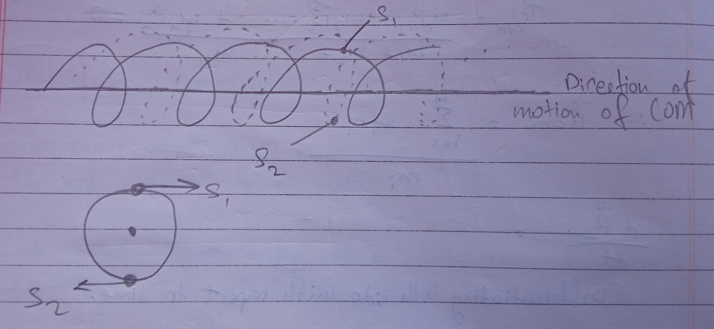

2. Earth-moon system 

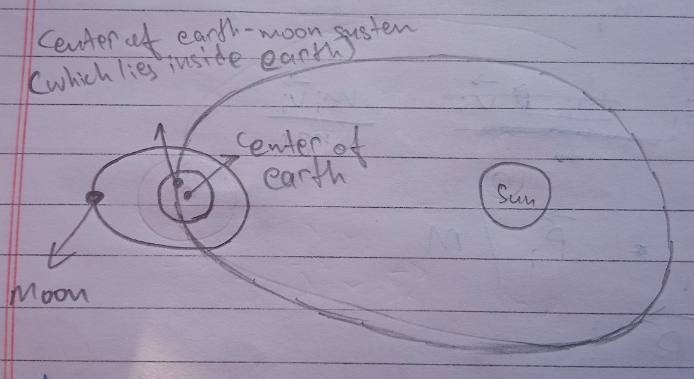

> The center of mass of Earth-moon system revolves around the elliptical path and not the actual center of Earth. 

3. Motion of center of mass of exploding crackers 

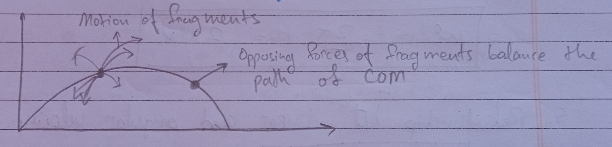

4. Equation of motion for rotational motion 

(i) Circular motion 

1. Angular displacement 

$\Delta \Theta = \frac{\Delta s}{r}$ 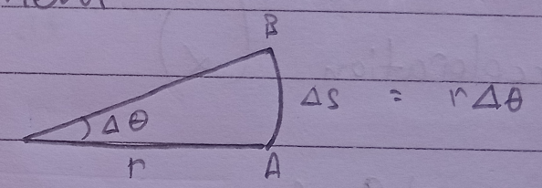

$\circ = \frac{2\pi r}{r}$

2. Angular velocity 

$\omega = \frac{d \theta}{dt}$

3. Frequency of revolution 

$\nu = \frac{1}{T}$

4. Relationship between $\omega$, $\nu$ and T 

$\omega = \frac{2 \pi}{T} = 2\pi\nu$

5. Relationship between Linear and angular velocity 

$\nu = \omega r$  
$\overrightarrow{v} = \overrightarrow{\omega} \times \overrightarrow{r}$

6. Angular acceleration $(\alpha)$

$\alpha = \frac{d\omega}{dt}$

7. Relationship between angular and linear acceleration. 

$a = \alpha r$  
$\overrightarrow{a} = \alpha \times \overrightarrow{r}$

8. Centripetal acceleration 

$a_c = \frac{v^2}{r}$

9. Tangential acceleration 

$a_T = \alpha r$

$\alpha_{net} = \sqrt{a_c^2 + a_T^2}$

# Equation of Motion 

($v = u + at$) = ($\omega = \omega_0 = \alpha t$)  
($s = ut + \frac{1}{2}at^2$) $=$ ($\theta = \omega_0t + \frac{1}{2}\alpha t^2$)  
($v^2 - u^2 = 2as$) $=$ ($\omega^2 - \omega_0^2 = 2\alpha\theta$)

## 1st Equation of Motion 

$\omega = \omega_0 + \alpha t$

We know that,  
$\alpha = \frac{d\theta}{dt}$  
$\implies d\omega = \alpha dt$

On integration, 

$\overset{\omega}{\underset{\omega_0}{\int}}d\omega = \alpha \underset{0}{\overset{t}{\int}} dt$

$\implies \omega - \omega_0 = at$  
$\implies \omega = \omega_0 + at$

## 2nd Equation of Motion 

$\theta = \omega_0t + \frac{1}{2} at^2$  
$\omega = \frac{d\theta}{dt}$  
$d\theta = \omega dt$  
On integrating, 

$\overset{\theta}{\underset{0}{\int}}d\theta = \overset{\theta}{\underset{0}{\int}}\omega dt$  
$\implies \underset{0}{\overset{\theta}{\int}}d\theta = \overset{t}{\underset{0}{\int}}(\omega_0 + \alpha t)dt$

## 3rd Equation of Motion 

$\omega^2 - \omega_0^2 = 2\alpha\theta$  
$\alpha = \frac{d\omega}{dt} = \frac{d\omega}{dw} \cdot \frac{d\theta}{d\theta}$  
$\alpha = \frac{d\omega}{d\theta} \omega$  
$\alpha d\theta = \omega d\omega$

**Integrating**,  

$\overset{\theta}{\underset{0}{\int}}\alpha d\theta = \overset{\omega}{\underset{\omega_0}{\int}} \omega d\omega$  
$a[\theta\overset{\theta}{\underset{0}{]}} = [\frac{\omega^2}{2}\overset{\omega}{\underset{\omega_0}{]}}$  
$2\alpha\theta = \omega^2 - \omega_0$  
$\omega^2 - \omega_0^2 = 2\alpha\theta$

These formular can only be used if angular acceleration is constant.

# Moment of Force or Torque 

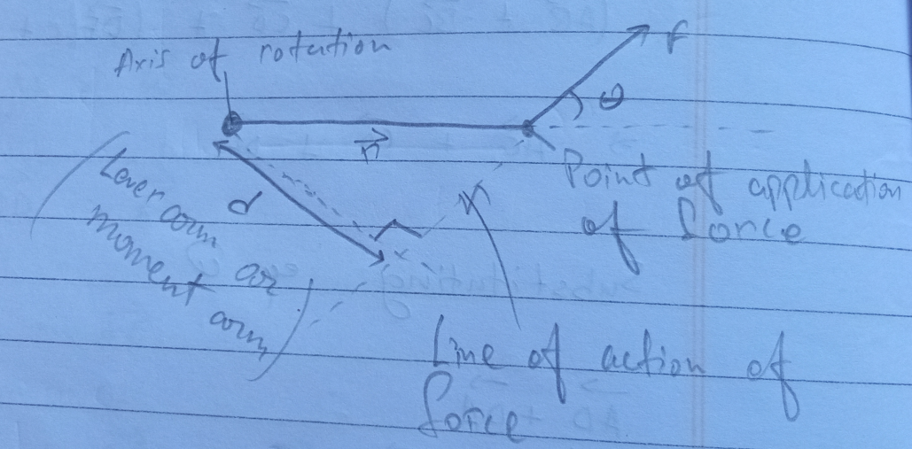

**Torque ($\tau$)**: The turning effect of forec is called moment of forec or torque.  
**Dependencies**: force magnitude, direction, perpendicular distance from axis of rotation. 

Perpendicular distance from axis is called lever arm or moment arm.

$\therefore$ Torque ($\tau$) = $Fd$

# Unit and Dimenstion of Torque 

Unit = dyne cm, newton meter 

**Dimension**: $[ML^2T^{-2}]$

## Special Cases

1. $\theta$ = 0$\degree$ or 180$\degree$, the torque is 0. 
2. $\theta$ = 90$\degree$, $\tau$ is maximum and its values is $rF$
3. If r is large torque is large. 

## Couple 

A pair of equal and opposite force acting on a body along two different line of action constitute a couple. 

Let us assume that a body rotates along the point O when the two forces are applied. This couple will produce the torque on the body.  
So torque of couple about point O will be given as 

$\tau$ = $F \times OA + F \times OB$  
$\implies F(OA+OB)$  
$\implies F\times AB$  
**or**, 
$\tau = Fd$

$\therefore \tau$ or moment of couple is the product of either force and perpendicular distance between two forces. 

> The moment of couple is independent of point of rotation. 

## Work done by Torque 

1. By constant force 

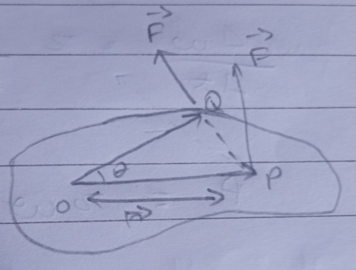

Let us assume after the application of force $F$, the particle $P$, inside the body moves to a point $Q$

$\therefore W = F \cdot \text{arc}PQ$  
$\implies F \text{arc} PQ$

Now $\text{arc}(PQ)$ = $r\Delta\theta$

$\therefore W = Fr\Delta\theta$  
$W = \tau\Delta\theta$

$\therefore \text{Work done by applied force} = \tau \times \text{angular displacement}$

# Work Done by Variable Force 

$\overset{\omega}{\underset{0}{\int}}d\omega = \overset{\theta_2}{\underset{\theta_1}{\int}}\tau d \theta$

# Power Delivered by Torque 

$\Delta = \tau \Delta \theta$  
$\frac{\Delta \omega}{\Delta t} = \tau \frac{\Delta\theta}{\Delta t}$  
$P = \tau \omega$

**Power is the product of torque and angular velocity.**

# Components of Torque 

$\overrightarrow{\tau} = \overrightarrow{r} \times \overrightarrow{F}$  
$\tau_x \hat{i} + \tau_y \hat{j} + \tau_z \hat{k} = (r_x\hat{i} + r_y\hat{j} + r_z\hat{k}) \times (F_x\hat{i} + F_y\hat{j} + F_z\hat{k})$  
$\implies r_y\hat{j}F_z\hat{k}$

# Angular Momentum 

The produm of linear momentum and the perpendicular distance of line of action of linear momentum from the axis of rotation is called linear momentum. 

Linear momentum, $L$ = $mvr$

In vector form,  
$\overrightarrow{L} = \overrightarrow{r} \times \overrightarrow{p}$

**Dimension**: $[ML^2T^{-2}]$

**SI unit:** $kg$ $m^2$ $/s$

**Cgs unit:** $g$ $cm^2$ $/s$

# Direction of Angular Momentum 

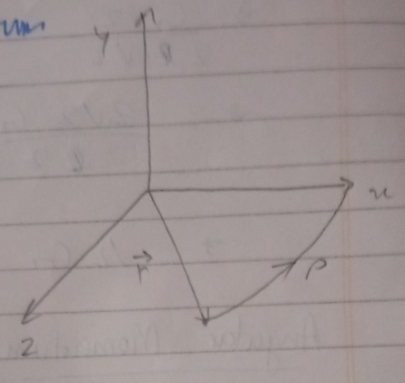

The direction of angular momentum is given by right-hand thumb rule. 

## Physical Significance of Angular Momentum 

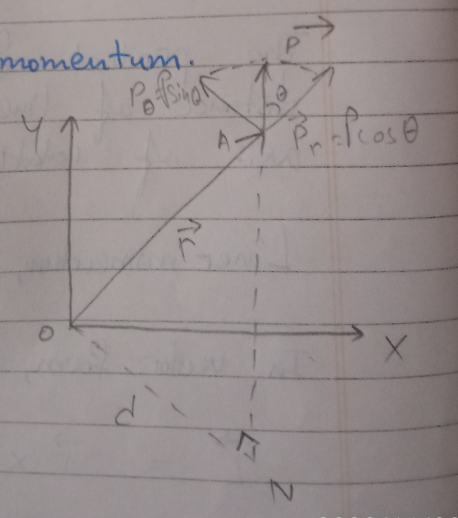

Draw ON perpendicular to line to action of linear momentum. 

In $\Delta OAN$, 

$\frac{ON}{OA} = sin\theta$

$sin\theta = \frac{d}{r}$

$d = r \text{ sin}\theta$

Accordign to definition of angular momentum, 

$L = pd$  
$\implies pr \text{ sin}\theta$  
$\implies rp \text{ sin}\theta$

$\overrightarrow{L} = \overrightarrow{r} \times \overrightarrow{p}$

Thus Angular momentum is also known as moment of linear momentum. 

# Comparison of Torque and Angular Momentum 

1. Torque is movement of force is given by $\tau = rF \text{ sin}\theta$  
   - $L = rp \text{ sin}\theta$

2. Radial component of Linear momentum is $\overrightarrow{P}_r = P\text{ cos}\theta and angular momentum, $P_\theta = P\text{ sin}\theta$$

We know,  
$L = rp \sin\theta$  
$\implies rp \theta$

$\therefore$ Angular momentum only exists because of angular component of Linear momentum. 

3. Angular momentum in rectangular component. 

$\overrightarrow{r} = x\hat{i} + y\hat{j} + z\hat{k}$  
$\overrightarrow{P} = P_x\hat{i} + P_y\hat{j} + P_z\hat{k}$  
$\overrightarrow{L} = \overrightarrow{r} \times \overrightarrow{p}$  
$L_x\hat{i} + L_y\hat{j} + L_z\hat{k}$

# Relation between Torque and Angular Momentum 

$\overrightarrow{\tau} = \overrightarrow{r} \times \overrightarrow{F}$  
$\overrightarrow{L} = \overrightarrow{r} \times \overrightarrow{p}$

Differentiating Linear momentum with time, 

$\frac{d\overrightarrow{L}}{dt} = \frac{d}{dt} (\overrightarrow{r} \times \overrightarrow{p})$  
$\implies \frac{d\overrightarrow{r}}{dt} = \overrightarrow{p} + \overrightarrow{r} \times \frac{d(P)}{dt}$  
$\implies \overrightarrow{v} \times m\overrightarrow{v} + \overrightarrow{r} \times \overrightarrow{F}$  
$\implies \overrightarrow{r} \times \overrightarrow{F}$ 

$\frac{d\overrightarrow{L}}{dt} = \overrightarrow{\tau}$

$\therefore$ Rate of change of angular momentum is equal to torque acting on the body. 

# Geometrical Representation of Angular Momentum 

Consider a particle of mass M rotating in x-y plane abut the origin. Let $\overrightarrow{r} and \overrightarrow{r}+/Delta \overrightarrow{r}$ be the position vector of the particle at instant $t$ and $t+\delta t$ 

$\therefore$ Displacement of the particle will be, 

$PQ = \Delta r$

If v is the velocity of the particle then $\Delta \overrightarrow{r}$ will be,

$\Delta \overrightarrow{r} = v\Delta t$

Now,  
Area of paralleleogram $OPQR$ = $\overrightarrow{r} \times \Delta\overrightarrow{r}$

So, area of $\Delta OPQ = \frac{1}{2} (\overrightarrow{r}\times \Delta \overrightarrow{r})$  
$\Delta A = \frac{1}{2}(\overrightarrow{r}\times\overrightarrow{v}\Delta t)$ ------ $\frak{1}$

Now, 

$\overrightarrow{P} = m\overrightarrow{v}$  
$\overrightarrow{v} = \frac{\overrightarrow{P}}{M}$  
Putting this value in equation 1, 

$\Delta A = \frac{1}{2}(\overrightarrow{r}\times \frac{\overrightarrow{P}}{M} \Delta t)$

$\frac{\Delta A}{\Delta t} \frac{1}{2M} (\overrightarrow{r} \times \overrightarrow{P})$  
$\therefore \frac{\Delta A}{\Delta t} \frac{1}{2M} \overrightarrow{L}$

Here, the quantity $\frac{\Delta A}{\Delta t}$ is the area swept by the position vector per unit time and is called areal velocity of particle. 

Torque and angular momentum for system of particle 

$\overrightarrow{L} = \overrightarrow{L}_1 \overrightarrow{L}_2..... + \overrightarrow{L}_n = \overset{n}{\underset{i=1}{\Sigma}} L_i$  
$\implies \overset{n}{\underset{i=1}{\Sigma}} \overrightarrow{r}_i \times \overrightarrow{p}_i$

**Similarly,** 

$\overrightarrow{\tau} = \overset{n}{\underset{i=1}{\tau}_i}$  
$\implies \overset{n}{\underset{i=1}{\Sigma}} \overrightarrow{r} \times \overrightarrow{F}$

# Equilibrium of Rigid Body 

A rigid body is said to be in equilibrium if both linear and angular momentum of the body remains constant with time.

1. For a body to be in translational equilibrium, the body will be at rest or in uniform motion. Under this condition, 

$$
\overrightarrow{F}_{ext} = 0
$$

2. For a body to be in rotational equilibrium, the torque must be zero, i.e., 

$$
\overrightarrow{\tau} = \overrightarrow{r} \times \overrightarrow{F} = 0
$$

# Types of Equilibrium 

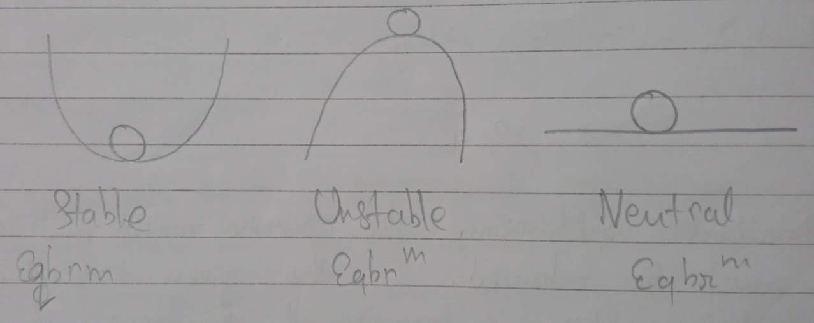

- Center of mass rises when displaced, potential energy is minimum. 

- Types
    1. **Stable**: center of mass returns to its original position when displaced, and the potintial energy is at a minimum. 
    2. **Unstable**: center of mass falls when displaced, potential energy is maximum. 
    3. **Neutral**: center of mass stays the same, potential energy is same.

# Moment of Inertia / Rotational Inertia 

The property of a body by virtue of which it opposes the change in rotational motion or torque which tends to change its state of rest or uniform rotation about its axis is called rotational or moment of inertia. 

It is given as,  
$I = \overset{n}{\underset{i=1}{\Sigma}} m_ir_i^2$

**SI unit:** $kg m^2$  
**CGS unit:** $g cm^2$  

**Dimension:** $[ML^2T^0]$

## Factors on which moment of Inertia depends 

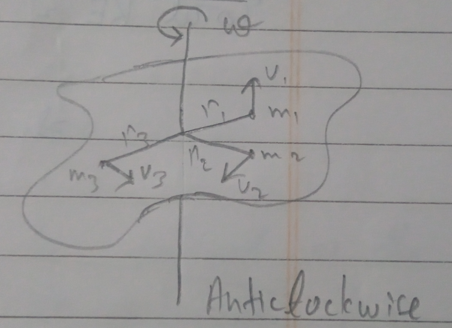

1. Mass of the body.
2. Shape and size of the body.
3. Distribution of mass about the rotational axis. 
4. Position and orientation of axis or rotation.

# Relationship between Rotational Kinetic Energy and Moment of Inertia 

$KE = \frac{1}{2}m_1v_1^2 + \frac{1}{2}m_2v_2^2..... m_nv_n^2$  
$\implies \overset{n}{\underset{i=1}{\Sigma}} \frac{1}{2}m_iv_i^2$

$v_1 = \omega r_1, v_2 = \omega r_2, v_n=\omega r_n$

Applying in previous equation, 

$KE = \frac{1}{2}m_1\omega^2r_1^2 + \frac{1}{2}m_2\omega^2r_2^2 ....\ +\frac{1}{2}m_n\omega^2r_n^2$  
$\implies \frac{1}{2}\omega(m_1r_1^2.... m_nr_n^2)$

$\therefore$ Rotational Kinetic Energy = $\frac{1}{2}\omega^2(\overset{n}{\underset{i=1}{\Sigma}}m_ir_i^2)$

# Total Kinetic Energy of a Body 

Total kinetic energy = Translatory kinetic energy + rotational kinetic energy 

$\implies \frac{1}{2}mv^2 + \frac{1}{2}\Iota\omega^2$

# Radius of Gyration (k)

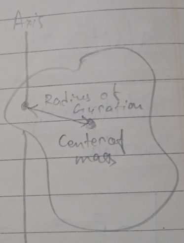

The radius of gyration of a body about tsi axis of rotational may be defined as the distance from the axis or rotation at which whole mass of the body is concentrated, the moment of inertia about given axis would be tthe same as of actual mass distribution. 

# Expression for Radius of Gyration 

$I = \overset{n}{\underset{i=1}{\Sigma}}m_ir_i^2$

If mass of all the particles is assumed to be same and the body contains 'n' particles, 

$I = \overset{n}{\underset{i=1}{\Sigma}} mr_i^2$  
$\implies mn(\frac{r_1^2 + r_2^2..../ r_n^2}{n})$

$I = Mk^2$

Here,  
$M = m\times n =$ Total mass of body  
$K = \overset{n}{\underset{i=1}{\Sigma}}\frac{r_i^2}{n}$  
$\implies \text{Root mean square distance}$

The distance of gyration can also be defined as the root mean square distance of its particles from axis of rotation. 

# Factors on which Radius of Gyration (k) Depends 

1. Position and direction of axis of rotation.
2. Distribution of mass about axis of rotation.

# Distance of Centroid from Vertex 

$\frac{2}{3} \times \text{height of equilateral}\ \Delta$  
$\implies \frac{2}{3}\times\frac{\sqrt{3}}{2}a$ [a = side of triangle]

# Moment of Inertia of Different Shaped Objects

  

# Relationship between Torque and Momentum of Inertia 

$\tau = Fr$, $\tau = mr^2\alpha$  
$F = ma$, $F = mr\alpha$  
$a = r\alpha$

If the body is made up of n particles of mass $m_1$, $m_2$... 

$\tau = \overset{n}{\underset{i=1}{\Sigma}} m_ir_i^2 \alpha$  
$\implies \alpha(\overset{n}{\underset{i=1}{\Sigma}} m_ir_i^2)$

$\tau = \Iota\alpha$

# Relationship between Moment of Inertia and Angular Momentum 

$L = pr$  
$p = mv = mr\omega$  
$L = mr^2\omega$

If there are n particles, 

$L = \omega (\overset{n}{\underset{i=1}{\Sigma}} m_ir_i^2)$  
$L = \Iota\omega$

# Conservation of Angular Momentum 

If angular momentum is conserved, 

$\tau = \frac{dL}{dt} = 0$  
$\implies \int dL = \int 0 dt$  
$\implies L = const$  
$\Iota\omega = const$  
$\Iota_1\omega_1 = \Iota_2\omega_2$

# Applications of Angular Momentum 

1. **Planetary Motion**: Angular velocity increases when planet comes close to the sun in elliptical orbit. 
2. Ice skater increases angular velocity by holding their arms. 
