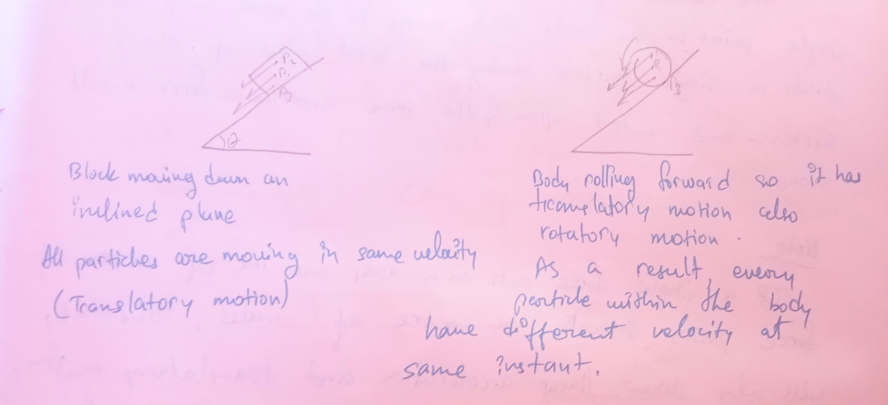
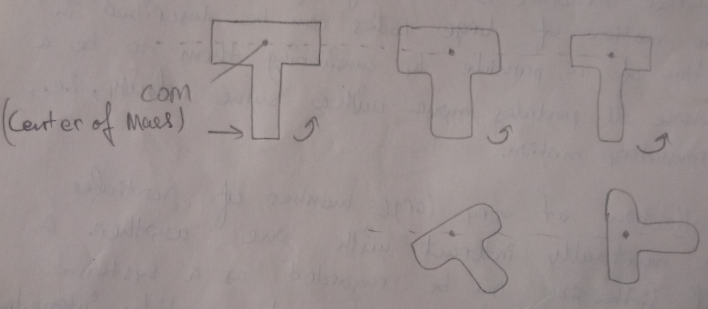
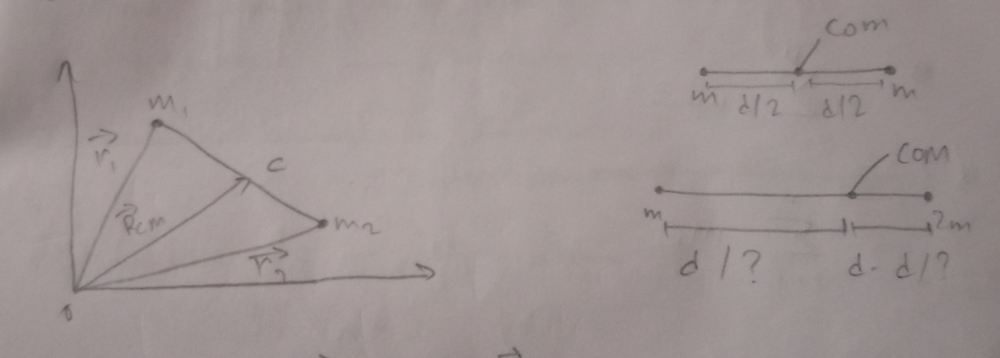
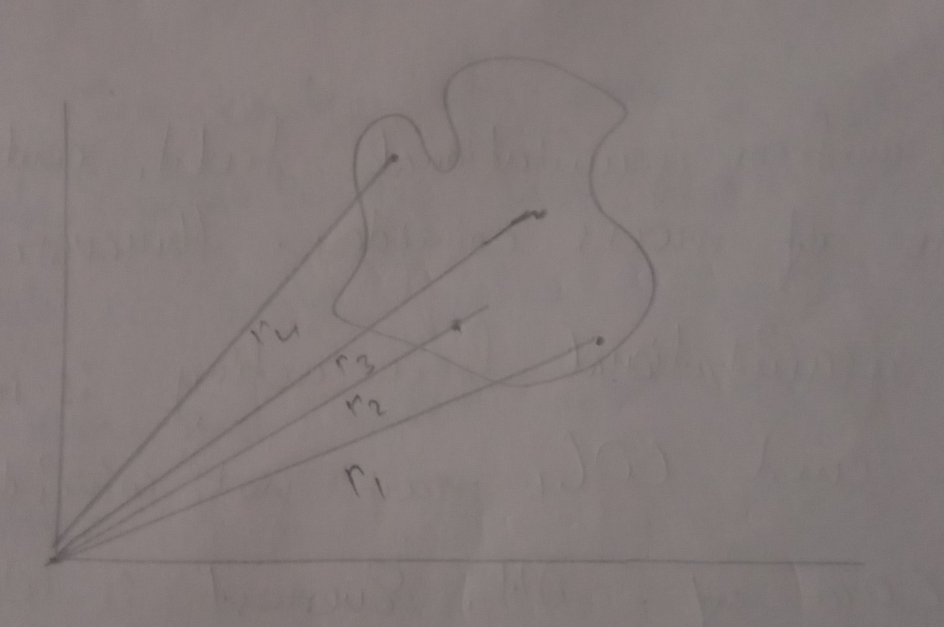

# System of Particles & Rotational Motion 

# Introduction 

## Some Important terms 

1. **Particle**: An object whose mass is finite but size and internal structure can be neglected. In Most cases the motion of large bodies can be described in terms of motion of a particle by considering them to be a rigid body where all particles move with a same velocity, i.e., have only translatory motion. 
2. **System**: A collection of very large number of particles which mutually interact with one another. A body of finite size can be regarded as a system because it is composed of large number of particle interacting with one another.
3. **Internal forces**: The mutual forces exerted by the particles of a system on one another is called internal force. This force is responsible for holding particles of system together.
4. **External forces**: The external agencies that can change the velocity of the object. 

Newton's Laws are applicable only to the objects which shows translatory motion.  
The center of mass of a system of particle is that single point in the body which moves in the same way in which a single particle having the total mass of the system and acted upon by the same exteal force would move. 

> If a single force acts on a body and line of action of force passes through the center of mass, the body will only show linear acceleration and translatory motion, but if force is not applied along the line of force, then the body would rotate about center of mass. 

# Center of gravity and Mass 

The center of mass is a point where whole mass of the body is concentrated for describing the translatory motion.  
Center of gravity is a point at which the resultant of gravitational force on all the particles of a body acts, i.e., a point where whole weight of the body may be assumed. 

> For a small body and uniform gravitational field, center of gravity and center of mass coincides. However for a body in which gravitational force acting is not constant, the center of center of gravity and center of mass may not coincide. For example: center of gravity of Mt. Everest is belor center of mass of it. 

# Center of mass of Two Particle System 

$$
R_{CM} = \frac{m_1\overrightarrow{r_1} + m_2\overrightarrow{r_2}}{m_1 + m_2}
$$

### NOTE: 

1. If $m_1 = m_2$, 
   - $R_{CM} = \frac{\overrightarrow{r_1} + \overrightarrow{r_2}}{2}$
   - $x_{CM} = \frac{m_1x_1 + m_2x_2}{m_1 + m_2}$ 
2. If $(x_1, y_1)$ and $(x_2, y_2)$ are coordinates of two points,  
   - $y_{CM} = \frac{m_1y_1 + m_2y_2}{m_1 + m_2}$
   - $z_{cm} = \frac{m_1z_1 + m_2z_2}{m_1 + m_2}$

# Center of Mass of n Particle System 

$$
\overrightarrow{R}_{CM} = \frac{m_1r_1 + m_2r_2 ..... + m_nr_n}{m_1 + m_2 ... m_n}
$$
$$
\overrightarrow{R}_CM = \frac{\overset{n}{\underset{i=1}{\Sigma}} m_i\overrightarrow{r}_i}{ \overset{n}{\underset{i=1}{\Sigma}} m_i }
$$
$$
\implies \frac{\overset{n}{\underset{i=1}{\Sigma}} m_ix_i}{M} [M = \text{Sum of all masses}]
$$

 

> Center of mass of a body doesn't depend on coordinate system.

$x_{CM} = \frac{\overset{n}{\underset{i=1}{\Sigma}} m_ix_i}{M}$  
$y_{CM} = \frac{\overset{n}{\underset{i=1}{\Sigma}} m_iy_i}{M}$  
$z_{CM} = \frac{\overset{n}{\underset{i=1}{\Sigma}} m_iz_i}{M}$

# Center of Mass of Different Objects 

1. Uniform hollow sphere: center 
2. Uniform solid sphere: center 
3. Uniform circular ring: at center
4. Uniform circular disk: center 
5. Uniform rod: center of rod 
6. Plane lamina (square, rectangle, trapezium): intersection opint of diagonal 
7. Triangular lamina: at centroid (intersection point of medians)
8. Solid cone: $\frac{3h}{4}$ from top (h=height of cone)

# Derivation of Expression for Center of Mass of Two Particle System 

The velocity and acceleration vector of two particles are:

$$
v_1 = \frac{d\overrightarrow{r}_1}{dt}, a_1 = \frac{d\overrightarrow{v}_1}{dt} = \frac{d^2\overrightarrow{r}_1}{dt^2}
$$
$$
v_2 = \frac{d\overrightarrow{r}_2}{dt}, a_2 = \frac{d\overrightarrow{v}_2}{dt} = \frac{d^2\overrightarrow{r}_2}{dt^2}
$$

**Considering these equation as eq. 1**

Now, the total force acting on body $m_1$ will be 

$\overrightarrow{F}_1 = \overrightarrow{F}_1^{ext} + \overrightarrow{F}_{12} = m_1\overrightarrow{a}_1$  
Similarly,  
$\overrightarrow{F}_2 = \overrightarrow{F}_2^{ext} + F_{21} = m_2\overrightarrow{a}_2$

And these as equation 2.

But according to Newton's second law of motion,  
$\overrightarrow{F}_1 = m_1\overrightarrow{a}_1$

Adding both centered equations from above, 

$m_1\overrightarrow{a}_1 + m_2\overrightarrow{a}_2 = \overrightarrow{F}_1^{ext} + \overrightarrow{F}_2^{ext} + \overrightarrow{F}_{12} + \overrightarrow{F}_{21}$

But,  
$\overrightarrow{F}_1^{ext} = -\overrightarrow{F}_2^{ext} \text{ }[\text{From Newton's third law}]$  
$\therefore \overrightarrow{F}^{ext}_1 + \overrightarrow{F}_2^{ext} = m_1\overrightarrow{a}_1 + m_2\overrightarrow{a}_2$

This equation shows that the internal force is not responsible for any change in motion of the body. The change is only caused due to external forces. 

$\therefore \overrightarrow{F} = \overrightarrow{F}_1^{ext} + \overrightarrow{F}_2^{ext} = m_1\overrightarrow{a}_1 + m_2\overrightarrow{a}_2$ ---------- 3

$\overrightarrow{F}$ = net force acting on body  
Then, M = $m_1$ and $m_2$  
and if the force F is applied to the center of mass, then the acceleration of the body will be, 

$\overrightarrow{a}_{CM} = \frac{F}{M}$

From equation 3, $\overrightarrow{a}_{CM} = \frac{m_1\overrightarrow{a}_1 + m_2\overrightarrow{a}_2}{M}$  
or,  

$$
\frac{d^2R_{CM}}{dt^2} = \frac{(m_1 \frac{d^2\overrightarrow{r}_1}{dt^2} + \frac{m_2d^2\overrightarrow{r}_2}{dt^2})}{M} [\text{From equation 1}] 
$$

$$
\implies \frac{1}{M}\frac{d^2}{dt^2} (m_1\overrightarrow{r}_1 + m_2\overrightarrow{r}_2)
$$

$d^2R_{CM} = \frac{d^2}{dt^2}(\frac{m_1\overrightarrow{r}_1 + m_2 \overrightarrow{r}_2}{M})$  

$\overrightarrow{R}_{CM} = \frac{m_1\overrightarrow{r}_1 + m_2\overrightarrow{r}_2}{M}$

### NOTE

1. $M\overrightarrow{a}_{CM} = \overrightarrow{F}_1 + \overrightarrow{F}_2 + \overrightarrow{F}_3...$
   - $\implies M\overrightarrow{a}_{CM} = \overrightarrow{F}_{total}$
   - or $\overrightarrow{a}_{CM} = \frac{\overrightarrow{F}_{total}}{M}$
   - or $\frac{d^2}{dt^2}(\overrightarrow{R}_{CM}) = \frac{\overrightarrow{F}_{total}}{M}$

 

2. Position of center of mass if masses are descrete
   - $x_{CM} = \overset{n}{\underset{i=1}{\Sigma}} \frac{m_ix_i}{m_i}$
   - $y_{CM} = \overset{n}{\underset{i=1}{\Sigma}} \frac{m_iy_i}{m_i}$
   - $z_{CM} = \overset{n}{\underset{i=1}{\Sigma}} \frac{m_iz_i}{m_i}$

 

3. Position of center of of mass if masses are continious
   - $x_{CM} = \frac{1}{M} \int x dm$
   - $y_{CM} = \frac{1}{M} \int y dm$
   - $z_{CM} = \frac{1}{M} \int z dm$

4. If we assume that center of mass is at origin then the sum of movement of mass of the system about center of mass is 0.  
i.e. $m_i\overrightarrow{r}_1 + m_2\overrightarrow{r}2 + m_3\overrightarrow{r}_3 .... = 0$  
or $\overset{n}{\underset{i=1}{\Sigma}} m_i\overrightarrow{r}_i = 0$

Here $m_ir_i$ is known as movemnt of masses. 