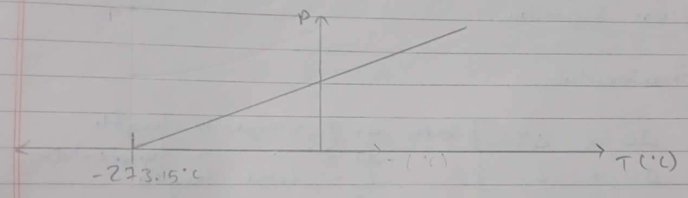
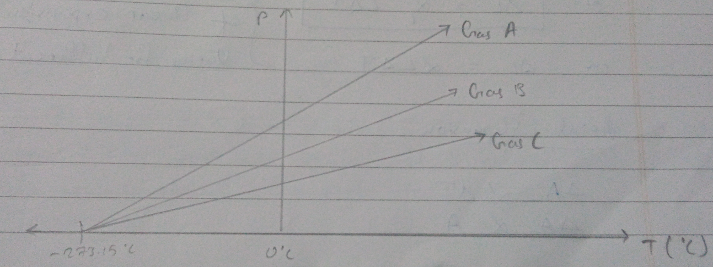
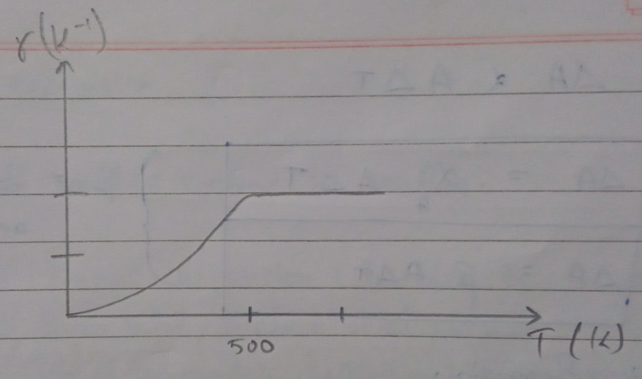

# Thermal Properties of Solids 

**Heat**: It is a form of energy which produces in us the sensation of warmth or coldness.  
Heat is energy in transit that flows from one body to another due to temperature difference. 

## Dynamic Theory of Heat 

Heat is the energy produced due to molecular motion and is equal to the sum total of kinetic energy possessed by molecules due to translational, rotational and vibrational motion. 

**Si unit**: Joule  
**CGS unit**: Calorie

**1 calorie**: It is the amount of heat required to raise the temperature of $1g$ of water by $1\degree C$.

1 cal = 4.186 J 

# Temperature 

It is the measure of degree of nothess or coldness.  
The temperature of a body decides the direction of flow of heat when two bodies are in contact.

The temperature of a body is the measure of average kinetic energy of its molecules. 

**SI unit**: Kelvin $(K)$

# Conversion of Temperature from One Scale to Another 

$\frac{\text{Temperature in one scale - Lower fixed point}}{\text{Higher fixed point - Lower fixed point}}$

$\implies \frac{\text{Temperature on anothre scale - Lower fixed point}}{\text{Higher fixed point - Lower fixed point}}$

- $T_C$
  - Boiling point of water: $100\degree C$
  - Melting point of water: $0\degree C$
- $T_F$
  - Boiling point of water: $212\degree F$
  - Melting point of water: $32\degree F$
- $T_K$
  - Boiling point of water: $373.15 K$
  - Melting point of water: $273.15 K$

$\frac{T_C-C}{100-0} = \frac{T_F-32}{212-32}=\frac{T_K-273.15}{373.15-273.15}$  

$\frac{T_C}{100}=\frac{T_F-32}{180}=\frac{T_K-273.15}{100}$

$T_F=\frac{9}{5}+32$

# Absolute Scale of Water 

Liquid in glass thermometer shows different readings for temperature other than fixed point because of different expansion properties.  
However, experiment shows that thermometer that uses gas shows same expansion property at low density, when same quantity of gas is used. The factor which describes the behavior of given mass of gas are pressure, temperature and volume. And these properties of gas can be expressed by using two laws.

1. **Charles' law**: here pressure remains constant

$\frac{V}{T} = const$

2. **Boyle's law**: here temperature remains constant 

$PV = const$

Combining both relations we get, 

$\frac{PV}{T}=const$  
$\implies PV = const \times T$  
$\implies PV = \mu RT = nRT$

Here $\mu \text{ or } n$ = number of moles of gas  
$R$ = universal gas constant  
$R = 8.314 J mol^{-1}K^{-1}$

From this equation,

$PV \propto T$

IF volumes is constant, 

$P \propto T$

## Variation of Pressure and Temperature of different Gases at Low Density 

# Thermal Expansion 

Almost all matter expand on heating. 

- Types 
  1. **Linear expansion**: increase in length
  2. **Superficial/surface arial expansion**: increase in surface area 
  3. **Cubical/volumetric expansion**: Increase in volume 

As temperature increases, vibration increases as well as inter-molecular space. 

## Linear Expansion 

$\Delta L\propto \Delta T$  
$\Delta L\propto L$

- Here, 
  - $\Delta L$ = change in length 
  - $\Delta T$ = change in temperature
  - $L$ = total length 

$\therefore \Delta L \propto L\Delta T$

or $\Delta L = \alpha_l L\Delta T$  
or $\Delta L = \alpha L\Delta T$

$\alpha_l$ or $\alpha$ is the coefficient of linear expansion. Varies for different material. 

## Arial Expansion 

$\Delta A \propto \Delta T$  
$\Delta A \propto A$  
$\Delta A \propto A\Delta T$

$\implies \Delta A =\alpha_A A\Delta T$  
or $\Delta A = \beta A\Delta T$

$\beta$ = coefficient of arial expansion 

## Volumetric Expansion

$\Delta L \propto \Delta T$  
$\Delta L \propto V$

$\implies \Delta L \propto V\Delta T$

$\implies \Delta A=\alpha_v\Delta V\Delta T$  
$\implies \Delta A=\gamma V\Delta T$

**SI unit of $\alpha$, $\beta$, $\gamma$**: $[K^{-1}]$ 

> We know, $\gamma = \frac{\Delta V}{V\Delta T}$  
> So it can be said that $\gamma$ is not independent of $\Delta T$. However for solid and liquid,it is noticed that $\gamma$ becomes almost constant at high temperatures. 

# Relationship between $\alpha$, $\beta$ and $\gamma$

## Between $\alpha$ and $\beta$

Let $dA$ be the change in are ao a 2D square metal sheet when temperature is changed by $dT$. Under this condition, 

$dA = \beta AdT$ ------$\frak{1}$

But,  
$A = l^2 [l \text{ is the size of square sheet}]$

Differentiating we get, 

$dA =2ldl$----- $\frak{2}$

From eq. $\frak{1}$ and $\frak{2}$,

$2ldl = \beta Adt$------$\frak{3}$

But,  
$dl=\alpha ldT$

Putting this value in eq. $\frak{3}$,

$2l \times \alpha ldT = \beta AdT$  
$2l^2\alpha dT = \beta l^2 dT$  
$\implies 2\alpha=\beta$  
or $\alpha = \frac{\beta}{2}$

## Relationship between $\alpha$ and $\gamma$

Let $dv$ be the increasing volume where $dt$ temperature is increased for a cube side $l$ 

$\therefore dv=\gamma VdT$ ------$\frak{1}$

But,  
$v =l^3$  
$dv=3l^2dl$-------$\frak{2}$

From eq. $\frak{1}$ and $\frak{2}$

$3l^2dl = \gamma VdT$ -------$\frak{3}$

But,  
$dl=\alpha ldT$

Butting this in eq. $\frak{3}$

$3l62\alpha ldT=\gamma VdT$  
$\implies 3l^3\alpha=\gamma V$  
$\implies 3l^3\alpha = \gamma l^3$  
$\implies 3\alpha = \gamma$  
$\implies \alpha=\frac{\gamma}{3}$ 

$\therefore \alpha =\frac{\beta}{2}=\frac{\gamma}{3}$

