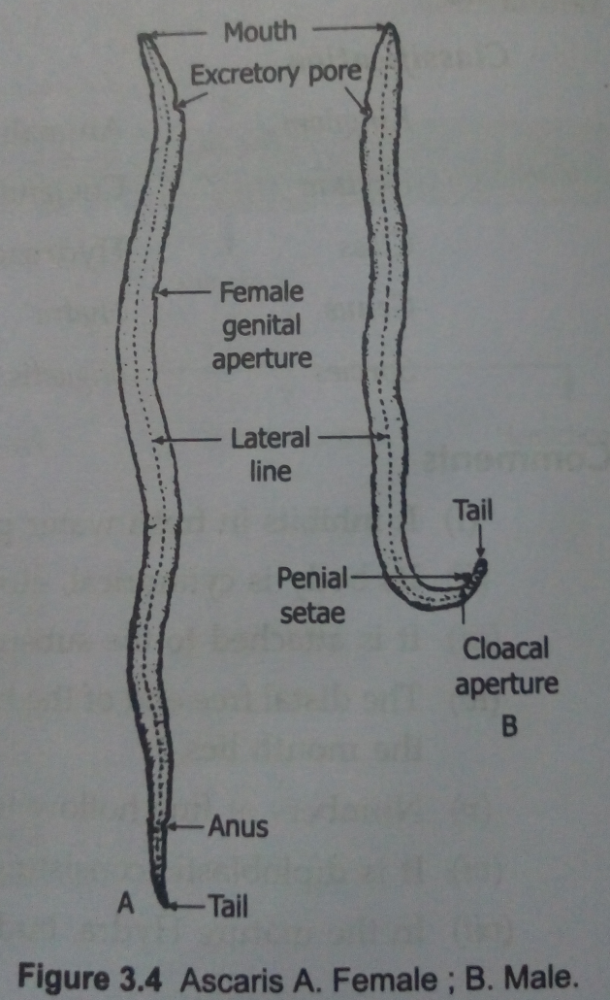
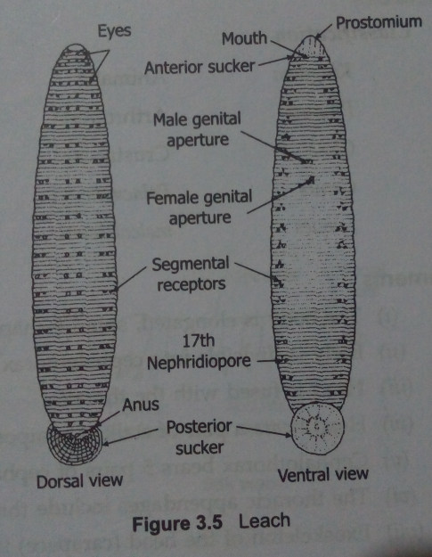
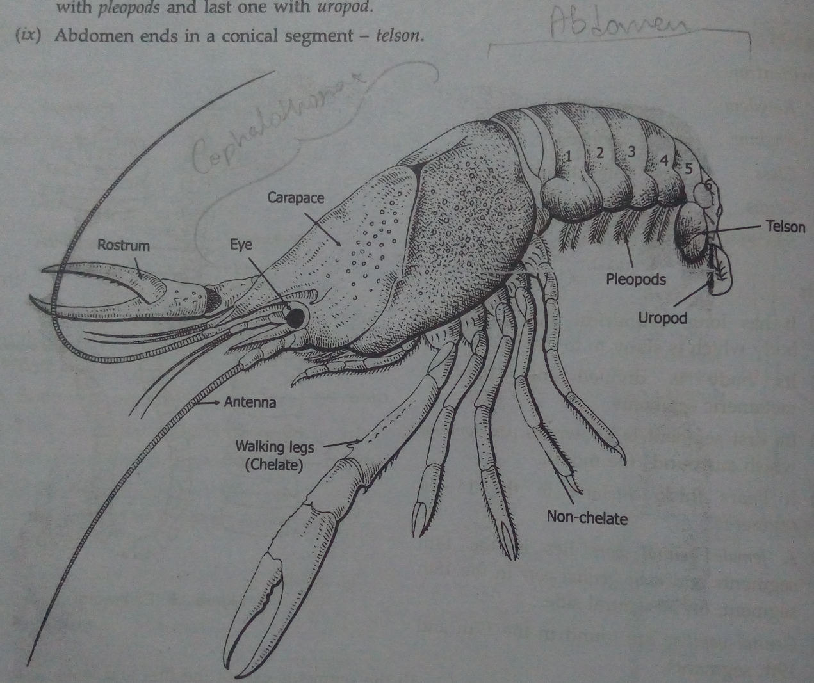
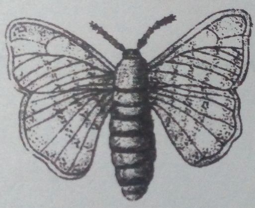
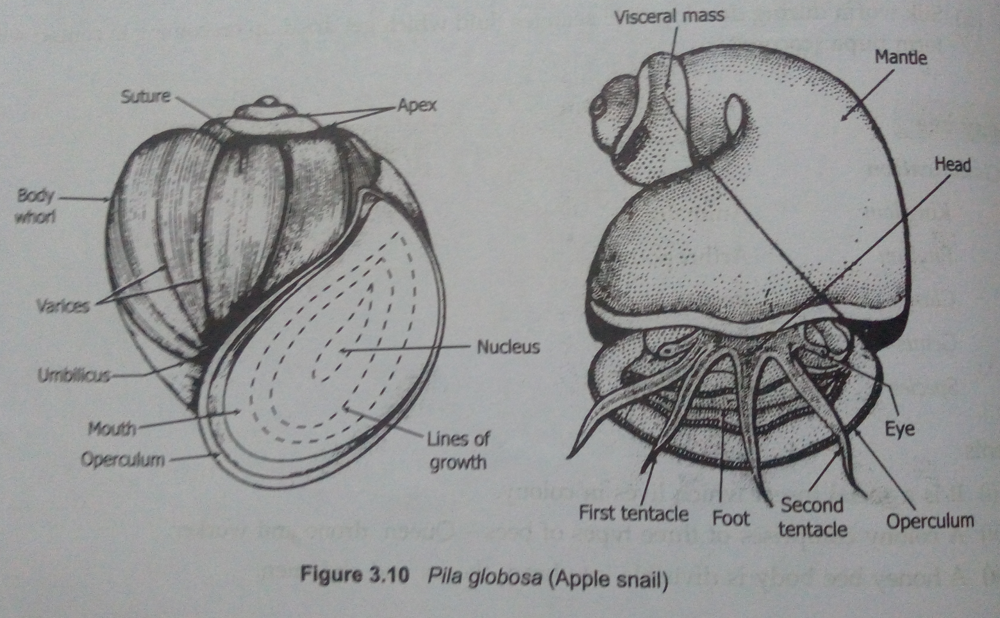
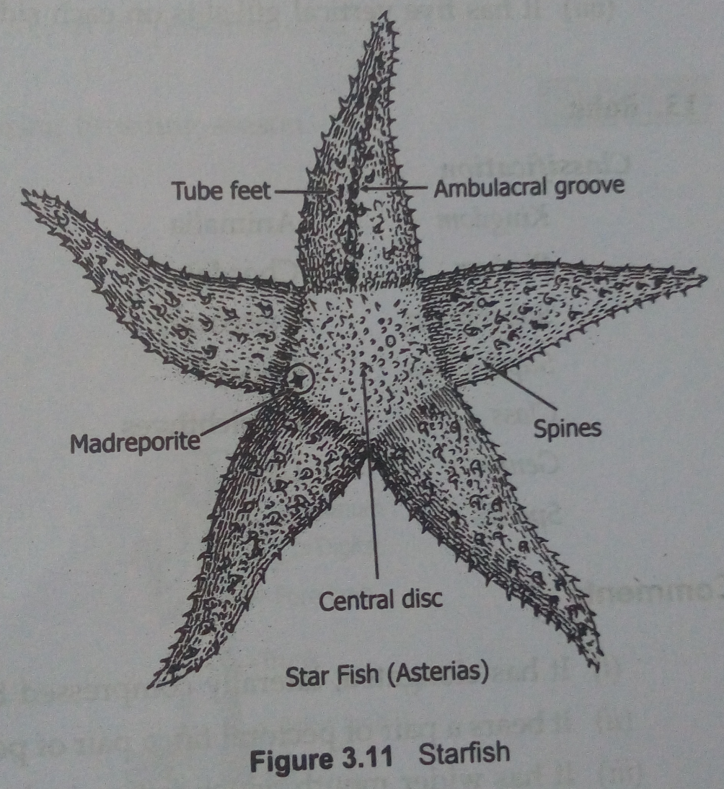

# 08/08/23 

## Aim of the experiment
To identify animals based on their morphology.

## Materials required
Specimen: ascaris, leech, earthworm, prawn, silkmoth, snail, starfish

## Observation
The purpose of this study was to investigate and identify the animal based on the morphology. Several set of characteristics helps us to identify an animal through careful observation and writing down to help in its classification. Following are the animals studied in this experiment:

### Ascaris 

1. Is an endoparasite in human intestine.
2. Body is elongated, cylindrical, unsegmented and pointed at both ends. 
3. There is sexual dimorphism.
4. Males are smaller than females.
5. There are one dorsal, one ventral and tro lateral lines extending the whole length of the body. 

         

---

### Leech 

1. Inhibits fresh water ponds, lakes, tanks and in the standing water of rice fields. 
2. It is sanguivorous diet (feeds on blood). 
3. Bears elongated, flattened soft body
4. Mouth lies in the centre of anterior sucker on the ventral side. 

       

---

### Earthworm 

1. Has long, cylindrical and segmented body which is slimy to touch. 
2. Body is divided into many metameric segments.
3. Locomotary organ, setae are found in all the segments except first and last. 
4. Anus lies in the last segment.
5. Female genital pore lies in the 14th segment and male genital pore in the 18th segment on the ventral side. 

          

---

### Prawn 

1. Body is elongated, spindle-shaped.
2. Body its divided into cephalothorax and abdomen. 
3. Head is fused with thorax.
4. Head bears a pair of stalked compound eyes. 
5. Exoskeleton of the head is projected forward as a serrated rostrum. 

          

---

### Silkmoth 

 

1. Has a creamy white color with heavy body. 
2. Wing has faint striations.
3. Body is divided into heah, thorax and abdomen.
4. Head bears a pair of compound eyes and antennae.
5. Body is covered with hair.
6. It is unisexual in nature. 

    

---

### Snail 

1. Found in ponds, pools, lakes and in marshy places. 
2. Is globular in shape and is univalved.
3. Shell consists of various whorls and is marked by faint growth lines. 
4. Head bears a pair of tentacles and stalked eyes.
5. Foot is large and triangular organ whish is used for creeping. 

           

---

### Starfish 

1. Has flattened star shaped body with five blunt radiating arms. 
2. Has two surfaces- lover oral surface and upper aboral surface. 
3. Oral surface bears ambulacral groove in each arm having 2 or 4 rows of retractile tube feet.
4. Mouth is pentagonal lying in the central disc of oral surface. 
5. Aboral surface bears anus, short spines and madreporite.