# Certificate

This is to certify that “`student name`”, student of class - `class` `stream` ‘`section`’ has successfully completed his Chemistry Project on **“Tensile Strength of Different Fibers”** under the guidance of “`teacher name`".

________________   Teacher's name

________________  Student's name

  

# Acknowledgement 

In the accomplishment of this project successfully, many people have best owned upon me their blessings and the heart pledged support, this time I am utilizing to thank all the people who have been concerned with this project.

Primarily, I would thank god for being able to complete this project with success. Then, I would like to thank my principal `principal name` and the chemistry `teacher name`, whose guidance has been the ones that helped me patch this project and make it full proof success. `His/Her` suggestions and `His/Her` instructions have served as the major contributor towards the completion of the project. 

Then I would like to thank my parents and friends who have helped me with their valuable suggestions and their guidance has been very helpful in various phases of the completion of the project. 

Last but now least I would like to thank my classmates who have helped me a lot. 

# Index 

| 
 S.No. | 
 Topic | 
 Page no. | 
|:-:|:-:|:-:|
| 1. | Certificate | I |
| 2. | Acknowledgements | II |
| 3. | Introduction | 1 | 
| 3.1 | Cotton | 1 | 
| 3.2 | Wool | 2 | 
| 3.3 | Silk | 3 | 
| 3.4 | Nylon | 4 | 
| 4. | Objective | 6 | 
| 5. | Scope and Limitation | 7 | 
| 6. | Theory | 8 | 
| 7. | Experiment | 11 | 
| 8. | Observation | 12 | 
| 9. | Result and Conclusion | 13 | 
| 10. | Bibliography | 15 | 

# Introduction 

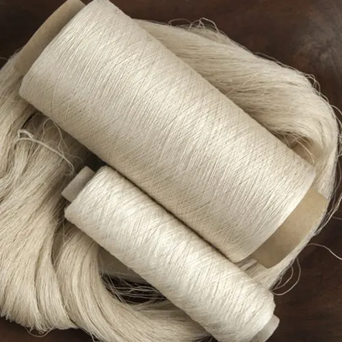

**I**n the ever-evolving landscape of materials science, understanding the mechanical properties of fibers is a pivotal pursuit with far-reaching  implications for diverse industries. Tensile strength, a fundamental parameter gauging   a material's capacity to withstand axial forces, stands as a critical facet in assessing the viability of fibers for applications  ranging from textiles to biomedical engineering.  This research initiative undertakes a thorough exploration into the intriguing dynamics of fiber behavior, honing in on the tensile strength variations exhibited by four distinctive fibers—cotton, silk, wool, and nylon—following exposure to both acidic and basic solutions. As we embark on this journey, the intricacies of each fiber's composition and structural nuances shall unravel, shedding light on their unique mechanical responses and paving the way for nuanced insights into the interplay between chemical environments and tensile strength. The study's implications extend beyond the confines of individual fiber characteristics, contributing to a broader understanding of how varying chemical exposures influence the mechanical resilience of fibrous materials in a spectrum of real-world scenarios. 

# Cotton: A natural Marvel with Deep Roots 

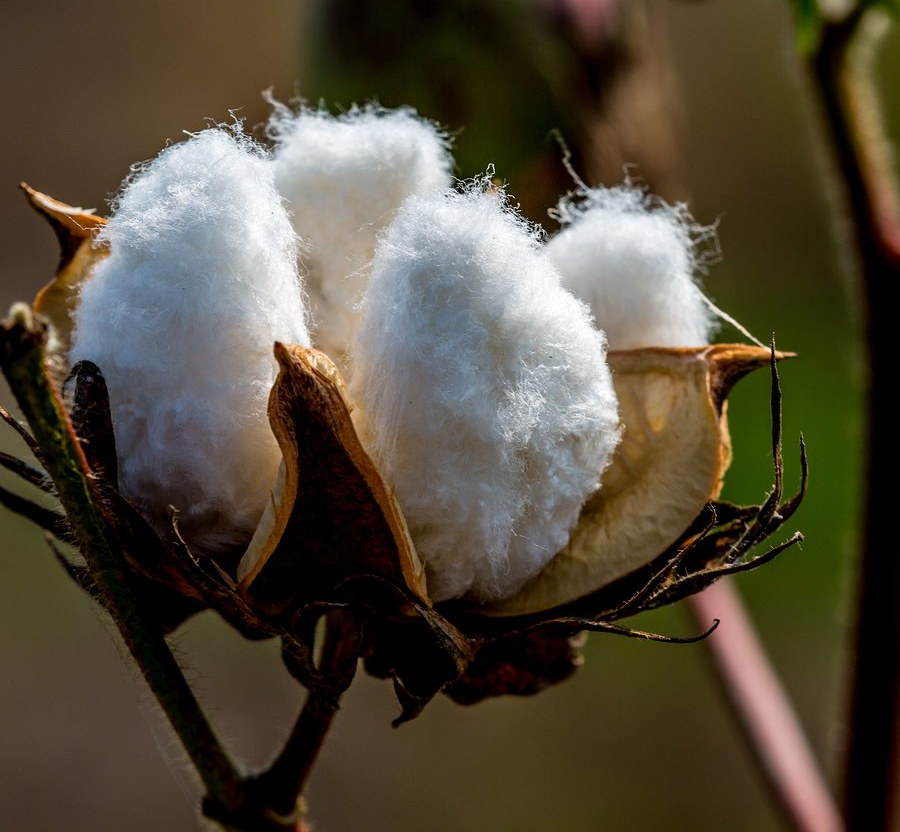

Cotton, originating from the fibers of the Gossypium plant, boasts a rich heritage intertwined with human civilization. The cotton plant yields delicate white fibers known as lint, enveloping its seeds, and this bounty has been cultivated and cherished for millennia. Grown globally, cotton has become synonymous with textile production due to its innate qualities. Its breathability, softness, and absorbent nature make cotton a sought-after fabric, adaptable to diverse climates and styles. As a timeless and versatile material, cotton's journey from seed to fabric weaves a story that transcends borders and epochs, making it an enduring symbol of comfort and cultural significance. 

## Fabrication of Comfort: From Harvest to Weave 

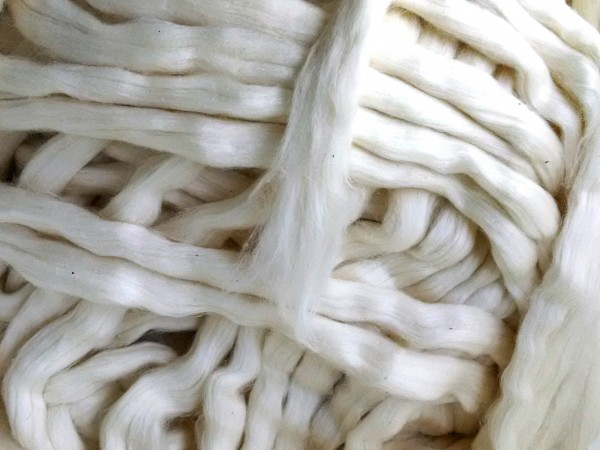

The journey of cotton from plant to fabric involves a meticulous manufacturing process. After harvesting, the cotton fibers undergo ginning, separating seeds from lint. Subsequent carding and combing align fibers for strength and smoothness. Spinning  transforms them into yarn, ready for weaving or knitting. Final stages include bleaching, dyeing, and optional treatments for added properties. This intricate process ensures that the end product retains cotton's desirable characteristics, resulting in garments cherished for their comfort and wearability. 

## Cotton: Symbolyzing Nature's Bounty and Human Innovation

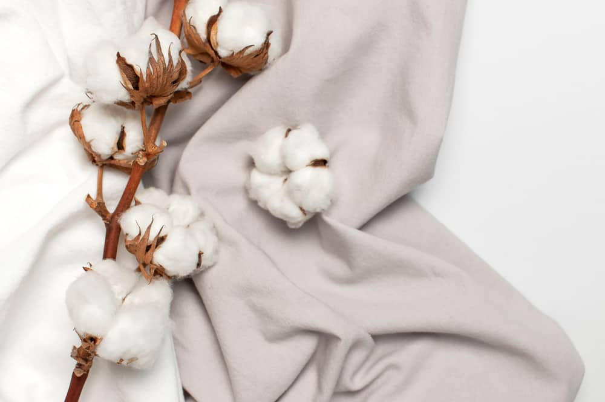

Beyond its tactile allure, cotton represents a harmonious intersection of nature's bounty and human ingenuity. The economic significance of cotton, coupled with its adaptability and comfort, positions it as a timeless symbol in textiles. From the delicate origins of the cotton plant to the complex manufacturing stages, the narrative of cotton is one  that weaves together tradition and innovation, creating a fabric that stands the test of time and continues to be an integral part of our global sartorial story.

---

In summary, the journey of cotton from the Gossypium plant's fibers to the cherished fabric we know today encapsulates a rich heritage entwined with human civilization. Its delicate white fibers, known as lint, have been cultivated globally for millennia, becoming synonymous with textile production. Cotton's innate qualities—breathability, softness, and absorbency—make it a sought-after material adaptable to diverse climates and styles. This natural marvel's story, from seed to fabric, weaves a narrative that transcends borders and 

epochs, symbolizing both nature's bounty and human ingenuity. The intricate manufacturing process, from harvesting and ginning to carding, combing, and spinning, ensures that the end product retains cotton's desirable characteristics. Beyond its practical applications, cotton represents a harmonious blend of tradition and innovation, standing as a timeless symbol in the global narrative of textiles.

# Wool: A Heritage of Warmth and Resilience 

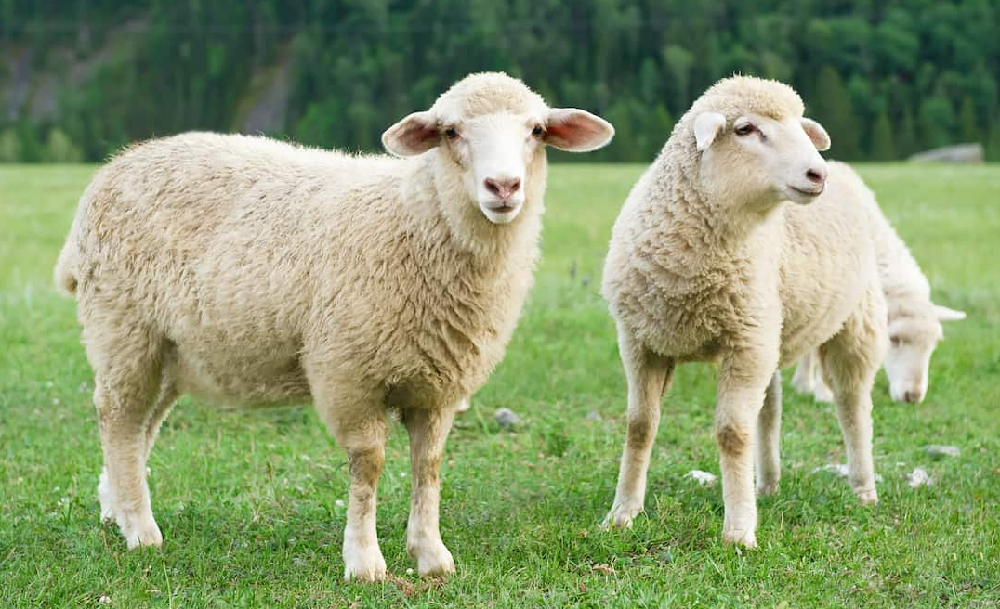

As a natural and renewable resource, wool exemplifies sustainability in the textile industry. The resilience of wool fibers not only provides insulation but also boasts moisture-wicking properties, keeping wearers warm even in damp conditions. This unique combination of warmth and breathability makes wool a versatile material suitable for a range of climates. Beyond its functional attributes, wool has played a significant role in cultural traditions and craftsmanship. From the nomadic herders tending to their flocks to the skilled artisans crafting intricate woolen textiles, the story of wool extends beyond practicality to encompass a rich tapestry of human connection and creativity.

## Wool: Crafting Comfort from Fleece to Fiber 

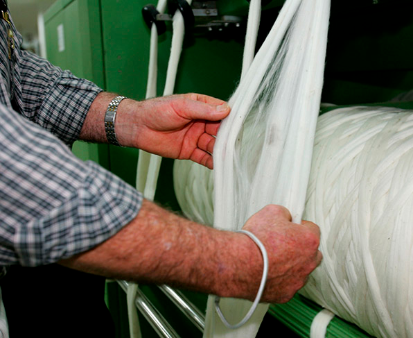

The journey of wool from raw fleece to a luxurious textile involves a meticulous manufacturing process. Following shearing, the wool undergoes thorough cleaning processes to eliminate impurities and prepare it   for further refinement. Subsequently,  the fibers undergo carding and combing, a process that aligns them in a parallel fashion. This step not only enhances the strength of the yarn but also contributes to its smoothness. The next phase is spinning, a transformative process that turns the prepared fibers into yarn, creating the foundation for the final fabric. This yarn is then ready to be skillfully woven or knitted, bringing to life the fabric that embodies the warmth and luxury synonymous with wool. The intricate steps in the manufacturing journey highlight the craftsmanship involved in creating woolen textiles, underscoring its status as a timeless and cherished material.

## Wool: Bridging Tradition and Modernity 

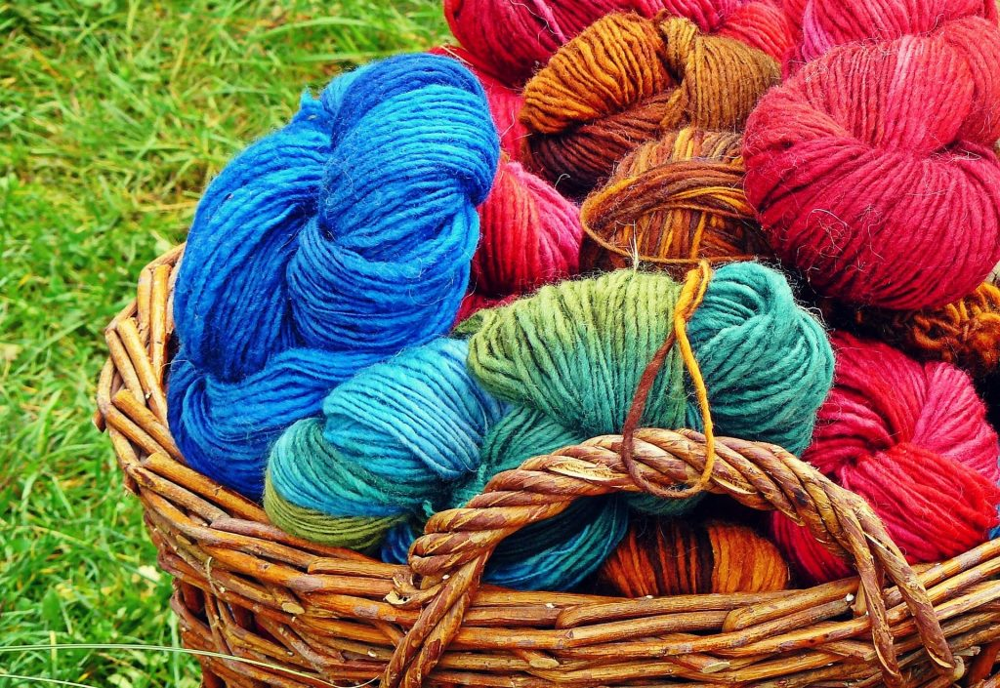

Beyond its tangible characteristics, wool serves as a symbolic bridge between tradition and modernity. This natural fiber, deeply rooted in historical significance, maintains its relevance in the ever-evolving realms of contemporary fashion and lifestyle. From the comfort of cozy sweaters to the sophistication of tailored suiting, wool's enduring versatility and timeless charm seamlessly connect the threads of the past and present. It stands as a symbol of resilience, not merely withstanding the test of time but evolving gracefully with the changing tides of fashion and functionality. In each garment crafted from wool, there lies a narrative that transcends eras, embodying the enduring spirit of a material that has stood witness to the evolution of style and culture.

---

In conclusion, wool stands as a testament to the seamless interplay of tradition and modernity, encapsulating a rich heritage of warmth and resilience. As a natural and sustainable resource, the meticulous journey from raw fleece to luxurious textile underscores the craftsmanship that defines its timeless appeal. Beyond its functional attributes, wool symbolizes human connection and creativity, reflecting the narratives of nomadic herders and skilled artisans. With a unique blend of warmth, breathability, and versatility, wool not only withstands the test of time but gracefully adapts to changing fashion trends, embodying a material that bridges the threads of the past and present. In each garment crafted from wool, there lies a narrative that transcends eras, capturing the enduring spirit of a textile that has played a vital role in the evolution of style and culture.

# Silk: Threads of Elegance and Silkmoth Alchemy 

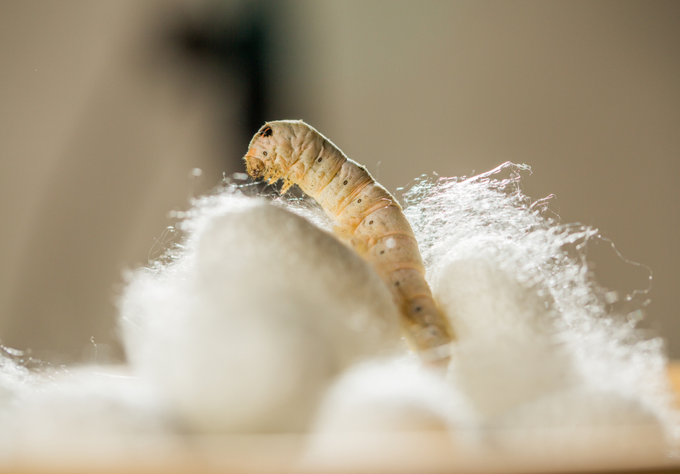

Silk, a prized natural fiber, originates from the intricate process of sericulture, where silkworms spin delicate fibers to create protective cocoons during their pupal stage. Derived from the Bombyx mori species, these silkworms feed on mulberry leaves, sustaining their growth and silk production. The carefully harvested cocoons yield luxurious silk threads, renowned for their unparalleled sheen and softness. Beyond its tactile qualities, silk carries a rich cultural history, originating in ancient China and spreading globally through trade routes. Adorning royalty and symbolizing elegance, silk stands as a testament to the meticulous craftsmanship and dedication involved in producing one of the world's most cherished fabrics.

## Artistry in Weaving: From Silkworm to Silk Fabric

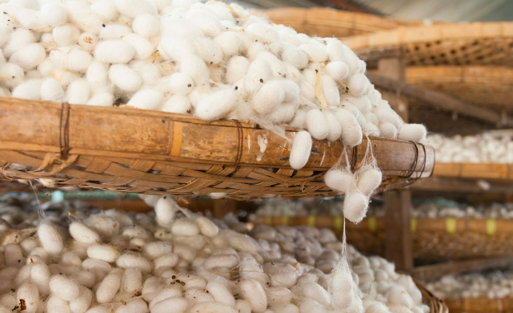

The journey from silkworm to silk  fabric involves a meticulous transformation process. After harvesting the silk cocoons, the fibers are carefully unraveled through a process known as reeling. These fine silk threads are then twisted into yarn, ready  to be woven into the luxurious fabric that epitomizes sophistication. The inherent properties of silk, including its smooth texture and natural luster, make it a coveted material for a wide range of applications, from exquisite clothing to opulent home furnishings. 

## Silk: A Timeless Tapestry of Tradition and modern Glamour

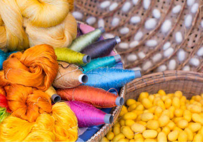

Silk, with its enduring allure, weaves a timeless tapestry that connects tradition with modern glamour. Its association with royalty and  luxury spans cultures and epochs, making silk a  symbol of refinement. From traditional silk saris to contemporary high-fashion garments, this exquisite fiber continues to captivate with its unparalleled beauty and versatility. Silk, with its rich history and contemporary relevance, stands as a testament to the seamless fusion of nature's artistry and human craftsmanship. 

--- 

In essence, silk emerges as more than just a luxurious fabric; it embodies a timeless tapestry that seamlessly weaves tradition with modern glamour. Originating from the meticulous   sericulture process, where silkworms spin delicate fibers to create protective cocoons, silk captures the artistry of nature and human craftsmanship. Harvested and transformed into fine threads through reeling, silk becomes a symbol of sophistication. Beyond its tactile allure, silk carries a rich cultural history from ancient China to global trade routes, adorning royalty and symbolizing elegance. Whether in traditional silk saris or contemporary high-fashion garments, silk's enduring allure stands as a testament to the harmonious fusion of nature's ingenuity and human dedication, creating one of the world's most cherished and sought-after fabrics. The inherent properties of silk, including its smooth texture and natural luster, make it a coveted material for a wide range of applications, from exquisite clothing to opulent home furnishings. The journey from silkworm to silk fabric exemplifies meticulous craftsmanship, and silk remains an everlasting symbol of refinement that seamlessly connects tradition with the contemporary allure of modern glamour.

# Nylon: The Synthetic Marvel of Modern Engineering

Nylon, a synthetic polymer, stands as a testament to the ingenuity of modern engineering. Developed in the early 20th century, nylon revolutionized the textile industry by offering a versatile alternative to natural fibers. Composed of repeating amide groups, nylon exhibits exceptional strength, durability, and elasticity. Its creation marked a significant milestone in material science, opening new possibilities for applications ranging from apparel to industrial uses.

## Precision in Production: Crafting Strength from Polymer Chains 

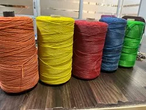

Nylon's manufacturing process unfolds through the meticulous polymerization of specific monomers, yielding long chains of polyamide. These resilient chains are subsequently spun into fibers, showcasing remarkable tensile strength and durability. Beyond its physical attributes, nylon's adaptability shines as it can be easily modified to meet diverse specifications, making it an ideal choice for a wide array of products. From clothing and carpets to industrial components, the versatility of nylon plays a pivotal role in shaping various industries. This ability to tailor its properties to specific needs underscores the material's significance in the manufacturing landscape, contributing to its widespread use in both everyday and specialized applications.

## Nylon: Where Innovation meets Practicality

The synergy of innovation and practicality is epitomized by nylon. Its synthetic composition provides a platform for meticulous control over its properties, enabling it to meet the diverse demands of various industries. Whether gracing the runways of high fashion or forming the gears of machinery, nylon's unparalleled adaptability has granted it a ubiquitous presence in our daily lives. As a testament to modern  engineering prowess, nylon stands as a reminder of humanity's capacity to leverage science and technology in crafting materials that not only meet but often surpass our expectations. In its versatility, nylon becomes a symbol of the boundless possibilities that arise when innovation meets practical application.

---

In essence, nylon represents the pinnacle of precision in production, where meticulous polymerization yields resilient polyamide chains spun into fibers with exceptional strength. Beyond its physical attributes, nylon's adaptability is showcased as it can be easily modified for a range of applications, from clothing and carpets to industrial components. This versatility underscores its significance in shaping various industries, embodying the boundless possibilities that arise when innovation meets practical application. Nylon stands as a testament to humanity's capacity to leverage science and technology, serving as a symbol of the dynamic harmony achieved in the realm of modern engineering.

In the intricate tapestry of fibers, cotton's versatile legacy, wool's warmth, silk's regal allure, and nylon's synthetic marvel converge and diverge, each contributing a unique thread to our material landscape. Cotton, with its time-honored legacy, emerges as a breathable fabric, intricately woven into cultures worldwide. Wool, sourced from animals, bridges tradition and modernity, symbolizing enduring elegance.
Silk's timeless appeal connects tradition with modern glamour, while nylon, a modern engineering marvel, reshapes textiles with its strength and versatility. From cotton's natural elegance to nylon's engineered precision, these fibers showcase the diverse ways human creativity intertwines with science to shape our fabric landscape, weaving a distinct narrative in the materials that surround us.

# Objective 

This project's core objective is to evaluate the tensile strength of diverse fibers and scrutinize how alkali and acid impact this crucial parameter. Through systematic experiments, we aim to gain insights into the nuanced behavior of different fibers, facilitating informed choices for specific applications. Visual assessments alone prove inadequate; hence, our focus on the comprehensive exploration of tensile strength under various chemical conditions.
In essence, this multifaceted project contributes to understanding fiber characteristics and aids decision-making for optimal fiber choices in diverse contexts. The findings empower stakeholders to make discerning choices, ensuring fibers are matched with the most appropriate applications based on their performance in response to challenges posed by alkali and acid environments. 

## Scope and Limitation 

The aim of this experiment is to determine whether plant fibers under tension are stronger or weaker by calculating their tensile strength. The theoretical expectation is that the plant might show different tensile strength after submerging them in different solutions due to the affect on the molecules. However, there are limitations to consider. Fiber strands taken from the stem may vary in maturity, introducing potential strength variations, especially if sourced from different parts or plants of the same species. Within a single fiber, the diameter may differ along its length, with the end potentially having a thicker diameter than the middle. Additionally, the drying process may lead to over-drying, increasing brittleness and causing fibers to snap prematurely under minimal loads, potentially providing misleading indications of their actual tensile strength. 

The project aims to investigate the dependencies influencing the tensile strength of stone wool fibers and understand their fracture characteristics. These characters are: 

1. Production-related factors 
	1. Hyper quenching 
	2. Melting atmosphere 
	3. Fiber diameter variations
         4. Applied axial tension during forming
2. Fiber surfaces characteristics
	1. Surface homogeneity 
         2. Surface roughness 
	3. Surface reactivity

Certainly, these factors display a notable correlation, a relationship that will be explored in the thesis overview and across the four associated articles. The mechanical performances of both continuous and discontinuous fibers will be examined, focusing on measuring their tensile strength in relation to varying production parameters. This investigation aims to provide valuable insights into the interconnected influences on fiber strength.

# Theory 

Depending upon the source, various fibers can be categorized as: 
1. Plant fiber (e.g. cotton and jute)
2. Animal fiber (e.g. silk and wool)
3. Synthetic fiber (e.g. nylon and polyester)
Natural fibers can be grouped based on where they come from. The plant-based category, like cotton, flax, and jute, comes from vegetables or cellulose. The animal-based group includes fibers from animals like wool, mohair, and silk. Another category is minerals, and a key example is asbestos. These fibers are derived from different sources and have various uses.
Vegetable fibers, like cotton, kapok, and coir, can be grouped based on where they come from in plants. For example, some fibers, such as cotton, grow as hairs on seeds or inner fruit walls, with each fiber being a long, narrow cell. Others, like flax and hemp, are called bast fibers and come from the inner tissue of certain plant stems, made up of overlapping cells. Fibers such as abaca and sisal come from the fibrovascular system of leaves.
Chemically, all these vegetable fibers are mostly made of cellulose, but they also have other substances like hemicellulose, lignin, pectins, and waxes that need to be removed or reduced during processing. Animal fibers, on the other hand, are made entirely of proteins. Except for silk, which is spun by moth larvae to make cocoons, animal fibers are essentially fur or hair that acts as a protective covering for animals.
Except for mineral fibers, all natural fibers really like water, whether it's in liquid or vapor form. This strong liking for water makes the fibers swell when they soak up water. This swelling is helpful when dyeing the fibers in watery solutions.
Unlike many man-made fibers, all-natural fibers don't change when heat is applied; they are what we call "nonthermoplastic." They don't get soft when heated, and at temperatures below the point where they break down, they don't really react much to dry heat. There's no shrinking or stretching when you heat them, and they don't become brittle if you cool them below freezing. However, natural fibers have a tendency to turn yellow when exposed to sunlight and moisture, and if they're exposed for a long time, they can lose some of their strength.
Natural fibers, like those from plants or animals, are prone to being broken down by tiny living things, such as bacteria and fungi. For plant-based fibers, this happens especially when it's humid and warm, and there's not much light. Even animal fibers like wool and silk can be broken down by bacteria and molds. Bugs like moths and carpet beetles can also harm animal fibers, while cellulose fibers can be attacked by termites and silverfish. However, this damage can be resisted by using certain chemicals.

## Structure of Polysaccharide 

A polysaccharide is a complex carbohydrate composed of multiple monosaccharide units linked together through glycosidic bonds. These macromolecules serve various essential functions in living organisms, such as energy storage, structural support, and cellular recognition. The monosaccharide units, typically glucose, fructose, or galactose, are joined through condensation reactions, where a water molecule is eliminated, forming glycosidic linkages between the sugar molecules. The resulting chain can be linear or branched, depending on the specific arrangement of the monosaccharide units.

The structure and composition of polysaccharides vary widely among different biological systems. Common examples include starch and glycogen, which are storage polysaccharides in plants and animals, respectively. Cellulose, another prevalent polysaccharide, forms the structural component of plant cell walls. Chitin, found in the exoskeletons of arthropods and insects, is yet another example. The diverse roles and forms of polysaccharides highlight their significance in maintaining cellular integrity, energy balance, and the structural integrity of biological tissues.

## Structure of Polyamide 

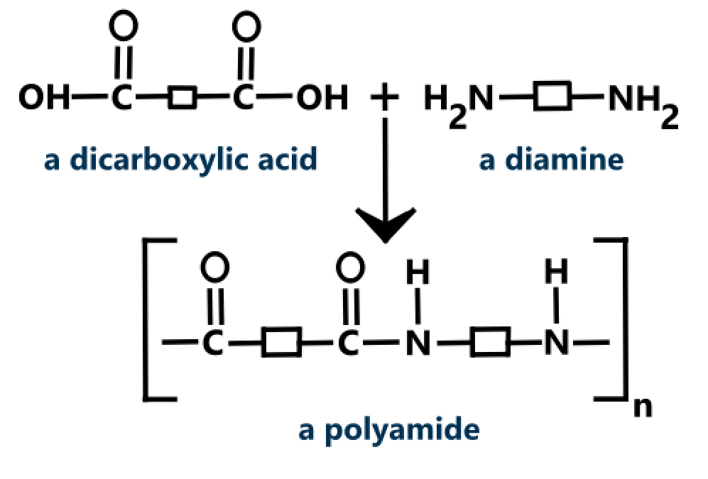

Polyamide is a type of synthetic polymer characterized by the presence of amide linkages (CONH) in the polymer chain. Commonly known as nylon, polyamides exhibit a repeating unit structure in which amide groups link individual monomers. The synthesis typically involves the reaction of diamines with dicarboxylic acids, or the use of amino acids, resulting in the formation of long chains with alternating amide bonds. The versatility of polyamides lies in their ability to form strong and resilient fibers, films, and plastics, making them widely used in various industrial applications.

The structure of polyamides is often linear, and the properties of the polymer can be tuned based on the specific monomers used in their production. Polyamides possess high tensile strength, durability, and resistance to wear, making them suitable for applications such as textiles, automotive parts, and engineering materials. Additionally, polyamides are known for their versatility in adapting to different forms, including nylon-6, nylon-66, and nylon-12, each with distinct characteristics based on their molecular structure. The widespread use of polyamides in diverse industries underscores their importance as a key class of synthetic polymers.

## Structure of Nylon 6,6

$C_{12}H_{22}N_2O_2$

Nylon 6,6 is a specific type of polyamide, a synthetic polymer known for its strong and durable properties. The "6,6" in its name refers to the hexamethylenediamine and adipic acid monomers used in its production. The polymerization process involves the reaction between hexamethylenediamine and adipic acid, forming a repeating unit with six carbon atoms in each monomer. This results in a long-chain polyamide structure with amide linkages (CONH) and alternating hexamethylene segments.

The structure of nylon 6,6 is characterized by a linear arrangement of these repeating units, contributing to its high tensile strength and resilience. The presence of the amide linkages gives the polymer its unique properties, including excellent resistance to abrasion and chemicals. Nylon 6,6 is widely used in the production of fibers for textiles, such as clothing and carpets, as well as in engineering applications, such as automotive components and industrial parts. Its versatility and robust characteristics make nylon 6,6 a valuable and widely employed material in various industries.

# Experiment 

**Aim**: Tom compare tensile strength of cotton, wool, silk and nylon fibers.

**Apparatus Required**: Cotton, wool, silk, nylon, hook, weight hangers, slotted weights, acid, base, clamp, clamp stand, tweezers.

### Procedure 

1. Take five different samples of fibers in equal length.
2. Take a ring fixer and tie one end of the fiber on an iron stand and the other end with a hanger which carries the weights to keep the fiber gets straighten.
3. Now, start adding weight onto the weight hanger and observe the stretching of the thread.
4. Repeat step 2 and 3 with other threads made up of different material and compare their tensile strength.
5. To study the effect of acid and base on the tensile strength of fibers, dip each type of fabric in dilute HCl or dilute NaOH solution of equal quantity for equal interval of time.
6. After a fixed interval of time, the fibers are removed from the solution, washed with water and dried.
7. Determine again the tensile strength of the dried fibers by repeating steps 2, 3 and 4.

# Observation 

| 
 S.No. | 
 Type of fiber | 
 Original Tensile Strenght | 
 Tensile strength after $HCl$ | 
 Tensile strength after $NaOH$ |
|:-:|:-:|:-:|:-:|:-:|
|1.|Cotton|250 g| 350 g| 200 g| 
|2.|Wool|1300 g|1300 g|1250 g|
|3.|Silk|50 g|100 g|100 g| 
|4.|Nylon|1700 g|1600 g|1750 g| 

# Result and Conclusion

Conclusions drawn from the experiment are:
1. When woolen fibers come into contact with bases, their tensile strength tends to decrease, showing a reduction in overall strength.
2. Fibers don't undergo significant changes when exposed to acids, as acids have minimal impact on their properties.
3. The tensile strength of cotton thread experiences a decrease in the presence of acids, while exposure to bases has comparatively less effect, leaving the strength relatively unaffected.
4. Nylon fiber exhibits remarkable stability, showing little to no change in its properties when exposed to both acids and bases.

In a comprehensive study of fiber tensile strength, cotton, wool, silk, and nylon were examined. Cotton exhibited a tensile strength of 250 g, increasing to 350 g in HCl and decreasing to 200 g in NaOH. Wool maintained a consistent strength of 1300 g despite exposure to acids and bases. Silk, with an original strength of 50 g, showed increased tensile strength (100 g) in acid but remained stable in a basic environment. Nylon, starting at 1700 g, demonstrated stability under both acidic and basic conditions.

### Cotton's Response:
Cotton's versatile nature was evident as it displayed varying tensile strengths under different chemical exposures. The increase 

in strength in HCl suggests a complex interaction, while the decrease in NaOH highlights the material's responsiveness to different environments.

### Wool's Resilience:
Wool, known for its warmth and resilience, exhibited a consistent tensile strength of 1300 g throughout the experiment. This stability underscores wool's durability, showcasing its resistance to changes induced by acidic or basic solutions.

### Silk's Sensitivity:
Silk, celebrated for elegance, presented a delicate original strength of 50 g. Its sensitivity to acidic environments, as seen in the increased tensile strength in acid, provides insights into how chemical exposures can influence the mechanical properties of this natural fiber.

### Nylon's Stability:
Nylon, a synthetic marvel engineered for strength and versatility, demonstrated an impressive original tensile strength of 1700 g. Surprisingly, both acids and bases had minimal impact on nylon's tensile strength, highlighting its stability and consistency.

This comprehensive experiment meticulously explored how cotton, wool, silk, and nylon fibers respond to diverse acidic and basic environments. The nuanced findings underscore the crucial role of considering chemical exposures in assessing fiber suitability for practical applications. By subjecting each fiber type to controlled conditions, the study offers insights with implications for industries such as textiles and fashion, enhancing material selection processes.

The experimentation process involved detailed observations of the distinct behaviors exhibited by each fiber type in response to varying chemical conditions. The outcomes carry substantial implications for material scientists and decision-makers, providing a practical tool for informed choices in applications where chemical factors are pivotal. Whether it's creating durable clothing or developing resilient industrial materials, understanding these interactions contributes to a refined approach in material science.

In summary, this multifaceted experiment not only deepens our understanding of fiber-chemical dynamics but also serves as a valuable guide for practical decision-making in diverse industries. The insights gained pave the way for more informed material selections, promoting advancements in material science and fostering the development of sustainable solutions in real-world applications.

# Bibliography

1. `education board` Chemistry Lab Manunal 
2. Wikipedia 
3. Polymer Science Learning Center 
4. American Chemistry Learning Center 
5. Science Photo Lab 
6. Britannica 
7. Nimble Needles
8. www.history.com