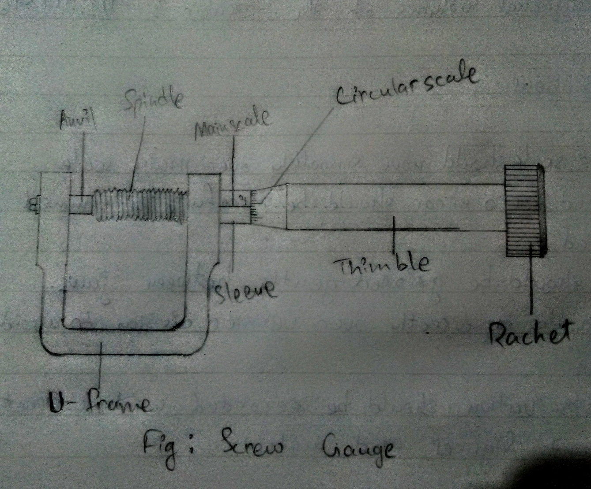

# Aim of the Experiment

To measure the diameter of a given wire with a screw gauge.

# Apparatus and Material Required

Screw gauge, metallic wire

# Theory

1. Pitch = $\frac{\text{Distance moved by the screw on linear scale}}{\text{Number of rotations of circular scale}}$
2. Least count = $\frac{\text{Pitch}}{\text{Total number of divisions on the main scale}}$
3. Total reading = $\text{LSR + CSR + least count}$

# Observation and calculation

# Result

The diameter of the given wire measure by screw gauge = $\underbar{0.622}$ $\text{mm}$

# Precautions

1. See that the screw gauge moves freely without friction.
2. The screw must always be rotated by holding it from the rachet and not from the cap so as to avoid any undue pressure on the wire.
3. The rotation of the screw must be stopped as soon as the rachet starts producing a clicking sound.
4. To avoid backlash error, the screw should always be rotated in the same direction while making the final adjustment.
5. Before measuring the length of the wire, remove the kinks in it if any.

# Sources of error

1. The cross section of the wire may not be uniform.
2. Error due to backlash though minimized cannot be completely eliminated.
3. The graduations on the main scale and the circular scale may not be evenly marked.
4. If the rachet arrangement is not functioning properly, the undue pressure on the wire may change the diameter.
