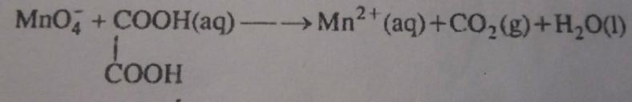

# General Instruction 
> [!IMPORTANT]
> Time: 1 Hour 
> Maximum Marks: 70

1. There are 35 questions in this question paper. 
2. Section A consists of 18 MCQs carrying 1 mark each. 
3. Section B consists of 7 very short answer questions carrying 2 marks each. 
4. Section C consists of 5 short answer question carrying 3 marks each. 
5. Section D consists of 2 case-based questions carrying 4 marks each.
6. Section E consists of 3 long questions carrying 5 marks each.

# Section A 
1. The number of moles present in 6 gms of carbon is
    1. 2 
    2. 0.5
    3. 5
    4. 1
2. A symbol not only represents the name of the element but also represents 
    1. Atomic Mass 
    2. Atomic Number 
    3. Atomicity 
    4. Atomic Volume 
3. In the ground state, an element has 13 electrons in its M-shell. The element is -
    1. Copper 
    2. Chromium
    3. Nickle
    4. Iron 
4. Which of the following sets of quantum numbers represents the highest energy of an atom? 
    1. n = 3, l = 0, m = 0, s = + 12
    2. n = 3, l = 1, m = 1, s = + 12
    3. n = 3, l = 2, m = 1, s = + 12
    4. n = 4, l = 0, m = 0, s = + 12
5. Element 'X' forms a chloride with the formula $XCl_2$, which is a solid with the highest melting point. X would most likely be in the same group of the periodic table as:
    1. $Si$
    2. $Mg$
    3. $Al$
    4. $Na$
6. The element with atomic number 20 belongs to 
    1. d-block 
    2. f-block
    3. p-block 
    4. s-block
7. The structure of $SF6$ is 
    1. Pentagonal bipyramid 
    2. Square pyramid
    3. Trigonal by=ipyramid 
    4. Octahedral 
8. The hybrid state of sulphur in $SO_2$ molecule is 
    1. $sp^2$
    2. $sp^3$
    3. $sp$
    4. $sp^3d$
9. Define hybridization.
10. the pH of a $10^{10}$ M $NaOH$ solution is nearest to 
    1.  10
    2.  7
    3.  4
    4.  -10
11. A reversible chemical reaction at equilibrium, if the concentration of any one of the reactants is doubled, then the equilibrium constant will
    1.  Also be doubled
    2.  Be halved
    3.  Remain the Same 
    4.  Become One-Fourth
12. One mole of which of the following has the highest entropy? 
    1. Liquid nitrogen 
    2. Hydrogen gas
    3. Mercury
    4. Diamond
13. The oxidation state of $Ni$ in $Ni(CO)_4$
    1.  0
    2.  2
    3.  -2
    4.  6
14. Which of the following is a redox reaction?
    1.  $NaCl + KNO_3 \rightarrow NaNO_3 + KCl$
    2.  $CaC_2O_4 + 2HCl \rightarrow CaCl_2 + H_2C_2O_4$
    3.  $Mg(OH)_2 + 2NH_4Cl \rightarrow MgCl_2 + 2NH_4OH$
    4.  $ZN + 2AgCn \rightarrow 2Ag + Zn(CN)_2$

## Assertion Reason

- An assertion reason question consists of two statements - Assertion (A) and Reason (R). You have to answer the question by selecting the appropriate option given below:
    1. Both A and R are true and R is the correct explanation of A.
    2. Both A and R are true but R is not the correct explanation of A.
    3. A is true but R is false.
    4. A is false but R is true.

### 15. 
**Assertion**: $HC=C-$ is more stable than $H_2C=CH-$.  
**Reason**: $HC = C -$ has more s-character than $H_2C=CH-$.
### 16.
**Assertion**: Nitrobenzene does not undergo Friedel Crafts reaction.  
**Reason**: Nitrobenzene is a m-director 
### 17. 
**Assertion**: Methane cannot be obtained by the Wurtz reaction.
**Reason**: Wurtz reaction leads to the formation of symmetrical alkanes having an even number of carbon atoms.
### 18. 
**Assertion**: Trans-pent-2-ene is polar but trans-but-2-ele is non-polar.
**Reason**: The polarity of cis-polymer is more than trans which is either non-polar or less-polar. 

# Section B
19. Show the relationship between $cp$ and $cv$.
20. Draw the MOT diagram of the oxygen molecule and find its magnetic character. 
21. Show the mechanism of nitration of benzene.
22. Prove that entropy is a state function. 
23. A reaction mixture containing $N_2$ at 0.50 atm, $H_2$ at 3.0 atm and $NH_3$ at 0.50 atm is heated to 450$\degree C$, in which direction the reaction $N_2 (g) + 3H_2 (g) \leftrightarrows 2NH_3 (g)$ will go if $K_P = 2.48 \times 10^{-5}$?
24. Calculate the wavelength of the spherical line in the Lyman series corresponding to $n_2 = 3$.
25. Balance the following equation in an acidic medium by the oxidizing number method. 

# Section C
26. Show the relationship between $K_P$ and $K_C$.
27. 1. Which out of $Cu^{2+}$, $Fe^{2+}$ and $Cr^{3+}$ has the highest paramagnetism and why?
    2.  State Pauli exclusion principle. 
28. 1. Write two differences between extensive and intensive properties.
    2.  What is the physical significance of free energy change in a system? 
    3.  State 1st Law of Thermodynamics.
29. 1. Show the shape of $PCl_5$.
    2.  Draw the resonance structure of nitrate ion.
    3.  Why are lower members of amine soluble in water? 
30. What happens when-
    1.  Prapan-2-ol react with Cu/573$K$
    2.  But-1-ene undergoes ozolysis. 
    3.  Sodium acetate undergoes Decarboxylation.

# Section D 
## Case-Based Question
31. Stoichiometry is a section of chemistry that involves a calculation based on chemical equations Chemical equations are governed by laws of chemical combination. The mass of reactants is equal to the mass of products. The compound obtained from different methods contains the same elements in the foxed ratio by mass. A mole is a counting unit, equal to $6.022 \times 10^{23}$ particles. One mole is also equal to molar mass expressed in grams. One mole of every gas at STP has a volume equal to 22.4 L. The reacting species that are consumed in the reaction completely is called limiting reagent which decides the amount of products formed. The concentration of the solution is expressed in terms of molarity, morality, and mole fraction.
    1. Calculate the number of moles of $NH_3$ formed by the reaction of 2 moles of $N_2$ and 2 moles of $H_2$, $N_2 (g) + 3H_2 \rightarrow 2NH_3 (g)$.
    2. Calculate number of electrons in 18 g of $H_2O$. [Atomic number of H = 1, O = 8]
32. Read the passage and answer the questions that follow:  
The attractive force which holds the two atoms together is called a chemical bond. A covalent bond is formed by an equal sharing of electrons. A coordinate bond is formed by unequal sharing of electrons. An ionic bond is formed by the transfer of electrons from one atom to another. Octet rule, although very useful but not universally applicable. According to valence bond theory, a covalent bond is formed by overlapping of half-filled atomic orbitals resulting in a lowering of energy and more stability. Bond order is the number of bonds between atoms in a molecule. The higher the bond order more stability and bond dissociation enthalpy but the smaller the bond length. The polarity of a covalent bond depends upon the difference in electronegativity. The covalent character of a bond depends upon polarising power, smaller cations and bigger anions have higher polarising power. VSEPR theory helps to predict the shapes of molecules. 
    1. Write the electron dot structure of $N_2O$.
    2. Draw the structure of $XeOF_4$ on the basis of VSEPR theory.
    3. Out of $CN^+$, $CN^-$, $NO$, which has the highest bond order?
    4. Out of nitrogen and oxygen which one is more stable, explain from bond order.

# Section E 
33. 1. Conversion 
        1.  Butanol to butene 
        2.  Phenol to benzene 
    2. Show the mechanism of dehydration of alcohol to alkene.
    3. Show the cis and trans isomer of Hex-2-ene.
34. 1. Show the Newman projection of propane.
    2.  Explain why Phenol acts as ortho and para director. 
    3.  Why ethyne is acidic in nature.
    4.  Arrange the following in increasing order by size- $N^{3+}, Na^+, F^-, O^{2+}, Mg^{2+}$
    5.  $Al$ atom loses electrons successively to form $Al^+, Al^{2+}, Al^{3+}$ ions. Which step will have the highest ionization enthalpy?
35. 1. Why ionization enthalpy of beryllium is greater than that of boron?
    2.  Give two examples of nucleophiles.
    3.  Show the relation between $PH$ and $POH$.
    4.  State AntiMarkonikov's rule.
    5.  How to prepare hexane from Wurtz reaction.