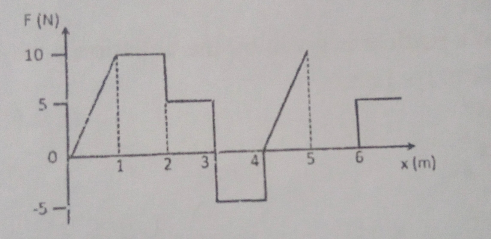
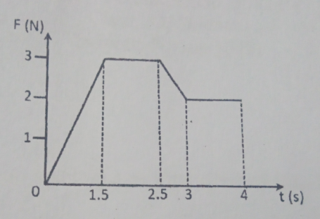
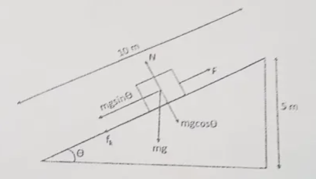

# General Instructions
> [!IMPORTANT]
> Maximum marks: 70  
> Duration: 3 hours 

1. The question paper consists of 35 questions in total divided into 5 sections- Section A, Section B, Section C, Section D and Section E.
2. Section A consists of 18 questions of one mark each, section B consists of 7 questions of two marks each, Section C consists of 5 questions of three marks each, Section D consists of 2 questions of four marks each and Section E consists of 3 questions of 5 marks each.
3. All the questions are compulsory and there is no overall choice.
4. The use of calculators is strictly prohibited.

# Section A 
1. The dimensional formula for tension in a string is,
    1. $[ML^2T^{-2}]$
    2. $[M^2L^2T^{-2}]$
    3. $[MLT^{-2}]$
    4. $[M^2LT^{-2}]$
2. Add 6.2 g, 4.33 g and 17.456 g and round off to the appropriate number of significant figures.
    1. 27.986
    2. 27.9
    3. 28
    4. 28.0
3. Which of the following quantities has the dimensional formula $[ML^2T{-3}]$?
    1. Work 
    2. Power
    3. Pressure 
    4. Impulse 
4. A bullet fired into a fixed target loses half of its velocity after penetrating 3 cm. How much further will it penetrate before coming to rest assuming that it faces constant resistance to motion?
    1. 1.5 cm 
    2. 1.0 cm 
    3. 3.0 cm 
    4. 2.0 cm 
5. The motion of a particle is given by the equation s = $(3t^3+7t^2+14t+8)$ m. The value of acceleration of the particle at $t$ = 1s is
    1. 10 $ms^{-2}$
    2. 32 $ms^{-2}$
    3. 23 $ms^{-2}$
    4. 16 $ms^{-2}$
6. Two vectors are perpendicular if
    1. $\overrightarrow{A}\cdot\overrightarrow{B}=1$
    2. $\overrightarrow{A}\times\overrightarrow{B}=0$
    3. $\overrightarrow{A}\cdot\overrightarrow{B}=0$
    4. $\overrightarrow{A}\cdot\overrightarrow{B}=AB$
7. If a unit vector is represented by $0.5\hat{i} +0.8\hat{j}+c\hat{k}$, then the value of $c$ is,
    1.  1
    2. $\sqrt{0.8}$
    3. $\sqrt{(0.11)}$
    4. $\sqrt{0.01}$
8. Which of the following is true for projectile motion? 
    1. Horizontal velocity of projectile is constant.
    2. Vertical velocity of projectile is constant.
    3. Acceleration is not constant.
    4. Momentum is constant.
9. The mass of a ship is $2 \times 10^7 kg$. On applying a force of $25\times10^5 N$, it is displaced through 25 m. The speed of the ship is
    1.  2.5 $ms^{-1}$
    2.  5 $ms^{-1}$
    3.  3.7 $ms^{-1}$ 
    4.  12.5 $ms^{-1}$
10. A ball strikes a bat with velocity $v$. The ball has mass $m$ and after striking, it retraces its path with the same velocity. What is the impulse imparted by the bat on the ball?
    1.  3 mv 
    2.  mv 
    3.  zero 
    4.  2 mv 
11. A person sitting in a lift accelerates upwards. The measured weight of the person will be,
    1. Less than actual weight.
    2. Equal to actual weight.
    3. More than actual weight.
    4. zero
12. The relationship between the force $F$ and position $x$ of a body is shown in the figure. The work done in displacing the body from $x = 1 m$ to $x = 5 m$ will be, 
    1.  30 $J$
    2.  15 $J$
    3.  25 $J$
    4.  20 $J$
13. For which of the following forces does the work done depend on the path?
    1. Gravitational force
    2. Electrostatic force
    3. Spring force
    4. Frictional force
14. A particle moves with a velocity of $(5\hat{i}-3\hat{j}+6\hat {k})ms^{-1}$ under the influence of a constant force $(10\hat{i} +10\hat{j}+20\hat{k} )N$. The instantaneous power applied to the particle is,
    1. 200 $Js^{-1}$
    2. 40 $Js^{-1}$
    3. 140 $Js^{-1}$
    4. 170 $Js^{-1}$
15. At what altitude 'h' above the earth's surface would the acceleration due to gravity be one-fourth of its value at the earth's surface? (R is the radius of the earth)
    1. $h=R$
    2. $h = 4R$
    3. $h = 2R$
    4. $h = 16R$
16. The velocity with which a projectile must be fired so that it escapes the Earth's gravitational field does not depend on, 
    1.  Mass of earth
    2.  Mass of Projectile 
    3.  Radius of orbit
    4.  Universal gravitational constant, G 
17. According to Kepler's Law of Planetary motion, which of the following is correct? 
    1.  $T \alpha R^{\frac{3}{2}}$
    2.  $T \alpha R^3$
    3.  $T \alpha R^{\frac{2}{3}}$
    4.  $T \alpha R^2$
(Where $T$ is the time period of rotation around the sun and R is the average distance between planets and the sun)

In the following question, a statement of assertion (A) is followed by a statement of Reason (R). Mark the correct choice as, 
(a) Both A and R and true, and R is the correct explanation of A.  
(b) Both A and R are true, but R is not the correct explanation of A.  
(c) A is true but R is false.  
(d) Both A and R are false.  

### 18. 
**A**: The speedometer of an automobile measures the average speed of the automobile.  
**B**: Avearge velocity is equal to total distance divided by total time taken. 

# Section B 

19. If the time period (T) of a simple pendulum is dependent on the length of the string (L) and acceleration due to gravity (g), then deduce an expression to show the dependency by using the method of dimensions. 
20. The equation of the state of a gas is given as $(P  + \frac{a}{V^2})(V-b=nRT)$, where, P = pressure, V = volume, T = temperature and n, a, b and R are constants. What are the dimensional formulae for a and b? 
21. An electron travelling with a speed of $5\times 10^3 ms^{-1}$ passes through an electric field with an acceleration of $2\times 10^{12}ms^{-2}$. 
    1.  How long will it take for the electron to triple its speed? 
    2.  What will be the distance covered by the electron at this time? 
22. A body is projected with a velocity of $30 ms^{-1}$ at an angle of $30\degree$ with the vertical direction. Find 
    1.  The maximum height and 
    2.  Time of flight of the projectile.
23. A body of mass m moves along the x-axis such that its position coordinates at any instant $t$ is, $x=at^4-bt^3+ct$, Where $a$, $b$ and $c$ are constants. What is the force acting on the particle at 1s? 
24. Find the work done by force $\overrightarrow{F}=2\hat{i}-3\hat{j}+\hat{k}$ on a body in moving it from the point (1, 2, -3) to the point (2, 0, -5).
25. At what height above the earth's surface the value of acceleration due to gravity 'g' is half of its value on the earth's surface? Given the radius of earth = 6400 km.

# Section C 
26. Derive the three equations of motion by using the calculus method.
27. Derive expressions for,
    1.  Time of flight 
    2.  Maximum height 
    - For a projectile with the angle of projection $\Theta$
28. Derive the expression for the maximum permissible speed of a car moving on a banked road with a proper diagram.  
Also, solve the following:  
A curved road forms an arc of radius 800 m. If the road is 19.6 m wide and the outer edge is 1 m higher than the inner edge, then calculate the speed for which it is banked. 
29. For a perfectly elastic collision, prove that the velocity of approach is equal to the velocity of separation.
30. Derive the expression of acceleration due to gravity 'g' with altitude. 

# Section D 
31. Deduce the impulse-momentum theorem.  
The initial speed of a body of mass 2 kg is $5 ms^{-1}$. A force acts for 4s in the direction of motion of the body. The force-time graph is shown in the figure. Calculate the impulse of the force and the final speed of the body. 

32. A body of mass 0.3 kg is taken up as an inclined plane to length 10 m and height 5 m and then allowed to slide down to the bottom again as shown in the figure. The coefficient of friction between the body and the plane is 0.15. What is the work done by, 
    1.  The gravitational force over the round trip.
    2.  The applied force over the upwrard journey. 
    3.  The frictional force over the round trip. 

# Section E 
33. The equation of velocity of an object is given by $v=(t^2+\frac{3}{t}ms^{-1})$. Find,
    1.  Acceleration from (1-3)s 
    2. Acceleration at 2 s.
    3. Displacement from (1-2) s. 
    4. Displacement at 2 s if the object was initially displaced by 2 m. 
    5. Acceleration of the object in 2 s 
34. If $\overrightarrow{A}=\hat{i}+2\hat{j}-\hat{k}$ and $\overrightarrow{B}=-\hat{i}+\hat{j}-2\hat{k}$, then find, 
    1.  Cosine of angle between $\overrightarrow{A}$ and $\overrightarrow{B}$.
    2.  A vector $\overrightarrow{C}$ perpendicular to both $\overrightarrow{A}$ and $\overrightarrow{B}$
    3.  Magnitude of $\overrightarrow{C}$.
    4.  Sine of angle between $\overrightarrow{A}$ and $\overrightarrow{B}$.
    5.  A vector of $\overrightarrow{D}$ having magnitude 5 and parallel to $\overrightarrow{C}$.
35. Four masses 1 kg, 2 kg, 3 kg and 2 kg are placed at four vertices of a square of side 2 m as shown in the figure. Find, 
    1. Resultant gravitational force on 1 kg mass. 
    2. Resultant gravitational field at the center O. 

